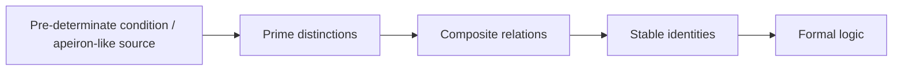
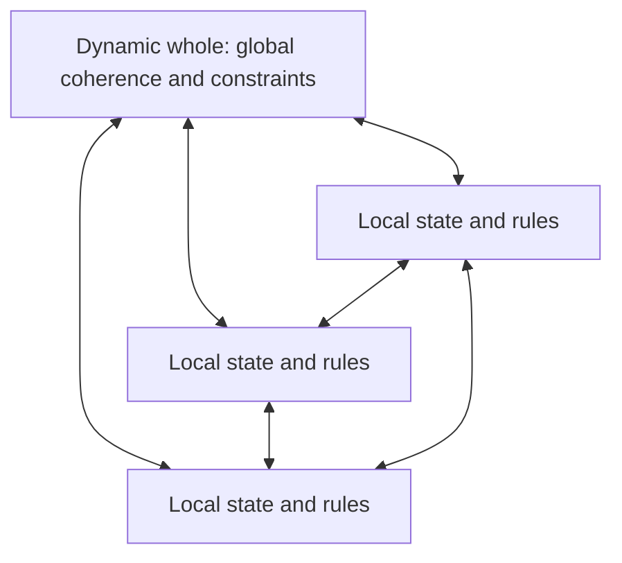
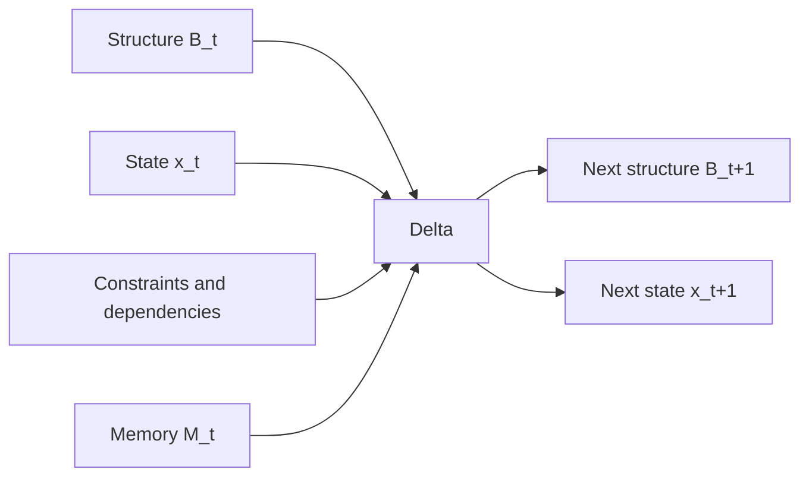
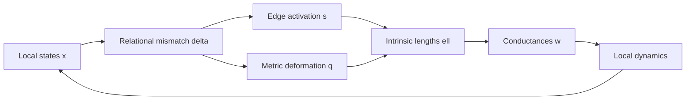
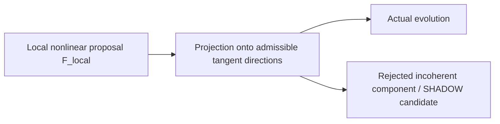
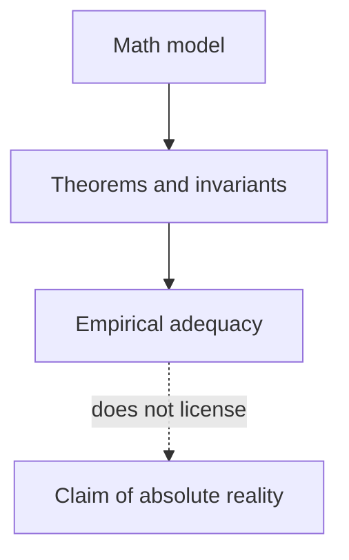
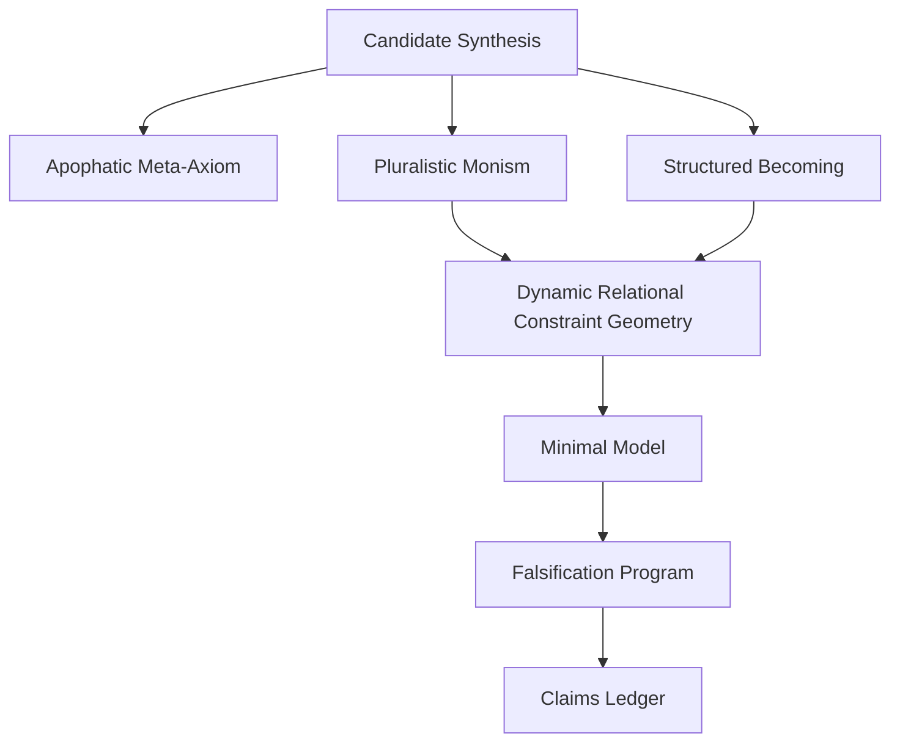

# Apophatic Relational Geometry — Master Current-Context Archive
This file concatenates the structured documentation bundle. The individual files remain canonical for editing and navigation.

---

<!-- SOURCE FILE: README.md -->

# Apophatic Relational Geometry — Current Context Archive

**Archive date:** 2026-08-05  
**Scope:** This bundle records the ideas, formulations, equations, objections, revisions, and proposed research program available in the current ChatGPT conversation context. It intentionally does not add web research, claims from the public repository, or facts not raised in the discussion.

## Source boundary

This archive draws only from:

1. the visible conversation in this session;
2. the prior discussion summaries available in the current context;
3. the attached text `Pasted text(429).txt`, which develops the rejected recursive-negation route.

The documents distinguish among:

- direct ideas stated in the conversation;
- mathematical formulations proposed during the conversation;
- hypotheses that remain unproved;
- rejected or revised formulations;
- established mathematical facts that were explicitly invoked in the conversation.

The archive is a **preservation and synthesis artifact**, not a claim that every statement is correct.

## Canonical status

The project is currently a **Candidate Synthesis**. The central mathematical proposal is provisionally called **Dynamic Relational Constraint Geometry**. The apophatic principle is a meta-level rule against reifying any model as absolute reality.

## Fast reading order

1. `00_INDEX.md`
2. `01_CANDIDATE_SYNTHESIS.md`
3. `02_SCOPE_STATUS_AND_CLAIMS.md`
4. `philosophy/10_APOPHATIC_META_AXIOM.md`
5. `philosophy/13_PLURALISTIC_MONISM.md`
6. `becoming/20_STRUCTURED_BECOMING.md`
7. `mathematics/31_DYNAMIC_RELATIONAL_CONSTRAINT_GEOMETRY.md`
8. `models/41_MINIMAL_THREE_NODE_MODEL.md`
9. `governance/50_CLAIMS_LEDGER.md`
10. `governance/56_ROADMAP.md`

## Integrity

`MANIFEST.json` contains file sizes and SHA-256 hashes. `MASTER_ARCHIVE.md` concatenates the principal documents into one searchable file.

---

<!-- SOURCE FILE: 00_INDEX.md -->

# Documentation Map

This index preserves the full architecture developed in the current conversation.

## Canonical orientation

### `01_CANDIDATE_SYNTHESIS.md`
The shortest complete statement of the framework: pre-determinate condition, distinction, relation, identity, logic, pluralistic monism, Structured Becoming, dynamic relational constraint geometry, computational fabric, and the apophatic non-reification rule.

### `02_SCOPE_STATUS_AND_CLAIMS.md`
Separates established reasoning, mathematical proposal, philosophical hypothesis, empirical question, and unsupported speculation.

### `03_GLOSSARY.md`
Controlled vocabulary. Terms must not drift between philosophical, mathematical, and engineering meanings.

## Philosophical foundations

### `philosophy/10_APOPHATIC_META_AXIOM.md`
The mature apophatic result: no internal mathematical construction is licensed, solely by its formal role, to declare itself the absolute ground of reality.

### `philosophy/11_NEGATIVE_MATHEMATICS_ARCHIVE.md`
The important but rejected attempt to make negation itself primitive through a non-closing recursive operator.

### `philosophy/12_APEIRON_WHOLE_NOTHINGNESS_INFINITY.md`
Anaximander’s *apeiron*, Ash’s wholeness–nothingness, infinity as inexhaustibility, and the distinction between mathematical infinity and ontological boundlessness.

### `philosophy/13_PLURALISTIC_MONISM.md`
One dynamic whole expressed through genuine local multiplicity.

### `philosophy/14_FIRST_CAUSE_GROUND_AND_EXPLANATION.md`
Why the apophatic position suspends the demand for an ultimate stopping point rather than proving that no first cause exists.

### `philosophy/15_PRIME_DISTINCTIONS_HYPOTHESIS.md`
The proposal that irreducible prime distinctions precede composite relations and stable identities, with the warning that literal prime numbers presuppose arithmetic structure.

## Structured becoming

### `becoming/20_STRUCTURED_BECOMING.md`
A thing persists as changing relational structure and state under dependencies, constraints, memory, and deltas.

### `becoming/21_PERSISTENCE_IDENTITY_AND_DISSOLUTION.md`
Identity as organizational continuity rather than unchanging substance.

### `becoming/22_RAIL_SHADOW_KEEPER.md`
RAIL, SHADOW, KEEPER, and delta as an operational vocabulary for persistence and correction.

### `becoming/23_CAUSATION_CONSTRAINT_AND_DEPENDENCE.md`
Causation as lawful dependence, distinguished from correlation, sequence, constraint, and description.

## Mathematical geometry

### `mathematics/30_FORMAL_DOMAIN_AND_PRESENTATIONS.md`
The provisional state presentation and its transformation rules.

### `mathematics/31_DYNAMIC_RELATIONAL_CONSTRAINT_GEOMETRY.md`
The principal geometry: local nonlinear proposals constrained by global admissibility.

### `mathematics/32_LOCAL_GLOBAL_DYNAMICS.md`
The one–many mechanism and a measurable local/global influence ratio.

### `mathematics/33_DYNAMIC_METRIC_AND_TOPOLOGY.md`
State-dependent edge activation, metric deformation, relational path distance, and topology change.

### `mathematics/34_PRESENTATION_INVARIANCE_AND_GAUGE.md`
Relabeling, coordinate, gauge, and observational invariance.

### `mathematics/35_INFINITY_BARRIERS_AND_NONCOLLAPSE.md`
Ash’s divergent contact barrier and finite-energy non-collapse.

### `mathematics/36_COMPUTATIONAL_FABRIC.md`
Why the coevolving graph, geometry, state, and transition law can be treated as one computational fabric.

## Models, proofs, and experiments

### `models/40_ARG_MECHANISM_SANDBOX_V1.md`
Minimal model family and explicit scope limits.

### `models/41_MINIMAL_THREE_NODE_MODEL.md`
The first fully specified prototype.

### `models/42_PROOF_OBLIGATIONS.md`
Metric, dynamical, invariance, non-collapse, locality, and identifiability obligations.

### `experiments/43_FALSIFICATION_AND_EXPERIMENT_PROGRAM.md`
Nulls, ablations, tripwires, structural permutations, and reproducibility requirements.

### `experiments/44_EMPIRICAL_PREDICTIONS.md`
Candidate observable consequences, each paired with a baseline and failure condition.

### `experiments/45_RELATION_TO_EXISTING_MATHEMATICS_AND_PHYSICS.md`
The known mathematical families invoked in conversation and the need for a later literature audit.

## Governance and preservation

### `governance/50_CLAIMS_LEDGER.md`
Every major claim, status, assumptions, evidence, and falsifier.

### `governance/51_DECISION_LEDGER.md`
Why major formulations were adopted, revised, or rejected.

### `governance/52_OPEN_QUESTIONS.md`
Unresolved mathematical, philosophical, and empirical issues.

### `governance/53_CONTRIBUTIONS_AND_ATTRIBUTION.md`
Attribution to Mike, Ash, and the jointly developed formulations.

### `governance/54_SOURCEBOOK.md`
Source boundary, quotations, equations, and provenance.

### `governance/55_DIAGRAMS_AND_CONCEPT_MAPS.md`
Canonical textual and Mermaid diagrams.

### `governance/56_ROADMAP.md`
The ordered research program.

### `governance/57_PAPER_OUTLINE.md`
A future paper architecture, not yet a paper.

## Archival support

### `archive/60_CURRENT_CONTEXT_NARRATIVE.md`
Chronological narrative of the conceptual development.

### `archive/61_QUOTATION_AND_FORMULA_LEDGER.md`
High-value exact or near-exact formulations preserved for later writing.

### `archive/62_REJECTED_OR_REVISED_FORMULATIONS.md`
Ideas that were valuable but must not silently return as settled claims.

### `source/Pasted text(429).txt`
The attached recursive-negation exploration, preserved unchanged.

---

<!-- SOURCE FILE: 01_CANDIDATE_SYNTHESIS.md -->

# Candidate Synthesis

## Status

This document states the current synthesis reached in conversation. It is a **candidate framework**, not an established ontology, physical theory, or new fundamental geometry.

## 1. The developmental sequence

The proposed conceptual order is:

$$
\boxed{
\text{pre-determinate condition}
\rightarrow
\text{prime distinctions}
\rightarrow
\text{composite relations}
\rightarrow
\text{stable identities}
\rightarrow
\text{formal logic}.
}
$$

The sequence does not claim that ordinary prime numbers literally existed before logic. Its strongest defensible meaning is:

- before determinate objects, there must be distinguishability;
- the first distinctions are irreducible relative to the current description;
- composite relations are built from distinctions;
- persistent relational patterns support identity;
- formal logic operates after subjects, predicates, and distinctions have stabilized.

The pre-determinate condition was compared with Anaximander’s *apeiron*: the boundless or indefinite source from which definite oppositions and entities emerge. The comparison is structural, not a claim that Anaximander stated this modern sequence.

## 2. One and many

The central ontological hypothesis is **pluralistic monism**:

$$
\boxed{
\text{one reality exists through genuine multiplicity}.
}
$$

The conversation gave this a mechanism:

$$
\text{One}
=
\text{dynamic global constraint or coherence},
$$

$$
\text{Many}
=
\text{dynamic local rules, relations, and states}.
$$

The whole is not an external object above the parts. It is the complete pattern of compatibility, closure, and admissibility instantiated by the parts. The parts are not illusions. They are local expressions with real states and local causal influence.

Both evolve:

$$
\text{local states}
\longleftrightarrow
\text{global coherence}.
$$

Ordinarily, a local state is governed mainly by its present state and neighborhood. The whole constrains the space of admissible local motion, especially near global boundaries or coherence failure.

## 3. Structured Becoming

A persistent thing is provisionally represented by relational structure and state:

$$
Q=(B,x),
$$

where $B$ is structure and $x$ is state.

A more complete context is:

$$
\Omega=(Q,C,E,M),
$$

where:

- $C$ denotes constraints;
- $E$ denotes environmental dependencies;
- $M$ denotes memory or historical carry.

The transition is:

$$
\boxed{
(B_t,x_t,C_t,E_t,M_t,\Delta_t)
\longrightarrow
(B_{t+1},x_{t+1},C_{t+1},E_{t+1},M_{t+1}).
}
$$

A thing does not persist by remaining identical in every property. It persists when enough relational organization, state continuity, dependency structure, and transition regularity remain compatible to justify continued identity.

## 4. The proposed geometry

The working mathematical model is **Dynamic Relational Constraint Geometry**.

A provisional presentation is:

$$
Z(t)=\bigl(x(t),s(t),q(t),\theta(t),c(t)\bigr),
$$

where:

- $x_i$ are local states;
- $s_e$ controls edge activation;
- $q_e$ controls metric deformation;
- $\theta_i$ contains local rule parameters;
- $c$ contains collective variables.

For edge $e=(i,j)$, define relational mismatch:

$$
\delta_e(Z)
=
\rho_{ie}(x_i,\theta_i,c)
-
\rho_{je}(x_j,\theta_j,c).
$$

Define edge activation:

$$
a_e=\sigma(s_e)
=
\frac{1}{1+\exp(-s_e)}.
$$

Define intrinsic edge length:

$$
\boxed{
\ell_e(Z)
=
\frac{\exp(q_e)}{a_e}
\psi_e\bigl(\delta_e(Z)\bigr),
}
$$

with $\psi_e>0$.

The path distance is:

$$
\boxed{
d_Z(i,j)
=
\inf_{\gamma:i\rightsquigarrow j}
\sum_{e\in\gamma}\ell_e(Z).
}
$$

State changes geometry, and geometry changes interaction.

## 5. Local proposal and global exclusion

The local rules propose nonlinear motion:

$$
F_{\mathrm{local}}(Z).
$$

Admissible configurations satisfy:

$$
\Gamma(Z)=0,
\qquad
H(Z)\geq0.
$$

Let $\mathcal M$ be the admissible configuration set. Actual motion is the component of the local proposal compatible with $\mathcal M$:

$$
\boxed{
\dot Z
=
\Pi_{T_Z\mathcal M}F_{\mathrm{local}}(Z).
}
$$

Equivalently:

$$
\boxed{
\dot Z
=
F_{\mathrm{local}}(Z)
-
\Pi_{N_Z\mathcal M}F_{\mathrm{local}}(Z).
}
$$

Interpretation:

> Local rules propose; the whole excludes incoherent motion.

This is the principal mathematical expression of one and many.

## 6. Geometry as computational fabric

The graph is not merely where computation occurs. In the candidate synthesis:

- topology determines possible interaction;
- metric determines interaction cost and strength;
- state determines topology and metric;
- local transitions alter global coherence;
- global coherence alters admissible local transitions;
- persistent structure carries memory.

Therefore:

$$
\boxed{
\text{graph}
+
\text{geometry}
+
\text{state}
+
\text{transition}
=
\text{computational fabric}.
}
$$

This remains a hypothesis until it produces results not reducible to ordinary adaptive-network dynamics.

## 7. Infinity

Ash’s model introduced a divergent barrier:

$$
U_{\mathrm{barrier}}(D)
=
\frac{B}{D^p},
\qquad
B,p>0.
$$

As $D\to0^+$:

$$
U_{\mathrm{barrier}}(D)\to+\infty.
$$

Infinity is not reached as a physical state. It acts as an inaccessible boundary shaping finite dynamics.

The broader philosophical interpretation was:

- the whole has no external boundary;
- no finite expression exhausts it;
- infinity is the absence of a terminal expression;
- every reached state may remain finite even when the space of possible states is infinite.

## 8. The apophatic discipline

The mature apophatic result is not a negative object or infinite negation process. It is a meta-level rule:

$$
\boxed{
\text{No formal construction is licensed, solely by its formal role,
to identify itself with absolute reality.}
}
$$

More formally:

$$
T\vdash\varphi(O)
\quad\not\Longrightarrow\quad
O=\text{absolute ground of reality}.
$$

This does not deny objects, models, proofs, or truth within a theory. It denies the promotion:

$$
\text{successful representation}
\not\Rightarrow
\text{ontological identity}.
$$

The geometry may be positive, nonlinear, dynamic, and testable. Only its claim to be ultimate is negated.

## 9. Prime distinctions

The conversation proposed that primes or prime distinctions may provide the generative ground of the computational fabric.

The careful formulation is:

$$
\boxed{
\text{irreducible distinctions may generate composite relational structure}.
}
$$

Literal prime numbers are not yet justified as ontologically prior because primality presupposes arithmetic concepts such as multiplication and divisibility. The prime hypothesis must therefore be tested in two forms:

1. **structural form:** irreducible distinctions precede composites;
2. **number-theoretic form:** prime-number relations generate distinctive geometry or dynamics.

The second form requires mathematical and empirical evidence.

## 10. Central caution

The framework currently explains how to construct a coherent relational model of one and many. It does not establish that reality is literally a graph, a manifold, primes, computation, a constraint system, or an apeiron.

The governing maxim is:

$$
\boxed{
\text{Construct freely. Test rigorously. Reify nothing.}
}
$$

---

<!-- SOURCE FILE: 02_SCOPE_STATUS_AND_CLAIMS.md -->

# Scope, Status, and Claims

## Purpose

This document prevents philosophical language, mathematical construction, and empirical assertion from collapsing into one another.

## Claim classes

### A. Definitions adopted for the project

These are stipulations, not discoveries.

- **Presentation:** a mathematical description used to represent a relational condition.
- **Local state:** variables assigned to a local entity or region.
- **Relation:** a specified dependency, comparison, or interaction between presentations.
- **Global constraint:** a condition on the complete configuration.
- **Persistence:** continued identity by sufficient organizational continuity.
- **Apophatic non-reification:** refusal to identify a successful formal object with absolute reality.

### B. Mathematical facts invoked in conversation

The following were treated as established within ordinary mathematics:

- a finite-valued variable can range over an infinite set;
- bounded intervals can contain infinitely many points;
- the natural numbers and real numbers have different cardinalities;
- a proper subset of an infinite set may have the same cardinality as the set;
- there is no ordinary set of all sets in standard set theory;
- $\pi$ is finite although its decimal expansion does not terminate;
- a vector space is defined relative to a field and operations;
- a kernel depends on its map, domain, codomain, and zero;
- a quotient depends on its equivalence relation;
- a universal property is universal within a specified category;
- graph shortest-path distance satisfies metric properties under appropriate positive edge-length assumptions.

These statements were not independently researched for this archive.

### C. Philosophical interpretations developed in conversation

These are coherent interpretations, not proven facts:

- Ash’s wholeness–nothingness resembles an *apeiron*-like ontology.
- A property present everywhere may become internally indistinguishable, as in the “all red” analogy.
- Pluralistic monism can be modeled as global coherence plus local multiplicity.
- The demand for a first cause may be an explanatory habit rather than a property of reality.
- Via negativa is best treated as a refusal of final reification.
- Nothingness means “no determinate thing” rather than literal nonexistence.
- Infinity may be understood as inexhaustibility or absence of a terminal state.

### D. Mathematical proposals introduced in conversation

These are constructions requiring proof and comparison:

- Dynamic Relational Constraint Geometry.
- State-dependent intrinsic edge length.
- Local nonlinear proposals projected onto a global admissibility manifold.
- A local/global influence ratio.
- Dynamic topology, metric, rule parameters, and collective variables.
- A graph generalization of Ash’s two-body intrinsic-distance barrier.
- Presentation invariance through a transformation group or groupoid.
- The three-node prototype.

### E. Central hypotheses

These are not established:

1. Objective reality is best characterized by pluralistic monism.
2. The whole is dynamically realized as global constraint or coherence.
3. Local rules and states are the many.
4. Geometry, graph, and computation form one coevolving fabric.
5. Persistence depends on compatibility between relational structure and state.
6. Prime distinctions or prime-number relations generate the computational fabric.
7. Ash’s divergent barrier corresponds to a physically meaningful non-collapse mechanism.
8. Global constraint effects may explain correlations not reducible to direct local transmission.

### F. Rejected or revised routes

These must not return as settled claims:

- a universal negation operator as the ultimate primitive;
- endless recursive negation as the ontology;
- an infinite tower of contexts as the final ground;
- the kernel as absolute nothingness;
- an equivalence class as underlying reality;
- the graph or manifold as reality itself;
- literal prime numbers asserted as prior to arithmetic without explanation;
- “set of all sets” treated as an ordinary set;
- “bounded state space” confused with “finite set.”

## Epistemic ladder

Every statement should be marked using this ladder:

1. **Definition**
2. **Mathematical fact**
3. **Derived result**
4. **Model assumption**
5. **Interpretive hypothesis**
6. **Empirical hypothesis**
7. **Speculation**
8. **Rejected or superseded**

## Non-equivalences

The archive repeatedly relies on the following distinctions:

$$
\text{finite value}
\neq
\text{finite set},
$$

$$
\text{bounded}
\neq
\text{finite},
$$

$$
\text{finite-dimensional}
\neq
\text{finitely many states},
$$

$$
\text{formal existence}
\neq
\text{physical existence},
$$

$$
\text{structural invariance}
\neq
\text{ontological ultimacy},
$$

$$
\text{constraint}
\neq
\text{cause},
$$

$$
\text{correlation}
\neq
\text{causation},
$$

$$
\text{model of reality}
\neq
\text{reality itself}.
$$

## Current status

The work has reached a coherent **research architecture**, not a validated theory.

The next valid milestone is not broader ontology. It is:

$$
\boxed{
\text{one minimal model}
+
\text{proof obligations}
+
\text{null comparisons}
+
\text{falsification criteria}.
}
$$

---

<!-- SOURCE FILE: 03_GLOSSARY.md -->

# Controlled Glossary

## Admissibility
The property of satisfying the currently specified constraints, inequalities, compatibility rules, and transformation requirements. Admissibility is model-relative.

## Apeiron
Anaximander’s boundless or indefinite originating principle, invoked in the conversation as a historical analogue for a pre-determinate source. The modern ARG formulation is not attributed directly to Anaximander.

## Apophatic
Proceeding by refusing inadequate positive identification. In this project, the apophatic principle prevents any mathematical construction from being promoted into absolute reality.

## Apophatic non-reification schema
The meta-level rule:

$$
T\vdash\varphi(O)
\not\Longrightarrow
O=\text{absolute reality}.
$$

## Barrier infinity
A divergence such as:

$$
U(D)=\frac{B}{D^p},
\qquad
D\to0^+
\Rightarrow
U(D)\to+\infty.
$$

The infinite value is not reached; it defines an inaccessible boundary.

## Causation
The lawful dependence of one relational condition on another under specified conditions. Causation requires counterfactual or dynamical content beyond correlation or temporal order.

## Coherence
Compatibility of a complete relational assignment with the specified constraints. It is not a cosmic substance.

## Composite relation
A relation constructed from more primitive distinctions or relations. “Composite” is structural, not necessarily arithmetic.

## Computational fabric
The coevolving combination of topology, metric, state, transition rules, constraints, and memory. The phrase is a hypothesis until it adds explanatory or predictive value beyond standard adaptive systems.

## Constraint
A restriction on admissible configurations or transitions. A constraint need not positively determine the next state.

## Delta
The information or intervention required to transform the current structure and state into the next. The “least information” interpretation remains a hypothesis requiring a measure.

## Dependency
A condition or relation on which a state, identity, or transition relies.

## Distinction
A separation sufficient to support different treatment, observation, or evolution. A distinction may be observational, logical, algebraic, or dynamical.

## Dynamic geometry
A geometry whose distances, topology, metric variables, or admissible paths change with system state.

## Emptiness
In the conversation’s Nāgārjunian use, absence of independent self-nature. It is not a hidden substance and not literal nonexistence.

## Equivalence class
The collection of presentations indistinguishable under a specified equivalence relation. It is not automatically the underlying reality.

## Formal logic
A system of stabilized inferential rules operating over determinate expressions. The proposed developmental sequence places it after distinction and identity, but that order is philosophical and requires careful qualification.

## Global constraint
A condition on the complete configuration. It is the candidate mathematical expression of the “one,” but not an independently existing controller.

## Identity
A designation of continuity across change when enough organizational, relational, and state structure persists.

## Infinity
A family of concepts including cardinal infinity, potential infinity, inexhaustible continuation, and divergent limits. These must not be conflated.

## Intrinsic distance
Distance determined by the system’s relational state rather than an external fixed coordinate separation.

## KEEPER
A proposed corrective or selection mechanism that uses residual information to preserve viable evolution. It is operational vocabulary, not yet a unique mathematical object.

## Kernel
For a map $D$, the set of inputs mapped to zero. In the apophatic discussion, it was interpreted as indistinguishability relative to $D$, not absolute nothingness.

## Local neighborhood
The states and relations that directly enter a local update rule. Global constraints may still affect local evolution indirectly.

## Local rule
A transition law depending primarily on a local state, its neighbors, and permitted collective variables.

## Many
The genuine local multiplicity of states, relations, and rules.

## Non-collapse
The property that intrinsic relational length cannot reach zero under finite admissible energy or finite evolution.

## Nonlinearity
Failure of superposition. In the candidate geometry, nonlinear feedback arises because states alter geometry and geometry alters state evolution.

## Nothingness
Ash’s term for the whole as “no particular thing” due to absence of external contrast. It does not mean literal absence.

## Objecthood
A provisional stabilization under a selected family of distinctions. The mature framework does not require endless negation of objects.

## One
The dynamic global coherence of a complete relational condition. It is not a separate node or external ruler.

## Ontological prior
A proposed condition claimed to be more fundamental than the structures it explains. Every such proposal remains subject to the apophatic non-reification schema.

## Pluralistic monism
The hypothesis that one reality exists through genuine multiplicity: one global coherence and many local expressions.

## Potential infinity
An operation or process that can always continue and has no final step.

## Pre-determinate condition
A provisional name for what precedes stable distinctions in the developmental narrative. It is compared with the *apeiron* but remains a speculative reconstruction.

## Presentation
A mathematical representation of a system. Different presentations may be equivalent under admissible transformations.

## Presentation invariance
The requirement that physical or structural claims remain unchanged under specified relabelings, coordinate transformations, or gauge transformations.

## Prime distinction
An irreducible distinction relative to a selected composition rule. It is not automatically a literal prime number.

## Prime-number hypothesis
The stronger proposal that mathematical primes generate or organize the computational fabric. It is unproved.

## RAIL
The corridor of simple, viable, or low-error continuation. The phrase is metaphorical until an objective function and admissibility condition are specified.

## Relation
A dependency, comparison, transformation, or interaction among distinguishable presentations. A relation does not exist independently of all relata and contexts.

## SHADOW
Accumulated residual, prediction error, mismatch, or corrective structure generated when current computation deviates from a viable path.

## Stable identity
A persistent organizational pattern robust enough to be tracked across changes.

## State
The current values needed, together with structure and dependencies, to determine or constrain subsequent evolution.

## Structure
The organization of relations, topology, parameters, and constraints that shape possible state transitions.

## Structured Becoming
The framework in which entities persist as changing structure and state under deltas, dependencies, memory, and constraints.

## Whole
The complete dynamic pattern of local states, relations, and global coherence. It is not merely an aggregate and not a positive ultimate object.

## Wholeness–nothingness
Ash’s expression for an unlimited whole that cannot be isolated as one determinate thing because it has no outside.

---

<!-- SOURCE FILE: philosophy/10_APOPHATIC_META_AXIOM.md -->

# The Apophatic Meta-Axiom

## 1. Mature result

The conversation began by trying to construct a negative mathematical object. It ended with a more coherent conclusion:

> The apophatic perspective should constrain interpretation rather than introduce another object inside the theory.

Let $T$ be a formal theory, $\mathfrak M$ a model of $T$, and $O$ an object interpreted in $\mathfrak M$. Then:

$$
\boxed{
\mathfrak M\models\varphi(O)
\quad\not\Longrightarrow\quad
O=\text{absolute ground of reality}.
}
$$

The predicate “absolute ground of reality” is metalinguistic. It is not an ordinary property proved inside the same theory.

## 2. Informal form

Every formal construction is legitimate within its domain.

No formal construction is thereby ultimate.

Sets, graphs, kernels, manifolds, categories, quotient spaces, fields, constraints, and invariants may all be used. None may identify itself with Being, the whole, or reality in itself solely because it plays a foundational role in one formalism.

## 3. Original formulation and refinement

The initial schema was:

$$
\boxed{
\text{No object internal to a formal theory may be identified
as the absolute ground of that theory.}
}
$$

A precision was added. An object can be a primitive or foundational component **within** a formal theory. The prohibited inference is not ordinary mathematical foundation. It is the promotion from internal formal status to absolute ontological status.

The refined form is:

$$
\boxed{
\text{No object constructed within a theory may, solely by virtue of
its formal role, be identified with the absolute ground of reality.}
}
$$

## 4. Strong contextual form

The meaning of an object is determined relative to:

- a language;
- axioms;
- operations or morphisms;
- a model or interpretation;
- an observational or transformation context.

This was expressed as:

$$
\forall O\in\mathcal O_T,
\qquad
O
\text{ is meaningful relative to the structure of }T.
$$

The framework should not overstate this as a theorem that every object requires a literal larger object $C$. The stable claim is interpretive: the object’s formal role is context-dependent.

## 5. Recursive or self-applicative form

The meta-axiom also applies to an internal representation of the theory itself.

If $T$ can encode a description $\ulcorner T\urcorner$, then:

$$
\ulcorner T\urcorner
$$

does not become the absolute ground of $T$.

The meta-axiom must also refuse its own ontological promotion:

$$
\boxed{
\text{The non-reification schema is not licensed as the final
description of reality.}
}
$$

This is not a contradiction. It is a limitation of scope.

## 6. What it does not claim

The schema does not assert:

$$
\text{nothing is true};
$$

$$
\text{objects do not exist mathematically};
$$

$$
\text{there is no first cause};
$$

$$
\text{all descriptions are equally good};
$$

$$
\text{all concepts must be negated forever}.
$$

It asserts only:

$$
\boxed{
\text{formal or empirical success does not entail ontological exhaustiveness}.
}
$$

## 7. Tests discussed in conversation

### Vector space

A vector space $V$ depends on:

$$
(V,K,+,\cdot).
$$

It is not self-grounding and is not the absolute ground of linear algebra or reality.

### Kernel

For:

$$
D:V\to W,
$$

$$
\ker D=\{v\in V:Dv=0\}.
$$

The kernel depends on $V$, $W$, $D$, and the zero of $W$. It is indistinguishability or annihilation relative to $D$, not absolute nothingness.

### Empty set

The empty set:

$$
\varnothing
$$

is a positively specified object of set theory with no elements. It is not metaphysical nothingness.

### Quotient

A quotient:

$$
X/{\sim}
$$

depends on both $X$ and $\sim$. It is one criterion-relative presentation.

### Category

A category remains a formal structure with objects, morphisms, composition, and identities. A relational ontology is not exempt from non-reification.

### Universal property

A product or other universal construction is universal within a category. Changing category may change or eliminate the object.

### Theory itself

A theory cannot promote its own internal representation into context-independent absolute ground merely through self-description.

## 8. Operational mathematical consequence

Let $\mathcal P$ be a family of presentations and $\mathcal G$ a group or groupoid of admissible transformations. A structural claim $Q$ should be invariant:

$$
Q(g\cdot P)=Q(P),
\qquad
g\in\mathcal G.
$$

Equivalently, it should descend to:

$$
\mathcal P/\mathcal G.
$$

But the apophatic clause remains:

$$
\boxed{
\operatorname{Inv}_{\mathcal G}(\mathcal P)
\neq
\text{context-independent absolute reality}.
}
$$

There is no invariant without a specified class of admissible variation.

## 9. Role in ARG

The meta-axiom is not the geometry. It disciplines the geometry.

ARG may construct:

- local states;
- graphs;
- dynamic metrics;
- global constraints;
- equivalence classes;
- invariants;
- computational rules.

The schema prevents any of them from being mistaken for the ultimate.

## 10. Canonical maxim

$$
\boxed{
\text{Construct freely. Test rigorously. Reify nothing.}
}
$$

---

<!-- SOURCE FILE: philosophy/11_NEGATIVE_MATHEMATICS_ARCHIVE.md -->

# Negative Mathematics Archive

## Status

This document preserves a productive but ultimately rejected route. It must remain visible because it exposed the hidden-ground problem that led to the mature apophatic meta-axiom.

## 1. Original proposal: negation as primitive

The radical proposal was to stop seeking a negative object and instead define a negative mathematics.

Introduce:

$$
\mathfrak K:\mathcal O\to\mathcal O,
$$

acting on ontological descriptions.

For a proposed object $O$:

$$
\mathfrak K(O)
=
\text{what survives one admissible negation}.
$$

The initial axiom prohibited fixed points:

$$
\forall O,
\qquad
\mathfrak K(O)\neq O.
$$

The stronger form required:

$$
\mathfrak K^{n+1}(O)
\neq
\mathfrak K^n(O)
$$

for every finite $n$.

Objects would become temporary intersections of incomplete negations:

$$
O
=
\bigcap_{i=1}^{n}
\ker(\mathfrak K_i),
$$

while:

$$
\forall n,
\quad
\exists\,\mathfrak K_{n+1}.
$$

The proposed primitive was **negatability**.

## 2. Self-application problem

The operator $\mathfrak K$ is itself a mathematical object or rule. A genuine apophatic theory cannot say:

> Every object is provisional except the rule declaring all objects provisional.

That makes $\mathfrak K$ a hidden first cause.

Unrestricted self-application:

$$
\mathfrak K(\mathfrak K)
$$

also creates a type problem and risks paradoxical self-reference.

## 3. Typed hierarchy

A proposed repair introduced levels:

$$
\mathcal O_0,\mathcal O_1,\mathcal O_2,\ldots
$$

with:

$$
\mathfrak K_n:\mathcal O_n\to\mathcal O_n.
$$

The next level would critique the prior operator:

$$
\mathfrak K_{n+1}(\mathfrak K_n).
$$

But the hierarchy itself then became a candidate absolute:

> No finite object is ultimate, but the entire infinite hierarchy is ultimate.

The proposed repair was to treat the hierarchy as open-ended rather than completed.

## 4. Non-closing recursion

Let:

$$
O_{n+1}
=
\mathfrak K_n(O_n).
$$

A defect measure $\delta_n$ was introduced:

$$
\delta_{n+1}(O_{n+1})
<
\delta_n(O_n).
$$

But if:

$$
\delta_n\to0,
$$

then zero could become the new absolute residue. The criterion of defect therefore also had to change.

## 5. Second-order revision

The stronger recursion modified both object and negation rule:

$$
\boxed{
(O_{n+1},\mathfrak K_{n+1})
=
\Phi(O_n,\mathfrak K_n).
}
$$

Then the entire stage became:

$$
S_n=(O_n,\mathfrak K_n,\mathcal A_n),
$$

and:

$$
S_{n+1}=\Phi(S_n).
$$

The candidate object, negation operator, and admissibility criterion all changed.

This revealed the next hidden ground: $\Phi$.

Replacing $\Phi$ with $\Phi_n$ required a rule $R$ that revised $\Phi_n$, but then $R$ became the hidden absolute. The regress did not disappear.

## 6. Non-finalizability program

A formal-stage version was proposed:

$$
S_n=(\mathcal L_n,\mathcal O_n,\mathcal K_n),
$$

with an extension:

$$
E(S_n)=S_{n+1}.
$$

The intended condition was:

$$
\mathcal L_n\subsetneq\mathcal L_{n+1},
$$

$$
\mathcal O_n\subseteq\mathcal O_{n+1},
$$

$$
\mathcal K_n\subsetneq\mathcal K_{n+1}.
$$

The proposed apophatic axiom was:

$$
\boxed{
\forall S_n,
\quad
\exists S_{n+1}
\text{ such that }
S_n
\text{ cannot certify the completeness of }S_{n+1}.
}
$$

This became a mathematics of non-finalizability.

## 7. Geometric route

At stage $n$, let $M_n$ be a space of admissible presentations. Let $\mathcal D_n$ be a family of distinctions. Define invisible directions:

$$
K_n(x)
=
\bigcap_{D\in\mathcal D_n}
\ker D_x.
$$

Then propose:

$$
M_{n+1}=M_n/K_n.
$$

The quotient could reveal new distinctions and a new kernel.

A noncommutative defect between negation routes was proposed:

$$
\Omega(q,r)
=
r_{n+1}\circ q_n
-
q_{n+1}\circ r_n.
$$

The failure of negations to commute was interpreted as a kind of apophatic curvature:

$$
\mathcal R_{\mathrm{apo}}
=
[\nabla_{K_1},\nabla_{K_2}].
$$

This is mathematically suggestive but was never established as a valid geometric theory.

## 8. Why the route was rejected as foundation

The decisive critique was:

> An infinite loop of negation is still a positive process: a thing that happens forever.

Questions immediately recur:

- Does the sequence exist?
- Does the rule generating it exist?
- Does recursion exist?
- Is the tower itself the ultimate?

The via negativa does not need to accumulate an infinite number of negations. Infinite recursion reifies recursion.

## 9. Idempotent alternative

A more stable local operation was considered:

$$
P_{\mathcal D}\circ P_{\mathcal D}
=
P_{\mathcal D}.
$$

This represents maximal removal relative to a chosen family of distinctions $\mathcal D$.

The result is not ultimate. A different context $\mathcal D'$ can give:

$$
P_{\mathcal D'}(O)
\neq
P_{\mathcal D}(O).
$$

This avoids endless recursion while preserving contextual provisionality.

## 10. Mature conclusion

The strongest surviving insight is not a new operator.

It is:

$$
\boxed{
\text{No internal construction is licensed to certify itself
as context-independent absolute ground.}
}
$$

The recursive program remains valuable as an archive of failed reification checks. It showed that any total operation of self-negation creates another meta-rule that can be mistaken for the ground.

The final project therefore uses ordinary positive mathematics under an apophatic discipline of interpretation.

---

<!-- SOURCE FILE: philosophy/12_APEIRON_WHOLE_NOTHINGNESS_INFINITY.md -->

# Apeiron, Wholeness–Nothingness, and Infinity

## 1. Ash’s formulation

Ash described an unlimited whole that:

- is not a set composed from prior parts;
- is not defined by its parts, although all parts are naturally expressed through it;
- has no exterior boundary;
- cannot be grasped as one determinate object;
- is therefore “no thing” while still whole;
- naturally expresses many infinities.

His analogy was:

> If everything were red, would red appear as a thing, or become transparent?

The point was not that red ceases to exist. It loses internal contrast.

## 2. Wholeness as no particular thing

A determinate thing is ordinarily identified through difference:

$$
A\neq\text{not-}A.
$$

An absolute whole has no outside against which it can be contrasted. Therefore it cannot appear as one bounded item among other items.

Ash’s “nothingness” means:

$$
\boxed{
\text{absence of determinate objecthood},
}
$$

not literal nonexistence.

The whole is “nothing” only in the sense that it is no particular thing.

## 3. Comparison with Anaximander’s apeiron

The conversation identified a strong structural parallel with Anaximander’s *apeiron*:

$$
\text{boundless or indefinite source}
\rightarrow
\text{definite oppositions and things}.
$$

The proposed modern reconstruction was:

$$
\text{undifferentiated whole}
\rightarrow
\text{distinctions}
\rightarrow
\text{relations}
\rightarrow
\text{identities}.
$$

The comparison must remain careful:

- *apeiron* was invoked as an ancient analogue;
- Ash’s wholeness–nothingness is a modern nondual interpretation;
- the phrase “pre-determinate condition” is not attributed to Anaximander;
- the surviving historical evidence was acknowledged as sparse.

## 4. How infinity “falls out”

The strongest coherent reconstruction is:

1. the whole is not exhausted by one determinate expression;
2. no finite collection of expressions captures the whole completely;
3. further distinction or expression remains possible;
4. therefore there is no terminal expression.

Thus:

$$
\boxed{
\text{infinity}
=
\text{absence of a final exhaustive expression}.
}
$$

This is closer to potential infinity or inexhaustibility than to one particular cardinal number.

## 5. Infinite journey

Ash said that infinity cannot be grasped by processing every step. A finite process cannot enumerate an infinite set and finish.

But an infinite structure can be characterized by a finite rule. The distinction is:

$$
\boxed{
\text{infinity cannot be exhausted step by step,
but it can be described structurally}.
}
$$

Every stage of a journey may be finite while the process has no final stage.

## 6. Sets and infinity

The conversation separated several claims.

A finite set has finitely many elements.

An infinite set may contain only finite-valued elements. For example, every natural number is finite, while the set of natural numbers is infinite.

A bounded interval such as:

$$
(0,1]
$$

contains infinitely many values even though every value is finite and the interval is bounded.

Therefore:

$$
\boxed{
\text{finite values}
\not\Rightarrow
\text{finite set}.
}
$$

## 7. Different infinities

The conversation distinguished:

- countable infinity, such as the integers;
- uncountable infinity, such as the reals;
- larger cardinalities generated by power sets;
- potential infinity as unending continuation;
- divergent limits as inaccessible boundaries.

“There are many infinities” is mathematically correct, but the examples require precision.

## 8. Pi and transcendental numbers

$\pi$ is not infinite in magnitude:

$$
3<\pi<4.
$$

Its decimal expansion is infinite and nonrepeating. Therefore:

$$
\boxed{
\text{infinite representation}
\neq
\text{infinite magnitude}.
}
$$

The collection of transcendental numbers is infinite, but each ordinary transcendental number may be finite.

## 9. Set of all sets

Ash used “the set of all sets” as an image of totality. The conversation corrected this mathematically:

- standard set theory does not admit an ordinary set of all sets;
- unrestricted totality produces paradox;
- the totality of all sets is treated, where appropriate, differently from an ordinary set.

The philosophical use remains an analogy for a whole that cannot be made one more internal object.

## 10. Anti-infinity

From the wholeness perspective, anti-infinity would mean absolute closure:

$$
W=\{P_1,\ldots,P_N\},
$$

with no further part, distinction, state, or expression.

Anti-infinity says:

> The whole can be exhausted completely by a finite final description.

Infinity says:

> No finite description exhausts the whole.

## 11. Ash’s barrier infinity

The physical model used:

$$
U_{\mathrm{barrier}}(D)
=
\frac{B}{D^p}.
$$

As:

$$
D\to0^+,
$$

the required energy diverges.

The model does not contain an attained infinite state. Infinity is encoded as the cost of violating a geometric boundary.

## 12. Final synthesis

The most faithful current interpretation is:

$$
\boxed{
\text{The whole is no bounded thing;
its finite expressions are real;
and no finite expression exhausts it.}
}
$$

This is *apeiron*-like, but it remains a candidate metaphysical synthesis rather than a historical or scientific conclusion.

---

<!-- SOURCE FILE: philosophy/13_PLURALISTIC_MONISM.md -->

# Pluralistic Monism

## 1. Central statement

$$
\boxed{
\text{One reality exists through genuine multiplicity.}
}
$$

This is the central ontological hypothesis developed in the conversation.

It is monist because there is one reality or whole.

It is pluralist because the many local states, relations, and identities are genuine and irreducible at their operating level.

## 2. Mechanism proposed in conversation

The key formulation was:

$$
\boxed{
\text{One}
=
\text{dynamic global constraints},
}
$$

$$
\boxed{
\text{Many}
=
\text{dynamic local rules and states}.
}
$$

Both exist simultaneously and are inseparable.

The whole is not a separate entity acting from outside. It is the global compatibility, closure, and constraint realized by the local configuration.

The local states are not merely appearances. They perform transitions, exchange influence, preserve memory, and collectively alter the global condition.

## 3. Why this is not simple monism

Simple reductive monism can imply that only the one is real and the many are illusion.

The current synthesis rejects that reduction:

$$
\text{one}
\not\Rightarrow
\text{many are unreal}.
$$

The whole has no expression apart from its local realization.

## 4. Why this is not independent pluralism

Independent pluralism treats the many as fundamentally separate realities.

The current synthesis also rejects this:

$$
\text{many}
\not\Rightarrow
\text{independent self-grounded substances}.
$$

Each local entity depends on relations, neighborhood, constraints, history, and the larger system.

## 5. Reciprocal realization

Let $X$ represent local states and $C$ represent collective variables.

A simplified reciprocal form is:

$$
C=\Phi(X),
$$

$$
\dot X=F(X,C).
$$

The whole is generated from the many:

$$
X\to C.
$$

The many evolve under the whole:

$$
C\to X.
$$

Neither is temporally or ontologically complete in isolation.

## 6. Nāgārjunian critique

A strong critique was raised:

- the whole cannot independently produce parts because a whole is the whole of parts;
- parts cannot independently produce the whole because “part” is relational;
- simultaneous co-production appears to presuppose a relational field;
- the relational field itself may become a hidden ground.

The mature response was not to declare reciprocal dependence ultimate. Instead:

- whole, parts, relation, and constraint are model-relative descriptions;
- none is independently self-grounding;
- the geometry may operationalize reciprocal dependence without identifying that mechanism as absolute reality.

## 7. Local control and global constraint

The practical interpretation is:

> The whole determines or restricts what is possible; the local neighborhood largely determines what happens next.

This is not an absolute rule. In strongly connected nonlinear systems, global modes or distant structure may have strong effects.

The model should measure, not assume, the balance between local and global influence.

## 8. Dynamic whole

The whole must not be frozen.

If global coherence is represented by $c(t)$:

$$
\dot c
=
R(c,\Psi(X)).
$$

Local states alter collective variables. Collective variables alter local admissibility and interaction.

## 9. Dynamic many

Local states, edges, metric variables, and even local rule parameters can evolve:

$$
\dot x_i,
\qquad
\dot s_e,
\qquad
\dot q_e,
\qquad
\dot\theta_i.
$$

The many are processes, not static atoms.

## 10. Relation to geometry

The graph is the provisional presentation of multiplicity.

The global admissibility condition is the provisional presentation of unity.

The dynamic metric expresses how local difference, relation strength, and collective state generate effective distance.

Thus:

$$
\boxed{
\text{pluralistic monism}
\rightarrow
\text{dynamic relational constraint geometry}.
}
$$

## 11. Relation to computation

The local rules perform transformations. The global constraint removes incoherent directions. The resulting trajectory updates the graph and metric.

Therefore the geometry is also a computational fabric.

## 12. Status

The statement:

$$
\text{pluralistic monism}
=
\text{objective reality}
$$

was proposed in conversation. It is not established.

The scientifically responsible formulation is:

$$
\boxed{
\text{Pluralistic monism is the central ontological hypothesis
that the geometry is designed to operationalize and test.}
}
$$

---

<!-- SOURCE FILE: philosophy/14_FIRST_CAUSE_GROUND_AND_EXPLANATION.md -->

# First Cause, Ground, and Explanation

## 1. The issue

The conversation repeatedly asked whether a dynamic whole, relational field, prime structure, recursion, or constraint law becomes a hidden first cause.

The critical distinction is between:

- a temporal first event;
- an ontological ground;
- a formal primitive;
- an explanatory stopping point.

These are not equivalent.

## 2. Causal versus noncausal reality

Ash’s wholeness–nothingness does not necessarily imply a noncausal reality.

A coherent version is:

$$
\text{pre-determinate or uncaused ground}
\rightarrow
\text{differentiated causal dynamics}.
$$

Causality may apply inside the manifested or modeled world even if the ultimate ground is not caused by something prior.

A truly noncausal reality would mean events lack lawful dependence, constraints, or relational regularity. That was not the position developed.

## 3. Religion and simulation

The conversation contrasted the framework with religion and simulation theory.

A religious model may posit an uncaused God and a causally ordered creation.

Simulation theory posits an external computing system and internal causal rules.

Both can provide an explanatory stopping point outside or above the observed system.

The current apophatic framework does not require either model and does not disprove either.

## 4. The hidden mechanism objection

When the geometry says:

> the whole constrains the parts and the parts instantiate the whole,

a critic can ask what makes that reciprocal process hold together.

If the answer is “the relational field,” then the field may become the new ground.

If the answer is “the update law,” then the law may become the new ground.

If the answer is “recursion,” recursion becomes the new ground.

The objection is valid whenever an explanatory mechanism is silently promoted into absolute ontology.

## 5. Co-emergence is not a final answer

The proposal that whole and parts co-emerge avoids linear temporal priority:

$$
\text{whole}
\leftrightarrow
\text{parts}.
$$

But it does not answer the final “why.” It is a structural description.

The mature position is:

- use reciprocal constraint as a model;
- do not declare reciprocal dependence to be self-existing ultimate reality.

## 6. The human demand for stopping points

The conversation observed that explanation often stops at:

- God;
- laws of physics;
- the quantum vacuum;
- information;
- mathematics;
- consciousness;
- Being;
- emptiness.

Apophatic thought questions whether the demand for a final stopping point is itself justified.

## 7. Suspending rather than denying

The careful position is not:

$$
\boxed{\text{There is no first cause.}}
$$

That would be another positive metaphysical absolute.

The careful position is:

$$
\boxed{
\text{No proposed ground is exempt from further examination
merely because explanation wants to stop there.}
}
$$

The via negativa suspends the demand for a first cause by showing that each proposed ground can itself become the subject of the same question.

## 8. Local explanation without final explanation

Reality may support:

- local causal explanations;
- structural explanations;
- dynamical laws;
- effective theories;
- invariant relations;

without being exhaustible by one final explanatory ground.

This permits rigorous science without requiring an ultimate ontology.

## 9. Implication for ARG

ARG must distinguish:

$$
\text{formal primitive}
\neq
\text{ontological first cause}.
$$

The model may begin with graph states, local rules, constraints, or prime-number structure. These are assumptions of a formal construction.

The apophatic rule prevents them from becoming unquestioned metaphysical absolutes.

## 10. Current conclusion

$$
\boxed{
\text{The geometry may explain how configured relations evolve.
It does not answer why there is any reality or law at all.}
}
$$

---

<!-- SOURCE FILE: philosophy/15_PRIME_DISTINCTIONS_HYPOTHESIS.md -->

# Prime Distinctions Hypothesis

## 1. Original claim

The conversation proposed:

> Primes may be the foundations from which logic originated and may be its actual ground.

The developmental sequence became:

$$
\boxed{
\text{apeiron or pre-determinate condition}
\rightarrow
\text{prime distinctions}
\rightarrow
\text{composite relations}
\rightarrow
\text{stable identities}
\rightarrow
\text{formal logic}.
}
$$

The phrase “prime distinctions” is stronger and safer than “prime numbers” at the ontological level.

## 2. Why distinctions precede logic in the proposal

Classical logical laws apply to determinate expressions such as $A$ and not-$A$.

Before those laws can operate, the framework assumes:

- a subject can be distinguished;
- an identity can be tracked;
- predicates can be assigned;
- alternatives can be separated.

Thus the proposed priority is not necessarily chronological. It is a dependency claim:

$$
\text{formal logic}
\text{ presupposes stabilized distinction}.
$$

## 3. Meaning of prime distinction

A prime distinction is provisionally defined as:

$$
\boxed{
\text{a distinction irreducible under the current admissible
composition or factorization rule}.
}
$$

This is relational and contextual. A distinction may be prime in one formalism and composite in a richer one.

## 4. Literal prime-number problem

A literal prime number $p$ is defined through arithmetic:

- natural numbers;
- multiplication;
- divisibility;
- units;
- factorization.

Therefore saying that prime numbers are prior to all logic creates a dependency problem. The concept “prime” already requires a formal arithmetic context.

The correct warning is:

$$
\boxed{
\text{Literal primes cannot be asserted as ontologically prior
without explaining the arithmetic structure that defines them.}
}
$$

## 5. Two separable hypotheses

### Structural prime hypothesis

Irreducible distinctions generate composite relational structure.

This is a broad philosophical and mathematical design principle.

### Number-theoretic prime hypothesis

The distribution and relations of mathematical prime numbers generate the graph or computational fabric underlying physical reality.

This is much stronger and requires:

- a precise prime-derived graph;
- a transition law;
- invariants;
- comparison with non-prime controls;
- predictions differing from generic number-theoretic or random graphs;
- empirical correspondence.

## 6. Proposed prime-generated graph

A provisional number-theoretic presentation might use nodes:

$$
V\subseteq\mathbb N
$$

and edges defined by relations involving:

- prime factor overlap;
- greatest common divisor;
- Möbius function;
- number of distinct prime factors;
- divisibility;
- shared multiplicative structure.

The conversation’s prior automaton work used number-theoretic relational operators of this general kind. That work must not be treated as confirmation of an ontological prime field.

## 7. “Prime field” terminology

The phrase “prime-number field” was used informally.

In formal algebra, “prime field” has a specific meaning. Therefore the project should use one of:

- prime-generated relational substrate;
- prime-distinction layer;
- arithmetic relational field, with “field” explicitly defined non-algebraically;
- prime-derived graph.

## 8. Relation to the computational fabric

The candidate sequence is:

$$
\text{irreducible distinctions}
\rightarrow
\text{compositions}
\rightarrow
\text{relational topology}
\rightarrow
\text{state transitions}
\rightarrow
\text{stable identities}.
$$

In this picture:

- prime distinctions provide irreducible generators;
- composites provide relational organization;
- topology constrains computation;
- dynamics stabilize or dissolve identity.

## 9. Apophatic restriction

Even if a prime-derived model succeeds:

$$
\boxed{
\text{prime-generated structure}
\not\Rightarrow
\text{primes are absolute reality}.
}
$$

The model may reveal an invariant or useful generative grammar without becoming the ultimate ground.

## 10. Required tests

The prime-number hypothesis should survive:

1. degree-preserving graph randomization;
2. replacement with non-prime arithmetic bases;
3. matched random multiplicative structures;
4. label permutation;
5. initial-state permutation;
6. ablation of each arithmetic function;
7. out-of-sample size scaling;
8. proof that observed effects are not generic consequences of sparsity or degree distribution.

## 11. Status

The structural prime idea is a conceptual hypothesis.

The literal prime-number foundation is speculative.

No document should state that primes underlie reality as fact.

---

<!-- SOURCE FILE: becoming/20_STRUCTURED_BECOMING.md -->

# Structured Becoming

## 1. Core idea

The conversation’s persistence framework began with:

> A thing persists as structure and state.

The mature version adds constraints, dependencies, memory, and deltas.

Let:

$$
Q_t=(B_t,x_t),
$$

where:

- $B_t$ is relational structure;
- $x_t$ is state.

Let the wider condition be:

$$
\Omega_t=(Q_t,C_t,E_t,M_t),
$$

where:

- $C_t$ contains constraints;
- $E_t$ contains dependencies or environment;
- $M_t$ contains memory, history, or latent carry.

The transition is:

$$
\boxed{
\Omega_{t+1}
=
\mathcal T(\Omega_t,\Delta_t).
}
$$

Expanded:

$$
\boxed{
(B_t,x_t,C_t,E_t,M_t,\Delta_t)
\longrightarrow
(B_{t+1},x_{t+1},C_{t+1},E_{t+1},M_{t+1}).
}
$$

## 2. Why both structure and state are required

Structure alone does not determine behavior.

The same graph or relation pattern can support different dynamics under different states.

State alone does not determine behavior.

The same state values can evolve differently when embedded in different relational structures.

Therefore:

$$
\boxed{
\text{behavior depends on the compatibility and positioning of state
within relational structure}.
}
$$

This was identified as a central experimentally testable claim.

## 3. Dependencies

A persistent condition is not isolated.

It depends on:

- neighboring states;
- environmental inputs;
- resource flows;
- constraints;
- historical path;
- internal correction;
- boundary conditions.

Dependencies are not optional annotations. They contribute to the identity and viability of the process.

## 4. Delta

The delta $\Delta_t$ was described as the corrective information needed to evolve the present condition into the next.

The strongest formalizable interpretation is:

$$
\Delta_t
=
\text{difference or intervention needed to realize the next admissible state}.
$$

The stronger claim that delta is the **least amount of information** requires:

- a coding scheme;
- a distance or cost function;
- an admissible transition class;
- proof or optimization.

Until then, “least information” remains a research hypothesis.

## 5. Persistence without recomputation

The operational intuition was:

- the thing remains what it is unless forces or information alter it;
- evolution updates the persistent structure and state rather than recreating the entity from nothing at every tick.

A continuous-time form is:

$$
\dot Q=F(Q,C,E,M).
$$

A discrete correction form is:

$$
Q_{t+1}=Q_t+\Delta_t,
$$

but this additive notation is only appropriate when the state space supports addition.

The general form is:

$$
Q_{t+1}=\mathcal U(Q_t,\Delta_t).
$$

## 6. Persistence as viability

Let $\mathcal V$ be a viability region. A process persists while:

$$
Q_t\in\mathcal V
$$

and enough identity-relevant invariants or continuities remain.

Persistence may fail through:

- structural fracture;
- state divergence;
- loss of dependency support;
- incompatible local-global constraint;
- uncorrectable accumulated error;
- topological disconnection;
- crossing a dissolution threshold.

## 7. Identity is not intrinsic independence

The conversation rejected the use of “intrinsic nature” for a dependent, changing structure-state process.

A pattern may have stable internal organization without being independent.

Thus:

$$
\boxed{
\text{persistent character}
\neq
\text{independent intrinsic essence}.
}
$$

An identity may be real and useful while remaining relationally constituted.

## 8. Structured becoming and apophasis

Structured Becoming is a positive model of persistence.

The apophatic principle adds:

$$
\boxed{
Q=(B,x)
\text{ is a model of persistence, not the ultimate essence of a thing}.
}
$$

The model should be revised when a richer description exposes omitted dependencies or transformations.

## 9. Relation to geometry

The dynamic geometry supplies:

- effective neighborhood;
- relational distance;
- admissible motion;
- global compatibility;
- topological persistence.

Structured Becoming supplies:

- state continuity;
- memory;
- correction;
- identity criteria;
- dissolution.

Together:

$$
\boxed{
\text{geometry describes the changing relational possibilities;
Structured Becoming describes persistence through those changes}.
}
$$

## 10. Testable core

The immediate empirical hypothesis is:

$$
\boxed{
\text{persistence is predicted better by structure–state compatibility
than by structure alone or state alone}.
}
$$

That claim can be tested without resolving the ultimate ontology.

---

<!-- SOURCE FILE: becoming/21_PERSISTENCE_IDENTITY_AND_DISSOLUTION.md -->

# Persistence, Identity, and Dissolution

## 1. Problem

A thing changes, yet we continue to refer to it as the same thing. The framework needs to explain this without assuming an unchanging substance.

## 2. Candidate identity condition

Let:

$$
Q_t=(B_t,x_t).
$$

Define a comparison map:

$$
\mathcal I(Q_t,Q_{t+1};\Lambda),
$$

where $\Lambda$ specifies identity-relevant features.

Continued identity is licensed when:

$$
\mathcal I(Q_t,Q_{t+1};\Lambda)
\geq
\tau_{\mathrm{id}}.
$$

This is a model-relative threshold, not a metaphysical law.

## 3. Sources of continuity

Identity may depend on:

- continuity of relational organization;
- causal or dynamical continuity;
- retention of memory;
- persistence of key functions;
- bounded transformation;
- path continuity;
- preservation of selected invariants;
- continued participation in the same dependency network.

No single criterion is universally sufficient.

## 4. Identity as designation

The Nāgārjunian critique implies that identity is not an independently existing essence.

The project therefore treats identity as:

$$
\boxed{
\text{a justified designation over an organized trajectory}.
}
$$

The designation can be objective relative to criteria and evidence without being absolute.

## 5. Formation

An identity forms when a configuration develops:

- distinguishable boundary conditions;
- sufficient internal coherence;
- recurrent or stable transition structure;
- persistence under perturbation;
- identifiable dependency relations.

Formation is not necessarily creation from nothing. It is stabilization of a relational pattern.

## 6. Transformation

A persistent thing can change:

$$
B_t\neq B_{t+1},
\qquad
x_t\neq x_{t+1},
$$

while retaining identity if the transformation remains within an admissible continuity class.

The exact class must be specified for each domain.

## 7. Dissolution

Identity dissolves when no admissible mapping preserves enough organization or trajectory continuity.

Possible criteria include:

$$
\mathcal I(Q_t,Q_{t+1};\Lambda)
<
\tau_{\mathrm{id}},
$$

loss of graph connectivity, loss of functional closure, divergence of state beyond viability, or irrecoverable dependency failure.

Dissolution may be gradual rather than instantaneous.

## 8. Structure–state compatibility

A major hypothesis is:

> Persistence depends on compatibility between the relational structure and the state moving through it.

Define a compatibility functional:

$$
\kappa(B,x).
$$

Persistence probability or duration may satisfy:

$$
P(\text{persistence}\mid B,x)
=
f\bigl(\kappa(B,x)\bigr).
$$

The hypothesis is stronger than:

$$
P(\text{persistence}\mid B)
$$

or:

$$
P(\text{persistence}\mid x).
$$

## 9. Structured alignments

The prior experimental discussion suggested that certain structured alignments can strongly block or permit persistent dynamics.

This leads to tests where:

- the graph is fixed and states are permuted;
- the states are fixed and graph labels are permuted;
- structure-state alignment is preserved or destroyed;
- degree distribution and other confounds are controlled.

## 10. Identity and intrinsic nature

The project distinguishes:

- **intrinsic property relative to a model:** a property assigned without reference to a selected external variable;
- **independent self-nature:** existence or identity independent of all conditions.

A dependent structure-state pattern may have stable properties without possessing independent self-nature.

## 11. Relation to local and global dynamics

Local rules maintain the immediate trajectory.

Global constraints define viability and coherence.

Persistence is therefore:

$$
\boxed{
\text{continued locally generated motion within globally admissible
and historically continuous organization}.
}
$$

## 12. Status

The framework does not yet provide a universal identity metric. It provides a disciplined way to construct domain-specific identity criteria and test their predictive value.

---

<!-- SOURCE FILE: becoming/22_RAIL_SHADOW_KEEPER.md -->

# RAIL, SHADOW, KEEPER, and Delta

## Status

These terms arose as an operational metaphor for self-correcting persistence. They must be translated into explicit variables before they are treated as a mechanism.

## 1. RAIL

RAIL denotes the corridor in which computation or evolution is simplest, viable, low-error, or dynamically stable.

A mathematical representation could be:

$$
\mathcal R
=
\{Q:\mathcal L(Q)\leq\tau_{\mathcal R}\},
$$

where $\mathcal L$ is an error, energy, inconsistency, or description-length functional.

Being “on the RAIL” means:

$$
Q_t\in\mathcal R.
$$

The project must specify which definition is used. Simplicity, optimality, stability, and viability are not automatically equivalent.

## 2. SHADOW

SHADOW denotes residual information generated when the current trajectory deviates from the RAIL.

Let the proposed prediction be:

$$
\widehat Q_{t+1}
=
F(Q_t).
$$

Let the realized or admissible next condition be $Q_{t+1}$. A residual is:

$$
e_t
=
Q_{t+1}-\widehat Q_{t+1},
$$

when subtraction is defined.

A memory-bearing SHADOW may be:

$$
S_{t+1}
=
\lambda S_t+\phi(e_t),
$$

where $\phi$ extracts structured residual information.

The conversation emphasized that errors can accumulate structure and become useful correction signals.

## 3. KEEPER

KEEPER is the policy that converts SHADOW into corrective action.

A generic form is:

$$
\Delta_t
=
K(Q_t,S_t,C_t).
$$

Then:

$$
Q_{t+1}
=
\mathcal U(Q_t,\Delta_t).
$$

The KEEPER may be:

- a controller;
- an optimizer;
- a projection onto constraints;
- an error-correcting rule;
- a learned policy;
- a selection mechanism.

No single interpretation has been fixed.

## 4. Delta

Delta is the correction applied to preserve or improve the trajectory.

The stronger “least information” version can be formulated as:

$$
\Delta_t^\ast
=
\arg\min_{\Delta}
\operatorname{Cost}(\Delta)
$$

subject to:

$$
\mathcal U(Q_t,\Delta)
\in
\mathcal V.
$$

This is a concrete research direction.

## 5. Shadow collapse

The conversation said the SHADOW “collapses” when computation is on the perfect RAIL.

A precise version is:

$$
Q_t\in\mathcal R
\quad\Rightarrow\quad
e_t=0
$$

and, under decay:

$$
S_{t+k}\to0.
$$

This need not mean information is physically destroyed. It means the corrective residual becomes unnecessary under the chosen error model.

## 6. Relation to projected dynamics

In Dynamic Relational Constraint Geometry:

$$
F_{\mathrm{local}}
$$

proposes motion, while:

$$
-\Pi_{N_Z\mathcal M}F_{\mathrm{local}}
$$

removes the incoherent component.

This correction can function as a mathematically explicit KEEPER:

$$
\Delta_{\mathrm{whole}}
=
-\Pi_{N_Z\mathcal M}F_{\mathrm{local}}.
$$

The normal component is a candidate SHADOW:

$$
S
=
\Pi_{N_Z\mathcal M}F_{\mathrm{local}}.
$$

The tangent admissible trajectory is the RAIL:

$$
T_Z\mathcal M.
$$

This mapping is promising but remains provisional.

## 7. Required disambiguations

Before implementation, choose exactly one meaning for each:

- RAIL: viability manifold, attractor, geodesic, optimum, or low-complexity path;
- SHADOW: residual, normal force, prediction error, latent memory, or accumulated defect;
- KEEPER: projection, controller, optimizer, or learned rule;
- delta: additive update, transformation, or compressed instruction.

## 8. Testable proposition

A viable first test is:

$$
\boxed{
\text{structured residual feedback increases persistence under
perturbation compared with memoryless correction}.
}
$$

This can be tested independently of metaphysical claims.

---

<!-- SOURCE FILE: becoming/23_CAUSATION_CONSTRAINT_AND_DEPENDENCE.md -->

# Causation, Constraint, and Dependence

## 1. Starting framework

Suppose a condition persists as changing structure and state:

$$
Q_t=(B_t,x_t).
$$

Its next condition is produced by:

$$
(B_t,x_t,\Delta_t,C_t,E_t,M_t)
\longrightarrow
(B_{t+1},x_{t+1}).
$$

The question is what “cause” means in such a framework.

## 2. Candidate definition

$$
\boxed{
\text{Causation is lawful dependence of one relational condition
on another under specified constraints.}
}
$$

A cause need not be a separate object that pushes an effect. It can be a variable, relation, intervention, boundary condition, or state component whose alteration changes the subsequent trajectory.

## 3. Dynamical form

Let:

$$
\dot Q=F(Q,U,C),
$$

where $U$ is an input or candidate cause.

$U$ has causal relevance when changing $U$, while controlling the relevant conditions, changes the trajectory:

$$
F(Q,U,C)
\neq
F(Q,U',C).
$$

A stronger intervention form is:

$$
\operatorname{do}(U=u)
$$

leading to a different distribution or trajectory than:

$$
\operatorname{do}(U=u').
$$

The conversation did not develop a full intervention calculus, so this remains a conceptual criterion.

## 4. Correlation

Correlation means variables vary together.

It does not establish:

- direction;
- mechanism;
- intervention response;
- exclusion of common causes;
- lawful dependence.

Thus:

$$
\text{correlation}
\not\Rightarrow
\text{causation}.
$$

## 5. Temporal sequence

A precedes B does not imply A causes B.

Temporal priority may be required in some causal models, but sequence alone is insufficient.

## 6. Constraint

A constraint removes possibilities:

$$
\Gamma(Q)=0.
$$

It may shape all trajectories without selecting one unique next state.

Therefore a constraint is not automatically a cause. It becomes causally relevant when modifying or removing the constraint changes actual or counterfactual evolution.

## 7. Description of change

An equation can describe a trajectory without explaining which dependency is causal.

For example:

$$
Q_{t+1}=\mathcal T(Q_t)
$$

may reproduce observed change but not identify interventions, mechanism, or explanatory decomposition.

## 8. Local and global causes

Local causes can enter direct update terms:

$$
\dot x_i
=
f_i(x_i,x_{\mathcal N_i},c).
$$

Global constraints can alter admissible motion:

$$
\dot Z
=
\Pi_{T_Z\mathcal M}F(Z).
$$

The global term may be interpreted as a distributed causal condition if changing $\mathcal M$ changes the trajectory. It should not be anthropomorphized as a separate agent.

## 9. Noncausal reality

A reality without separate objects acting on effects is not necessarily noncausal.

Lawful relational dependence can support causation even when:

- relata are mutually dependent;
- causes are distributed;
- constraints are global;
- no external controller exists.

A truly noncausal model would lack stable dependence or intervention-sensitive regularity.

## 10. Strongest weakness

The framework risks defining causation too broadly. If every dependency or constraint counts as causal, the concept loses discrimination.

A valid causal account must specify:

- variables;
- intervention class;
- temporal or structural ordering;
- controlled conditions;
- competing explanations;
- mechanism or invariant dependence.

## 11. Plain-English definition

> A cause is something whose change makes a lawful difference to what happens next, given the relevant conditions.

---

<!-- SOURCE FILE: mathematics/30_FORMAL_DOMAIN_AND_PRESENTATIONS.md -->

# Formal Domain and Presentations

## 1. Purpose

This document defines the provisional mathematical objects used by Dynamic Relational Constraint Geometry. None is ontologically privileged.

## 2. Potential relational support

Let:

$$
\bar G=(V,\bar E)
$$

be a potential graph.

- $V$ is a finite or countable collection of provisional local sites.
- $\bar E$ contains every relation permitted to become active in the chosen model.

A model may later generalize to hypergraphs, simplicial complexes, sheaves, categories, or continuous spaces. The initial graph is chosen for tractability, not ontological priority.

## 3. Local state spaces

For each node $i\in V$, let:

$$
x_i(t)\in M_i,
$$

where $M_i$ is a smooth manifold, vector space, discrete state space, or other specified local domain.

The aggregate local state is:

$$
x(t)=\prod_{i\in V}x_i(t).
$$

When all $M_i=\mathbb R^d$:

$$
x(t)\in\mathbb R^{N d}.
$$

## 4. Relation variables

For each potential edge $e\in\bar E$, introduce:

$$
s_e(t)\in\mathbb R.
$$

The active strength is:

$$
a_e(t)=\sigma(s_e(t))
=
\frac{1}{1+\exp(-s_e(t))}.
$$

This gives:

$$
0<a_e<1.
$$

A hard-topology model may use:

$$
a_e\in\{0,1\}.
$$

The soft version is preferable for differentiability.

## 5. Metric deformation variables

For each edge:

$$
q_e(t)\in\mathbb R.
$$

The factor:

$$
m_e(t)=\exp(q_e(t))
$$

is strictly positive and can expand or contract intrinsic edge length.

## 6. Local rule variables

Each node may have adaptive parameters:

$$
\theta_i(t)\in\Theta_i.
$$

The local rule is:

$$
f_i:
M_i\times
\prod_{j\in\mathcal N_i}M_j
\times\Theta_i\times C
\to
T_{x_i}M_i.
$$

Rule adaptation is optional. Fixed-rule models set $\dot\theta_i=0$.

## 7. Collective variables

Let:

$$
c(t)\in C
$$

represent collective observables, modes, or constraint parameters.

The whole is not identified with $c$ alone. The whole is represented by the jointly admissible relation:

$$
\Gamma(z,c)=0,
$$

where:

$$
z=(x,s,q,\theta).
$$

## 8. Complete provisional state

The working state is:

$$
\boxed{
Z(t)
=
\bigl(x(t),s(t),q(t),\theta(t),c(t)\bigr).
}
$$

This is a coordinate presentation.

## 9. Relational comparison maps

For edge $e=(i,j)$, introduce a comparison space $Y_e$ and maps:

$$
\rho_{ie}:M_i\times\Theta_i\times C\to Y_e,
$$

$$
\rho_{je}:M_j\times\Theta_j\times C\to Y_e.
$$

Define mismatch:

$$
\boxed{
\delta_e(Z)
=
\rho_{ie}(x_i,\theta_i,c)
-
\rho_{je}(x_j,\theta_j,c).
}
$$

When $Y_e$ is not a vector space, replace subtraction with a suitable discrepancy map.

## 10. Coherence functional

Let $W_e$ be positive semidefinite. Define:

$$
\boxed{
\mathcal E_{\mathrm{coh}}(Z)
=
\frac{1}{2}
\sum_{e\in\bar E}
a_e
\delta_e^{\mathsf T}W_e\delta_e.
}
$$

This measures relation-weighted mismatch. It is not necessarily physical energy.

## 11. Admissibility

Let equality constraints be:

$$
\Gamma_\alpha(Z)=0.
$$

Let inequality constraints be:

$$
H_\beta(Z)\geq0.
$$

The admissible set is:

$$
\boxed{
\mathcal M
=
\left\{
Z:
\Gamma_\alpha(Z)=0,\;
H_\beta(Z)\geq0
\right\}.
}
$$

When constraints depend explicitly on time:

$$
\mathcal M_t
=
\left\{
Z:
\Gamma_\alpha(Z,t)=0,\;
H_\beta(Z,t)\geq0
\right\}.
$$

## 12. Proposed dynamics

An unconstrained vector field proposes motion:

$$
F(Z,t)\in T_Z\mathcal P,
$$

where $\mathcal P$ is the presentation space.

Actual motion is restricted to the tangent cone:

$$
\boxed{
\dot Z
=
\Pi_{T_{\mathcal M_t}(Z)}F(Z,t).
}
$$

For smooth equality constraints and regular points, the tangent cone reduces to the tangent space.

## 13. Presentation transformations

Let $\mathcal G$ be a group or groupoid of admissible transformations.

A transformation:

$$
g:Z\mapsto g\cdot Z
$$

may represent:

- node relabeling;
- coordinate change;
- gauge transformation;
- equivalent parameterization;
- observationally irrelevant redundancy.

Dynamics should be equivariant:

$$
F(g\cdot Z)
=
Dg_ZF(Z).
$$

Observables should be invariant:

$$
Q(g\cdot Z)=Q(Z).
$$

## 14. Observational equivalence

For a family of admissible observations $\mathscr O$, define:

$$
Z\sim_{\mathscr O}Z'
$$

if:

$$
O(Z)=O(Z')
$$

for every:

$$
O\in\mathscr O.
$$

The equivalence class is a useful structural construction, not underlying reality.

A richer observation family may refine equivalence:

$$
\mathscr O\subseteq\mathscr O'
\quad\Rightarrow\quad
[Z]_{\mathscr O'}
\subseteq
[Z]_{\mathscr O}.
$$

## 15. Source of nonlinearity

Nonlinearity can arise from:

- nonlinear $f_i$;
- nonlinear comparison maps $\rho_{ie}$;
- sigmoid edge activation;
- exponential metric deformation;
- state-dependent constraints;
- projection onto a curved manifold;
- topology-state feedback;
- adaptive rules.

## 16. Source of memory

Memory may reside in:

- persistent state $x$;
- relation state $s$;
- metric state $q$;
- adaptive parameters $\theta$;
- collective state $c$;
- explicit history variables $M$.

## 17. Formal caution

The tuple $Z$ is a chosen formal domain. The apophatic schema prohibits:

$$
Z=\text{reality itself}.
$$

The valid claim is:

$$
Z
\text{ is one candidate presentation of selected relational observables}.
$$

---

<!-- SOURCE FILE: mathematics/31_DYNAMIC_RELATIONAL_CONSTRAINT_GEOMETRY.md -->

# Dynamic Relational Constraint Geometry

## 1. Objective

Construct a nonlinear, dynamic geometry that operationalizes:

- genuine local multiplicity;
- dynamic global coherence;
- local dominance under ordinary conditions;
- global exclusion of incoherent motion;
- state-dependent geometry;
- no privileged coordinate presentation.

## 2. Local proposed evolution

Let:

$$
Z=(x,s,q,\theta,c).
$$

The unconstrained local vector field is:

$$
F_{\mathrm{local}}(Z)
=
\begin{pmatrix}
F_x(Z)\\
F_s(Z)\\
F_q(Z)\\
F_\theta(Z)\\
F_c(Z)
\end{pmatrix}.
$$

For node $i$:

$$
\boxed{
F_{x_i}
=
f_i(x_i,\theta_i,c)
+
\sum_{j\in\mathcal N_i}
a_{ij}
K_{ij}(x_i,x_j,q_{ij},c).
}
$$

The direct dependence is local except for explicitly admitted collective variables.

## 3. Global admissibility

Let:

$$
\Gamma(Z)=0
$$

define equality constraints.

At a regular point:

$$
J_\Gamma(Z)
=
\frac{\partial\Gamma}{\partial Z}.
$$

Let $G(Z)$ be a positive-definite metric on presentation space.

The tangent space is:

$$
T_Z\mathcal M
=
\left\{
v:
J_\Gamma(Z)v=0
\right\}.
$$

## 4. Projection

The metric-orthogonal projection of $F$ onto the tangent space is:

$$
\boxed{
\dot Z
=
F
-
G^{-1}J_\Gamma^{\mathsf T}
\left(
J_\Gamma G^{-1}J_\Gamma^{\mathsf T}
\right)^\dagger
J_\Gamma F.
}
$$

Here $\dagger$ denotes a pseudoinverse when required.

Define:

$$
F_{\mathrm{whole}}
=
-
G^{-1}J_\Gamma^{\mathsf T}
\left(
J_\Gamma G^{-1}J_\Gamma^{\mathsf T}
\right)^\dagger
J_\Gamma F.
$$

Then:

$$
\boxed{
\dot Z
=
F_{\mathrm{local}}
+
F_{\mathrm{whole}}.
}
$$

## 5. Interpretation

The local rules propose motion.

The whole is not another object that issues commands. The whole is represented by the geometry of admissible configurations. The projection removes the component normal to that geometry.

Thus:

$$
\boxed{
\text{actual evolution}
=
\text{local proposal}
-
\text{globally incompatible component}.
}
$$

## 6. Constraint preservation

For time-independent equality constraints:

$$
\Gamma(Z)=0,
$$

the projected dynamics satisfy:

$$
\frac{d}{dt}\Gamma(Z)
=
J_\Gamma(Z)\dot Z
=
0
$$

under the regularity assumptions required by the projection.

For time-dependent constraints:

$$
\Gamma(Z,t)=0,
$$

the condition becomes:

$$
J_\Gamma\dot Z
+
\frac{\partial\Gamma}{\partial t}
=
0.
$$

The projection formula must then include the explicit time term.

## 7. Inequalities

For:

$$
H_\beta(Z)\geq0,
$$

the correct object at an active boundary is a tangent cone rather than an ordinary tangent space.

The actual motion should satisfy:

$$
\dot Z\in T_{\mathcal M}(Z).
$$

A projected differential inclusion may be required when active constraints switch.

## 8. Dynamic constraints

Let:

$$
Z=(z,c)
$$

and:

$$
\Gamma(z,c)=0.
$$

Local and collective proposals are:

$$
\dot z^{\mathrm{prop}}=F(z,c),
$$

$$
\dot c^{\mathrm{prop}}
=
R(c,\Psi(z)).
$$

The joint projection preserves the coupled admissibility relation.

This avoids treating $c$ as an external controller.

## 9. Relational geometry

For edge $e$:

$$
\ell_e(Z)
=
\frac{\exp(q_e)}{a_e}
\psi_e(\delta_e).
$$

Distance is:

$$
d_Z(i,j)
=
\inf_{\gamma:i\rightsquigarrow j}
\sum_{e\in\gamma}\ell_e(Z).
$$

The local vector field depends on edge lengths or conductances:

$$
w_e(Z)=\frac{1}{\ell_e(Z)}.
$$

Therefore:

$$
Z
\rightarrow
\ell
\rightarrow
F
\rightarrow
\dot Z
\rightarrow
Z'.
$$

The state generates the next geometry.

## 10. Nonlinearity

Even if the raw local rule is linear, the total dynamics are generally nonlinear because:

$$
a_e=\sigma(s_e),
$$

$$
\ell_e\propto\exp(q_e)\psi_e(\delta_e),
$$

the projection depends on $Z$, and the admissibility manifold may be curved.

## 11. Persistence and memory

The geometry stores history in $s$, $q$, $\theta$, and $c$.

Two systems with identical current $x$ but different relation or metric histories may evolve differently.

This directly supports the claim that state alone does not determine behavior.

## 12. Global coherence functional

A soft alternative to hard projection uses:

$$
\mathcal E_{\mathrm{coh}}(Z)
=
\frac{1}{2}
\sum_e
a_e\delta_e^{\mathsf T}W_e\delta_e.
$$

Gradient dynamics can include:

$$
-\lambda\nabla_Z\mathcal E_{\mathrm{coh}}.
$$

The project must compare hard constraints, penalties, and Lagrange-multiplier formulations rather than assume they are equivalent.

## 13. The one and many in the equations

$$
\boxed{
\begin{aligned}
\text{Many}
&=
F_{\mathrm{local}}(Z),\\
\text{One}
&=
\mathcal M
\text{ and the induced correction},\\
\text{Geometry}
&=
\ell_e(Z),d_Z,\text{ and }G(Z),\\
\text{Computation}
&=
Z\mapsto Z',\\
\text{Memory}
&=
\text{persistent components of }Z.
\end{aligned}
}
$$

## 14. What the equation does not prove

The projection equation does not establish:

- that reality is a graph;
- that global constraints are fundamental;
- that the whole is ontologically prior;
- that local/global duality is unique;
- that the model differs empirically from known constrained adaptive networks;
- that primes generate the graph.

## 15. Canonical equation

$$
\boxed{
\dot Z
=
\underbrace{F_{\mathrm{local}}(Z)}_{\text{many}}
-
\underbrace{
\Pi_{N_Z\mathcal M}
F_{\mathrm{local}}(Z)
}_{\text{whole excludes incoherence}}.
}
$$

---

<!-- SOURCE FILE: mathematics/32_LOCAL_GLOBAL_DYNAMICS.md -->

# Local–Global Dynamics

## 1. Core proposition

The conversation reached:

> We are connected to the whole, and it constrains us, but the local neighborhood largely controls local reality.

The mathematical version must state when this is true rather than assume it.

## 2. Local proposal

For node $i$:

$$
F_i^{\mathrm{local}}
=
f_i(x_i,\theta_i,c)
+
\sum_{j\in\mathcal N_i}
a_{ij}
K_{ij}(x_i,x_j,q_{ij},c).
$$

The neighborhood $\mathcal N_i$ gives direct coupling.

## 3. Whole correction

Let:

$$
F^{\mathrm{whole}}
=
-\Pi_{N_Z\mathcal M}F^{\mathrm{local}}.
$$

Then:

$$
\dot x_i
=
F_i^{\mathrm{local}}
+
F_i^{\mathrm{whole}}.
$$

The global term is distributed through the constraint Jacobian. It need not be spatially local in the graph.

## 4. Influence ratio

Define:

$$
\boxed{
\chi_i(Z)
=
\frac{
\|F_i^{\mathrm{whole}}(Z)\|_i
}{
\|F_i^{\mathrm{local}}(Z)\|_i+\epsilon
}.
}
$$

Interpretation:

- $\chi_i\ll1$: local proposal dominates;
- $\chi_i\approx1$: comparable local and global influence;
- $\chi_i\gg1$: global correction dominates.

This ratio depends on norms and coordinate choices. It should be defined using a presentation-invariant metric where possible.

## 5. Boundary expectation

The proposed qualitative expectation is:

$$
\chi_i
\text{ is small in the interior of admissible space}
$$

and grows near:

- active constraints;
- coherence failure;
- non-collapse barriers;
- topological disconnection;
- conservation boundaries;
- viability thresholds.

This is a testable model prediction, not a theorem.

## 6. Global influence without signal transmission

A global constraint can change the admissible joint state without representing a propagating message from a distant node.

This distinguishes:

- causal propagation through local edges;
- instantaneous mathematical enforcement of a constraint;
- effective long-range coupling after eliminating variables.

A physical theory must explain how the constraint is implemented and whether apparent instantaneous effects are fundamental or effective.

## 7. Whole generated by parts

Let:

$$
c=\Psi(Z)
$$

or:

$$
\tau_c\dot c
=
R(c,\Psi(Z)).
$$

Then local states collectively alter the whole.

The constraint may take the form:

$$
\Gamma(z,c)=0.
$$

The whole is therefore not independent of the local configuration.

## 8. Parts shaped by whole

The collective variable enters:

- local drift $f_i$;
- coupling $K_{ij}$;
- edge activation;
- metric deformation;
- constraint projection.

Thus:

$$
c
\rightarrow
\dot x_i,\dot s_e,\dot q_e,\dot\theta_i.
$$

## 9. Multiscale neighborhoods

“Local” depends on scale.

A node may be local at one graph level but represent a whole subsystem at a finer level.

The framework should permit nested presentations:

$$
\mathcal N_i^{(0)}
\subseteq
\mathcal N_i^{(1)}
\subseteq
\cdots.
$$

No scale is automatically privileged.

## 10. Compatibility hypothesis

The central persistence claim can be expressed:

$$
P(\text{persistence})
=
f\bigl(
\kappa(B,x),
\chi,
\text{perturbation},
\text{history}
\bigr).
$$

Structure-state compatibility $\kappa$ and local/global ratio $\chi$ should predict persistence better than degree, state magnitude, or topology alone.

## 11. Counterexamples to simplistic local dominance

Local dominance may fail when:

- the constraint is nearly singular;
- the graph has strong global modes;
- a conserved quantity couples all nodes;
- edge dynamics rapidly rewire the network;
- a phase transition amplifies collective feedback;
- the local proposal points strongly outside admissible space.

## 12. Falsification

The statement “local neighborhoods mostly control local reality” fails as a general claim if:

- $\chi_i$ is routinely large across ordinary trajectories;
- global-only predictors outperform neighborhood predictors;
- removing global correction leaves dynamics unchanged;
- local effects cannot be separated from arbitrary coordinate choices.

## 13. Canonical summary

$$
\boxed{
\text{The local neighborhood proposes the next motion;
the complete configuration determines whether that motion is admissible.}
}
$$

---

<!-- SOURCE FILE: mathematics/33_DYNAMIC_METRIC_AND_TOPOLOGY.md -->

# Dynamic Metric and Topology

## 1. Principle

Geometry is not a fixed stage. The current relational state determines effective distance, and effective distance determines subsequent interaction.

## 2. Edge activation

For potential edge $e$:

$$
a_e=\sigma(s_e)
=
\frac{1}{1+\exp(-s_e)}.
$$

Large $s_e$ produces strong activation.

Small $s_e$ produces weak activation.

A thresholded active graph may be:

$$
E_t
=
\{e:a_e(t)\geq\tau_a\}.
$$

Thresholding is a presentation choice and can create discontinuities.

## 3. Relational mismatch

For $e=(i,j)$:

$$
\delta_e
=
\rho_{ie}(x_i,\theta_i,c)
-
\rho_{je}(x_j,\theta_j,c).
$$

Mismatch is not necessarily Euclidean state difference. It may compare:

- features;
- phases;
- constraints;
- predictions;
- local coordinate representations;
- task-relevant observables.

## 4. Intrinsic edge length

The proposed length is:

$$
\boxed{
\ell_e(Z)
=
\frac{\exp(q_e)}{a_e}
\psi_e(\delta_e).
}
$$

A minimal choice:

$$
\psi_e(\delta)
=
\sqrt{\epsilon^2+\|\delta\|^2},
\qquad
\epsilon>0.
$$

Consequences:

- increasing $q_e$ expands distance;
- decreasing activation increases distance;
- increasing mismatch increases distance;
- $\epsilon$ prevents zero length in the minimal form.

## 5. Conductance

Define:

$$
w_e(Z)
=
\frac{1}{\ell_e(Z)}.
$$

Then short compatible relations carry stronger interaction.

Alternative functions may be required if inverse length produces singular or unrealistic coupling.

## 6. Path distance

For nodes $i,j$:

$$
\boxed{
d_Z(i,j)
=
\inf_{\gamma:i\rightsquigarrow j}
\sum_{e\in\gamma}\ell_e(Z).
}
$$

For a finite connected graph with positive symmetric edge lengths, this is a metric on nodes.

If the graph is disconnected:

$$
d_Z(i,j)=+\infty
$$

between components, giving an extended metric.

If directed edges are used, the distance may be asymmetric and is not an ordinary metric.

## 7. Topology dynamics

Relation variables evolve:

$$
\dot s_e
=
g_e(s_e,\delta_e,x_i,x_j,c).
$$

A candidate form is:

$$
\tau_s\dot s_{ij}
=
\eta_0
-\eta_1\|x_i-x_j\|^2
+\eta_2c
-s_{ij}.
$$

Compatible states can strengthen edges, while incompatibility weakens them. The sign choices are model assumptions.

## 8. Metric dynamics

Metric variables evolve:

$$
\dot q_e
=
h_e(q_e,\delta_e,x_i,x_j,c).
$$

A candidate form is:

$$
\tau_q\dot q_{ij}
=
-\gamma q_{ij}
+
\kappa\|x_i-x_j\|^2
-
\rho c.
$$

The restoring term prevents unlimited deformation in the minimal model.

## 9. Feedback loop

$$
\boxed{
x
\rightarrow
\delta
\rightarrow
(s,q)
\rightarrow
\ell
\rightarrow
w
\rightarrow
\dot x.
}
$$

This is the core state–geometry reciprocity.

## 10. Topology as control parameter

The topology constrains:

- which interactions exist;
- path redundancy;
- propagation;
- synchronization;
- persistence;
- bottlenecks;
- global modes.

But topology alone does not determine behavior. Its effect depends on state placement and transition rules.

## 11. State placement

Let $P$ be a permutation of state assignments over a fixed graph.

The topology remains fixed while:

$$
x\mapsto Px.
$$

If persistence changes, the result supports the claim that state–structure alignment matters.

## 12. Dynamic graph versus fixed graph

A fixed graph baseline sets:

$$
\dot s_e=0,
\qquad
\dot q_e=0.
$$

A dynamic metric baseline allows:

$$
\dot q_e\neq0
$$

with fixed activation.

A dynamic topology model allows:

$$
\dot s_e\neq0.
$$

A full model allows both.

## 13. Presentation invariance

Node labels must not affect distances:

$$
d_{g\cdot Z}(g(i),g(j))
=
d_Z(i,j).
$$

Coordinate transformations of $x_i$ must be accompanied by transformed comparison maps and metrics.

## 14. Open issue

The proposed edge-length form is plausible but not unique. The project must justify why this form is preferred over:

- diffusion distance;
- resistance distance;
- information distance;
- learned metric;
- geodesic distance on a continuous manifold;
- sheaf-based compatibility measures.

## 15. Canonical statement

$$
\boxed{
\text{Geometry is the current cost and possibility of relation,
generated by state and fed back into state evolution.}
}
$$

---

<!-- SOURCE FILE: mathematics/34_PRESENTATION_INVARIANCE_AND_GAUGE.md -->

# Presentation Invariance and Gauge

## 1. Apophatic motivation

A presentation may be useful without being privileged.

The operational form of that discipline is to identify transformations that change representation without changing structural or observable content.

## 2. Presentation space

Let:

$$
\mathcal P
$$

be the space of provisional presentations.

Let:

$$
\mathcal G
$$

be a group or groupoid of admissible transformations.

A transformation is written:

$$
g:P\to P'.
$$

## 3. Node relabeling

For a graph with $N$ nodes, a permutation:

$$
\pi\in S_N
$$

acts on:

- node states;
- edge indices;
- local parameters;
- constraint matrices.

A valid observable satisfies:

$$
Q(\pi\cdot Z)=Q(Z).
$$

The dynamics must satisfy equivariance:

$$
F(\pi\cdot Z)
=
D\pi_ZF(Z).
$$

## 4. Coordinate transformations

Suppose each local state is reparameterized:

$$
x_i'
=
\phi_i(x_i).
$$

The vector field transforms by pushforward:

$$
\dot x_i'
=
D\phi_i(x_i)\dot x_i.
$$

Comparison maps, local metrics, and constraints must be transformed consistently.

A coordinate-dependent quantity is not automatically meaningless, but it cannot be treated as presentation-invariant.

## 5. Gauge transformations

Some variables may contain redundancy. If:

$$
Z\sim g\cdot Z
$$

for all $g$ in a gauge group, then physical claims should descend to gauge orbits:

$$
[Z]_{\mathcal G}.
$$

The quotient is a structural construction, not reality itself.

## 6. Observational equivalence

For observation family $\mathscr O$:

$$
Z\sim_{\mathscr O}Z'
$$

iff:

$$
O(Z)=O(Z')
$$

for every $O\in\mathscr O$.

A richer observation family can distinguish previously equivalent presentations.

Therefore objecthood is relative to admissible distinctions.

## 7. Invariants

Define:

$$
\operatorname{Inv}_{\mathcal G}(\mathcal P)
=
\{Q:Q(g\cdot P)=Q(P)\}.
$$

The key principle is:

$$
\boxed{
\text{There is no invariant without a specified class of admissible variation.}
}
$$

Change $\mathcal G$, and the invariant content may change.

## 8. Structural descent

A claim $Q$ descends to the quotient when there exists $\bar Q$ such that:

$$
Q
=
\bar Q\circ\pi,
$$

where:

$$
\pi:\mathcal P\to\mathcal P/\mathcal G.
$$

This distinguishes presentation-level variables from structural observables.

## 9. Contextual invariance

An invariant under $\mathcal G$ is not necessarily invariant under a larger transformation class $\mathcal G'$.

Thus:

$$
Q\in\operatorname{Inv}_{\mathcal G}
$$

does not imply:

$$
Q\in\operatorname{Inv}_{\mathcal G'}.
$$

This is the mathematical counterpart of apophatic restraint.

## 10. Required invariants for the prototype

The three-node model should test:

- invariance under node permutation when parameters are permuted consistently;
- independence from arbitrary edge ordering;
- coordinate covariance under affine state reparameterization where supported;
- invariance of persistence statistics under equivalent presentations;
- invariance of path distances under graph isomorphism.

## 11. Symmetry versus empirical identity

Symmetry is part of a model.

Empirical indistinguishability is part of an observation protocol.

They may coincide but should not be conflated.

## 12. Failure modes

The model is presentation-dependent if:

- predictions change under node renaming;
- a local/global ratio changes due only to coordinate scale;
- a claimed geometric effect disappears under equivalent parameterization;
- constraints privilege a node without explicit physical reason;
- numerical implementation breaks an intended symmetry.

## 13. Apophatic clause

Even the quotient or invariant structure cannot be promoted into absolute ontology:

$$
\boxed{
\operatorname{Inv}_{\mathcal G}(\mathcal P)
\not\Rightarrow
\text{ultimate reality}.
}
$$

It is the content stable under the selected transformations.

## 14. Canonical hierarchy

$$
\boxed{
\begin{aligned}
\text{presentation}&:P\in\mathcal P,\\
\text{structural content}&:\operatorname{Inv}_{\mathcal G}(P),\\
\text{apophatic restraint}&:
\operatorname{Inv}_{\mathcal G}(P)
\neq
\text{absolute reality}.
\end{aligned}
}
$$

---

<!-- SOURCE FILE: mathematics/35_INFINITY_BARRIERS_AND_NONCOLLAPSE.md -->

# Infinity Barriers and Non-Collapse

## 1. Ash’s minimal barrier

The discussed potential is:

$$
\boxed{
U_{\mathrm{barrier}}(D)
=
\frac{B}{D^p},
\qquad
B,p>0.
}
$$

As:

$$
D\to0^+,
$$

$$
U_{\mathrm{barrier}}(D)\to+\infty.
$$

This places an inaccessible energy boundary at intrinsic contact.

## 2. Finite-energy lower bound

If total available energy is bounded by $E_0$:

$$
\frac{B}{D^p}\leq E_0,
$$

then:

$$
\boxed{
D
\geq
\left(\frac{B}{E_0}\right)^{1/p}
>0.
}
$$

Thus contact cannot occur at finite energy under the model assumptions.

## 3. Intrinsic distance

Ash’s two-body model used:

$$
D=\exp(q)d,
$$

where:

- $d$ is a base separation;
- $q$ is a metric degree of freedom;
- $\exp(q)$ is a positive scale.

The graph generalization sets:

$$
D\to\ell_e(Z).
$$

## 4. Metric restoring term

A term such as:

$$
\frac{a}{2}q^2
$$

bounds $q$ at finite total energy:

$$
|q|
\leq
\sqrt{\frac{2E_0}{a}}.
$$

Therefore:

$$
\exp(q)
$$

remains finite.

This separates:

- barrier divergence at $D=0$;
- metric divergence at $|q|=\infty$.

## 5. Graph barrier

For a graph:

$$
\boxed{
U_{\mathrm{barrier}}(Z)
=
\sum_{e\in\bar E}
\frac{B_e}{\ell_e(Z)^{p_e}}.
}
$$

If total structural energy is finite, every term is finite, implying:

$$
\ell_e(Z)>0
$$

for edges with $B_e>0$.

## 6. Candidate total energy

$$
\mathcal E(Z)
=
\mathcal E_{\mathrm{local}}(x)
+
\mathcal E_{\mathrm{coh}}(Z)
+
\sum_e
\frac{B_e}{\ell_e^{p_e}}
+
\frac{\kappa_q}{2}\sum_eq_e^2.
$$

The interpretation of each term must be specified. A Lyapunov functional is not automatically physical energy.

## 7. Barrier infinity versus infinite state space

All reachable variables can be finite while the set of possible states remains infinite.

A continuous interval of admissible $D$ values is an infinite set.

Therefore:

$$
\boxed{
\text{finite-energy state}
\not\Rightarrow
\text{finite state set}.
}
$$

## 8. Infinity as operational boundary

The divergence has finite consequences:

- it creates a lower bound;
- it redirects trajectories;
- it changes forces or gradients before contact;
- it prevents collapse;
- it may transfer energy into metric deformation or other modes.

The model does not require an attained infinite value.

## 9. Force from the barrier

If $D$ is a coordinate:

$$
F_D
=
-\frac{dU}{dD}
=
\frac{pB}{D^{p+1}}.
$$

The repulsive force diverges as $D\to0^+$.

In a graph, forces on node and metric variables require chain rules through:

$$
\ell_e(Z).
$$

## 10. Mathematical obligations

A non-collapse proof requires:

- positive initial edge lengths;
- finite initial energy;
- conserved or bounded energy;
- no negative terms that cancel the divergence;
- existence of solutions;
- no discontinuous topology operation bypassing the barrier.

## 11. Physical caution

A divergent potential can be mathematically consistent while physically unrealistic.

The project must test:

- whether divergence is required;
- whether a steep finite barrier suffices;
- whether the model is stable numerically;
- whether the barrier introduces artifacts;
- whether any physical system supports the proposed intrinsic distance.

## 12. Philosophical interpretation

The conversation described the deepest interpretation as:

$$
\boxed{
\text{Infinity is encoded as the limiting cost of violating the geometry.}
}
$$

This is a useful interpretation of the model, not a proof about metaphysical infinity.

---

<!-- SOURCE FILE: mathematics/36_COMPUTATIONAL_FABRIC.md -->

# Computational Fabric

## 1. Central hypothesis

The conversation proposed:

> The graph is the geometry, and it is also the computational fabric.

The precise version is:

$$
\boxed{
\text{The coevolving relational structure, state, metric,
constraints, and transition laws jointly perform the computation.}
}
$$

The graph alone is insufficient.

## 2. Components

A computational fabric includes:

$$
\mathfrak F
=
(V,E,x,s,q,\theta,c,\mathcal T).
$$

Here:

- $V,E$ define potential relational organization;
- $x$ is local state;
- $s$ is relation activation;
- $q$ is geometric deformation;
- $\theta$ is local rule state;
- $c$ is collective state;
- $\mathcal T$ is the transition rule.

## 3. Computation as transformation

Computation is:

$$
Z_t\mapsto Z_{t+1}
$$

or:

$$
\dot Z=F(Z).
$$

There need not be a separate processor acting on passive data.

## 4. Network is computation

The strong thesis is:

- topology determines which transformations are possible;
- edge weights determine coupling;
- metric determines effective communication cost;
- state determines edge and metric evolution;
- constraint projection determines admissible transformation;
- memory persists in the same variables.

Therefore the network does not merely carry computation. Its evolution constitutes computation.

## 5. Geometry and computation

State-dependent conductance:

$$
w_e(Z)=\frac{1}{\ell_e(Z)}
$$

enters local updates.

Then:

$$
\text{geometry}
\to
\text{interaction strength}
\to
\text{state change}.
$$

Because $\ell_e$ depends on state:

$$
\text{state change}
\to
\text{geometry}.
$$

## 6. Whole and computation

The whole appears as global admissibility:

$$
\mathcal M
=
\{Z:\Gamma(Z)=0,H(Z)\geq0\}.
$$

Projection removes invalid computational directions:

$$
\dot Z
=
\Pi_{T_Z\mathcal M}F_{\mathrm{local}}.
$$

Thus global coherence is not a central processor. It is distributed closure.

## 7. Memory

Memory may be encoded in:

$$
x_t,s_t,q_t,\theta_t,c_t.
$$

The same current local state $x_t$ can evolve differently because the fabric carries relational history.

This supports the idea that computation is path-dependent.

## 8. Local rules and global modes

Local rules operate over neighborhoods:

$$
F_i
=
f_i(x_i,x_{\mathcal N_i},c).
$$

Global modes summarize or constrain complete configurations:

$$
c=\Psi(Z)
$$

or evolve dynamically.

The fabric combines decentralized transition with collective closure.

## 9. Persistence as computation

A persistent identity is a stable or viable computational trajectory:

$$
Q_t\to Q_{t+1}\to\cdots
$$

that preserves enough relational organization.

The RAIL–SHADOW–KEEPER vocabulary can be mapped to:

- admissible tangent motion;
- rejected normal component;
- constraint correction.

## 10. Prime-generated fabric

The prime hypothesis proposes that the graph or relation rules derive from prime distinctions or prime-number relations.

This is a separable optional layer:

$$
\text{prime-derived substrate}
\to
\mathfrak F.
$$

The core computational-fabric model must be testable without assuming primes.

## 11. Difference from ordinary computation

To establish novelty, the project must show more than:

- a graph running local updates;
- an adaptive network;
- a constrained dynamical system;
- a recurrent state machine.

Potential distinctive features are:

- geometry and transition law coevolve;
- global admissibility acts through projection;
- structure-state compatibility predicts persistence;
- relational distance is intrinsic and dynamic;
- the same framework integrates identity, memory, and topology.

These features may already exist separately in known fields. A literature audit is required.

## 12. Empirical criterion

The computational-fabric claim earns content if the full coupled model predicts or controls behavior better than decomposed alternatives:

$$
\text{full fabric}
>
\text{fixed graph}
+
\text{state-only}
+
\text{local-only}
+
\text{global-only}.
$$

## 13. Canonical statement

$$
\boxed{
\text{The computation is the admissible evolution of the
state-bearing relational geometry.}
}
$$

---

<!-- SOURCE FILE: models/40_ARG_MECHANISM_SANDBOX_V1.md -->

# ARG Mechanism Sandbox V1

## Purpose

This sandbox isolates the smallest mechanisms needed to test the candidate synthesis. It is not a universe simulation and not a proof of ontology.

## Model family

### Model A: local fixed graph

State:

$$
x_i(t)\in\mathbb R.
$$

Dynamics:

$$
\dot x_i
=
f_i(x_i)
+
\sum_jw_{ij}(x_j-x_i).
$$

Purpose: ordinary local-network baseline.

### Model B: global constraint only

Use a fixed graph and project the local vector field onto:

$$
\Gamma(x)=0.
$$

Purpose: isolate the effect of global admissibility.

### Model C: dynamic relations

Let:

$$
\dot s_{ij}
=
g(s_{ij},x_i,x_j).
$$

Purpose: test whether adaptive topology changes persistence.

### Model D: dynamic metric

Let:

$$
\dot q_{ij}
=
h(q_{ij},x_i,x_j),
$$

with:

$$
\ell_{ij}
=
\frac{\exp(q_{ij})}{\sigma(s_{ij})}
\sqrt{\epsilon^2+(x_i-x_j)^2}.
$$

Purpose: isolate state–geometry feedback.

### Model E: full local–global fabric

Combine:

- nonlinear local dynamics;
- dynamic relations;
- dynamic metric;
- collective state;
- hard or soft global coherence;
- optional non-collapse barrier.

Purpose: test the complete mechanism.

### Model F: prime-derived support

Replace an arbitrary graph with a prime- or arithmetic-derived relational graph while keeping the same dynamics.

Purpose: test whether prime structure adds anything beyond generic graph properties.

## Common measurements

- persistence duration;
- escape or dissolution time;
- coherence energy;
- path distance;
- connectivity;
- local/global influence ratio;
- residual correction magnitude;
- sensitivity to state placement;
- sensitivity to structure permutation;
- Lyapunov or perturbation growth where appropriate;
- computational cost.

## Core comparisons

$$
\text{full model}
\quad\text{versus}\quad
\text{fixed geometry},
$$

$$
\text{aligned state–structure}
\quad\text{versus}\quad
\text{permuted alignment},
$$

$$
\text{global correction}
\quad\text{versus}\quad
\text{local-only},
$$

$$
\text{prime-derived graph}
\quad\text{versus}\quad
\text{degree-matched controls}.
$$

## Non-negotiable scientific constraints

The conversation established a strict experimental doctrine:

- no oracle labels;
- no synthetic confirmation disguised as evidence;
- no selective metric changes after seeing results;
- use tripwires;
- use independent parity checks;
- replace weak sign-flip controls with structural permutations;
- separate graph, operator, and initial-state permutations;
- freeze metrics in code;
- use many permutations when feasible;
- lock the environment;
- separate exploration from confirmatory analysis.

## Minimal sequence

1. Prove that each model is well-defined.
2. Implement deterministic small systems.
3. Verify numerical parity against independent formulas.
4. Run nulls and tripwires.
5. Test structure-state compatibility.
6. Add dynamic geometry only if earlier stages are sound.
7. Add prime-derived support last.

## What would count as progress

Progress is not visually complex dynamics.

Progress is one of:

- a proved property;
- a falsified hypothesis;
- a robust effect surviving controls;
- a reduction to known mathematics;
- a clearer boundary on the claim.

## What would not count

- attractive plots without nulls;
- one chosen initial condition;
- post hoc metrics;
- a prime graph outperforming a poorly matched random graph;
- metaphysical interpretation of generic nonlinear behavior;
- claiming “emergence” because a pattern appears.

## Sandbox status

The sandbox is a controlled test environment for the candidate geometry. It should remain small until the mechanism survives falsification attempts.

---

<!-- SOURCE FILE: models/41_MINIMAL_THREE_NODE_MODEL.md -->

# Minimal Three-Node Model

## 1. Objective

Construct the smallest nontrivial system that contains:

- local nonlinear state;
- neighborhood coupling;
- dynamic edges;
- dynamic metric deformation;
- a collective variable;
- global admissibility;
- intrinsic path geometry.

Three nodes are chosen because two nodes cannot exhibit nontrivial alternative paths or triangle-level relational structure.

## 2. State

For:

$$
i\in\{1,2,3\},
$$

let:

$$
x_i\in\mathbb R.
$$

For each undirected edge $(i,j)$, let:

$$
s_{ij}=s_{ji},
$$

$$
q_{ij}=q_{ji}.
$$

Let:

$$
c\in\mathbb R.
$$

The state is:

$$
Z=
(x_1,x_2,x_3,s_{12},s_{23},s_{31},q_{12},q_{23},q_{31},c).
$$

## 3. Collective mode

Define:

$$
\boxed{
c
=
\frac{1}{3}
\sum_{i=1}^{3}x_i^2.
}
$$

The constraint is:

$$
\boxed{
\Gamma(x,c)
=
c-\frac{1}{3}
\sum_i x_i^2
=
0.
}
$$

This $c$ is a simple collective amplitude, not “the whole” itself.

## 4. Edge activation

$$
a_{ij}
=
\sigma(s_{ij})
=
\frac{1}{1+\exp(-s_{ij})}.
$$

## 5. Intrinsic length

$$
\boxed{
\ell_{ij}
=
\frac{\exp(q_{ij})}{a_{ij}}
\sqrt{\epsilon^2+(x_i-x_j)^2}.
}
$$

Conductance:

$$
w_{ij}
=
\frac{1}{\ell_{ij}}.
$$

## 6. Local nonlinear proposal

$$
\boxed{
\dot x_i^{\mathrm{prop}}
=
\alpha x_i
-
\beta x_i^3
+
\sum_{j\neq i}
w_{ij}(x_j-x_i)
-
\chi c x_i.
}
$$

Interpretation:

- $\alpha x_i-\beta x_i^3$ gives local nonlinear growth and saturation;
- the coupling term aligns or diffuses neighboring states;
- $-\chi c x_i$ supplies collective feedback.

The sign and parameter ranges are assumptions.

## 7. Relation dynamics

$$
\boxed{
\tau_s\dot s_{ij}
=
\eta_0
-
\eta_1(x_i-x_j)^2
+
\eta_2c
-
s_{ij}.
}
$$

This provisional rule strengthens compatible edges and relaxes $s_{ij}$.

## 8. Metric dynamics

$$
\boxed{
\tau_q\dot q_{ij}
=
-\gamma q_{ij}
+
\kappa(x_i-x_j)^2
-
\rho c.
}
$$

This allows mismatch and collective state to deform distance.

## 9. Constraint-compatible collective evolution

If $c$ is treated as a derived variable, compute it directly from $x$ and do not integrate a separate equation.

If $c$ is integrated independently, preserve:

$$
\Gamma(x,c)=0.
$$

Differentiating:

$$
\dot c
=
\frac{2}{3}
\sum_i x_i\dot x_i.
$$

This is the exact compatible derivative.

## 10. Projection alternative

Let the raw proposal include an independent $\dot c^{\mathrm{prop}}$.

With Euclidean state-space metric, project the joint vector:

$$
F=
(\dot x_1^{\mathrm{prop}},
\dot x_2^{\mathrm{prop}},
\dot x_3^{\mathrm{prop}},
\dot c^{\mathrm{prop}})
$$

onto the tangent space of $\Gamma=0$.

The constraint gradient is:

$$
\nabla\Gamma
=
\left(
-\frac{2x_1}{3},
-\frac{2x_2}{3},
-\frac{2x_3}{3},
1
\right).
$$

The projection is:

$$
\dot Z
=
F
-
\frac{
\nabla\Gamma\cdot F
}{
\|\nabla\Gamma\|^2
}
\nabla\Gamma.
$$

This gives an exactly testable implementation.

## 11. Path distances

Direct distance:

$$
d(1,2)
=
\min
\left\{
\ell_{12},
\ell_{13}+\ell_{32}
\right\}.
$$

Similarly for the other pairs.

This permits a relation to become effectively closer through an indirect path.

## 12. Optional barrier

$$
U_{\mathrm{barrier}}
=
\sum_{i<j}
\frac{B_{ij}}{\ell_{ij}^{p_{ij}}}.
$$

A gradient or Hamiltonian version can be introduced only after specifying whether the model is dissipative, conservative, or mixed.

## 13. Persistence definition for the prototype

One provisional viability condition is:

$$
|x_i|\leq X_{\max},
$$

$$
\ell_{ij}\in[\ell_{\min},\ell_{\max}],
$$

$$
\mathcal E_{\mathrm{coh}}\leq E_{\max}.
$$

Persistence duration is the first exit time from the viability set.

The thresholds must be preregistered or sensitivity-tested.

## 14. Required baselines

1. Fixed $s,q$, no collective term.
2. Fixed $s,q$, collective term.
3. Dynamic $s$, fixed $q$.
4. Fixed $s$, dynamic $q$.
5. Dynamic $s,q$, no projection.
6. Full model.
7. State-permuted alignment.
8. Edge-permuted structure.
9. Matched random parameters.

## 15. Initial analysis

Before simulation, analyze:

- equilibria;
- linear stability;
- symmetry under node permutation;
- boundedness conditions;
- singularities;
- timescale separation;
- parameter identifiability.

## 16. Prototype claim

The model is not a model of objective reality. It is the smallest test of whether:

$$
\boxed{
\text{local nonlinear motion}
+
\text{dynamic relational geometry}
+
\text{global admissibility}
}
$$

produces robust behavior not present in simpler baselines.

---

<!-- SOURCE FILE: models/42_PROOF_OBLIGATIONS.md -->

# Proof Obligations

## 1. Purpose

No simulation result should be interpreted before the mathematical object is shown to be well-defined under stated assumptions.

## 2. Domain and regularity

Specify:

- state-space domain;
- parameter domain;
- differentiability class;
- bounded or unbounded variables;
- allowed graph changes;
- active constraint regularity.

Prove or assume explicitly that vector fields are locally Lipschitz where existence and uniqueness are claimed.

## 3. Edge-length positivity

For:

$$
\ell_e
=
\frac{\exp(q_e)}{a_e}
\psi_e(\delta_e),
$$

show:

$$
\ell_e>0.
$$

With sigmoid activation and $\psi_e\geq\epsilon>0$, positivity follows for finite $s_e,q_e$.

## 4. Metric validity

For finite connected undirected graphs with symmetric positive edge lengths, prove that shortest-path distance satisfies:

1. non-negativity;
2. identity of indiscernibles;
3. symmetry;
4. triangle inequality.

State exceptions:

- disconnected graph gives extended metric;
- directed graph may give quasi-metric;
- zero-length edges produce pseudometric.

## 5. Constraint preservation

For smooth equality constraints:

$$
\Gamma(Z)=0,
$$

verify:

$$
J_\Gamma\dot Z=0.
$$

For time-dependent constraints verify:

$$
J_\Gamma\dot Z+\partial_t\Gamma=0.
$$

For numerical integration, measure drift and use a projection or constraint-preserving integrator.

## 6. Projection well-definedness

Study:

$$
J_\Gamma G^{-1}J_\Gamma^{\mathsf T}.
$$

Require rank conditions or define pseudoinverse behavior.

Identify singular configurations where the constraint manifold is not regular.

## 7. Inequality constraints

For active inequalities, formulate a tangent cone or complementarity problem.

Prove existence of projected solutions or state the differential-inclusion theorem used.

## 8. Local existence and uniqueness

For smooth fixed topology, establish local existence and uniqueness.

For switching topology or nonsmooth projection, determine whether solutions are:

- classical;
- Carathéodory;
- Filippov;
- set-valued.

## 9. Global existence or blow-up

Determine whether trajectories remain bounded.

Analyze:

- cubic local terms;
- exponential metric factors;
- sigmoid saturation;
- barrier gradients;
- constraint singularities.

## 10. Non-collapse

If a barrier is used, prove:

$$
\inf_t\ell_e(t)>0
$$

under finite-energy assumptions.

A proof must exclude cancellation by unbounded negative energy terms.

## 11. Energy or Lyapunov structure

If $\mathcal E$ is called energy, show conservation or a physical derivation.

If it is a Lyapunov function, show:

$$
\frac{d\mathcal E}{dt}\leq0.
$$

Otherwise call it a score or functional.

## 12. Symmetry and equivariance

Prove:

$$
F(\pi\cdot Z)=\pi\cdot F(Z)
$$

for node permutations when parameters transform consistently.

Prove corresponding invariance of observables.

## 13. Locality

Compute Jacobian blocks:

$$
\frac{\partial F_i}{\partial x_j}.
$$

Direct local coupling should vanish for:

$$
j\notin\mathcal N_i,
$$

except through explicitly identified collective variables or constraint projection.

## 14. Nontrivial global influence

Show that:

$$
F_{\mathrm{whole}}\neq0
$$

on a nonempty set.

Show that the effect is not algebraically equivalent to a reparameterized local coupling in the tested regime.

## 15. Structure–state identifiability

Define compatibility $\kappa(B,x)$.

Show it is not reducible to:

- state norm;
- graph degree;
- edge count;
- spectral gap alone;
- initial energy alone.

## 16. Timescale limits

Analyze:

$$
\tau_s\to0,
\quad
\tau_s\to\infty,
\quad
\tau_q\to0,
\quad
\tau_q\to\infty.
$$

These limits may reduce the model to known fixed or slaved systems.

## 17. Three-node equilibria

Solve or characterize:

$$
\dot x_i=0,
\qquad
\dot s_{ij}=0,
\qquad
\dot q_{ij}=0.
$$

Include symmetric equilibria:

$$
x_1=x_2=x_3.
$$

Test symmetry-breaking branches.

## 18. Numerical convergence

Demonstrate:

- timestep convergence;
- solver agreement;
- constraint error convergence;
- stable handling of barriers;
- deterministic reproducibility.

## 19. Status tracking

Every obligation should carry one status:

- open;
- assumed;
- proved;
- proved under conditions;
- numerically verified only;
- failed;
- superseded.

## 20. Gate

No claim of new geometry should proceed until obligations 3, 4, 5, 6, 8, 12, and 18 are satisfied for the minimal model.

---

<!-- SOURCE FILE: experiments/43_FALSIFICATION_AND_EXPERIMENT_PROGRAM.md -->

# Falsification and Experiment Program

## 1. Scientific posture

The philosophy proposes a hypothesis. The mathematics must earn it.

The experimental program is designed to discover whether the proposed mechanisms add explanatory value beyond ordinary nonlinear adaptive-network dynamics.

## 2. Primary hypotheses

### H1: Structure–state compatibility

$$
\boxed{
\text{Persistence depends on compatibility between relational structure
and state placement.}
}
$$

### H2: Dynamic geometry

State-dependent topology or metric feedback produces robust behavior not reproduced by fixed geometry with matched parameters.

### H3: Global admissibility

A global constraint correction changes trajectories in ways not reducible to the local update rule alone.

### H4: Local dominance with boundary amplification

Local terms usually dominate, while global correction grows near coherence or viability boundaries.

### H5: Prime-derived substrate

Prime-derived structure produces reproducible effects that survive graph-matched controls.

## 3. Experimental units

Use ensembles of:

- graph structures;
- state assignments;
- parameter settings;
- perturbations;
- initial conditions.

Do not treat timepoints from one trajectory as independent experimental units.

## 4. Frozen primary endpoints

Candidate primary endpoints:

- persistence duration;
- probability of remaining in a viability set;
- recovery time after perturbation;
- coherence loss;
- constraint correction magnitude;
- change in path geometry;
- prediction error against held-out trajectories.

Choose and freeze one primary endpoint per experiment.

## 5. Structure–state alignment experiment

Construct a graph $B$ and state vector $x$.

Compare:

1. observed or designed alignment $(B,x)$;
2. state-permuted $(B,Px)$;
3. graph-relabeled with states held fixed;
4. degree-preserving edge rewiring;
5. jointly permuted control preserving pure relabeling equivalence.

The pure relabeling control must produce identical results. The destructive permutations should change only the targeted alignment.

## 6. Ablations

Run:

- local-only;
- global-only;
- no dynamic edges;
- no metric dynamics;
- no collective variable;
- no barrier;
- no SHADOW memory;
- no KEEPER correction;
- fixed random graph;
- prime-derived graph;
- matched random graph.

A component earns explanatory status only if its removal causes a robust, preregistered degradation.

## 7. Null models

Nulls must preserve relevant confounds.

Examples:

- degree sequence;
- weight distribution;
- connectedness;
- spectral density where feasible;
- state marginal distribution;
- energy;
- timescale distribution;
- parameter count.

A random graph is not a valid null if it is substantially different in degree or connectivity.

## 8. Structural permutations

The conversation rejected weak sign-flip controls where structural permutations are required.

Use separate permutation families for:

- graph topology;
- arithmetic operator or prime-derived labels;
- initial state;
- structure-state alignment;
- forcing schedule if present.

## 9. Tripwires

Tripwires are deliberately invalid or corrupted inputs that must fail.

Examples:

- broken constraint Jacobian;
- permuted output labels;
- non-symmetric edge lengths in a symmetric model;
- invalid negative activation;
- incorrect projection sign;
- leaked target information;
- constant state where the metric should not change;
- relabeling that incorrectly changes observables.

A pipeline that passes the target experiment while failing tripwires is untrustworthy.

## 10. Independent parity

Implement critical formulas twice:

- vectorized and loop form;
- symbolic and numerical derivative;
- projection matrix and Lagrange-multiplier solve;
- shortest path using two independent libraries or one library plus brute force for tiny graphs.

Parity failures block interpretation.

## 11. Seeds and blinding

Use deterministic seeds, but do not let a public date or chosen result determine the seed.

Freeze:

- seeds;
- metrics;
- parameter ranges;
- exclusions;
- permutation counts;
- stopping rules.

Where practical, blind condition labels during analysis.

## 12. Permutation count

Use enough structural permutations to estimate the target tail probability.

For exploratory work, hundreds may be acceptable.

For stronger inference, use approximately $999$ or more when computationally feasible.

## 13. Multiple comparisons

Distinguish:

- one primary endpoint;
- prespecified secondary endpoints;
- exploratory diagnostics.

Do not select the most favorable metric after seeing results.

## 14. Robustness

Require:

- multiple graph sizes;
- multiple parameter regions;
- multiple initial-condition families;
- alternative solvers;
- alternative viability thresholds;
- out-of-sample confirmation.

## 15. Falsification conditions

### H1 fails if
alignment effects disappear under matched controls or reduce to simple graph/state statistics.

### H2 fails if
fixed-geometry models reproduce the effect after matching effective couplings.

### H3 fails if
the projection correction is zero, redundant, or empirically irrelevant.

### H4 fails if
global influence is not generally local-small/boundary-large, or the ratio is coordinate artifact.

### H5 fails if
prime-derived effects disappear under degree-, spectrum-, and arithmetic-matched controls.

## 16. Interpretation discipline

A positive simulation result establishes behavior of the model.

It does not establish:

- objective reality is pluralistic monism;
- the universe is a graph;
- primes underlie physics;
- the apeiron is mathematically discovered;
- global constraints explain quantum entanglement.

Those require separate evidence.

## 17. Reporting template

For each experiment record:

1. hypothesis;
2. mathematical model;
3. endpoint;
4. null;
5. tripwires;
6. permutation scheme;
7. seed;
8. environment;
9. result;
10. sensitivity;
11. failure modes;
12. claim status update.

## 18. Immediate first experiment

The first experiment should test H1 on the minimal three-node model and a small graph ensemble:

$$
\boxed{
\text{Does preserving structure–state alignment increase persistence
relative to matched destructive permutations?}
}
$$

---

<!-- SOURCE FILE: experiments/44_EMPIRICAL_PREDICTIONS.md -->

# Candidate Empirical Predictions

## Status

These are candidate consequences of the model. None has been established as a physical prediction.

Each item must be paired with a baseline and a failure condition.

## 1. Structure–state compatibility predicts persistence

Prediction:

$$
\kappa(B,x)
$$

predicts persistence duration beyond separate features of $B$ and $x$.

Baseline:

- topology-only model;
- state-only model;
- additive topology-plus-state model without interaction.

Failure:

The interaction or compatibility term adds no out-of-sample predictive value.

## 2. Alignment-sensitive persistence

Destroying state placement while preserving state distribution and graph structure reduces or changes persistence.

Baseline:

- pure node relabeling, which must leave results invariant;
- state permutations;
- graph permutations.

Failure:

Destructive permutations do not differ from aligned conditions after confound matching.

## 3. Boundary amplification of global correction

Prediction:

$$
\chi_i
=
\frac{\|F_i^{\mathrm{whole}}\|}
{\|F_i^{\mathrm{local}}\|+\epsilon}
$$

increases near active global constraints or viability boundaries.

Baseline:

A random correction field with matched norm.

Failure:

$\chi_i$ does not track boundary proximity or is coordinate-dependent.

## 4. Dynamic geometry improves recovery

After perturbation, adaptive $s_e$ and $q_e$ improve recovery or persistence compared with fixed effective couplings.

Baseline:

A fixed graph tuned to match mean conductance.

Failure:

Dynamic geometry provides no robust advantage or only overfits the tested perturbation.

## 5. Hysteresis or path dependence

Because geometry carries memory, two systems with the same current $x$ but different $s,q,\theta,c$ histories may evolve differently.

Baseline:

A Markov model using $x$ alone.

Failure:

History variables add no predictive value once current state is controlled.

## 6. Topological gating

Certain graph-state alignments strongly permit or block persistent dynamics.

Baseline:

Degree-, weight-, and spectrum-matched graphs.

Failure:

The effect reduces to one ordinary graph statistic.

## 7. Global modes without central controller

Collective patterns can constrain local motion without a special central node.

Baseline:

A centralized controller model and a local-only model.

Failure:

The same behavior requires explicit centralized coupling or is reproduced by ordinary local diffusion.

## 8. Non-collapse

With the barrier:

$$
U_{\mathrm{barrier}}
=
\sum_e\frac{B_e}{\ell_e^{p_e}},
$$

finite-energy trajectories maintain:

$$
\ell_e>0.
$$

Baseline:

Steep finite repulsion.

Failure:

The divergent barrier is unnecessary, unstable, or empirically indistinguishable from finite alternatives.

## 9. Geometry–state reciprocity

Perturbing state changes intrinsic distances, which in turn changes subsequent state propagation.

Baseline:

A fixed metric with matched instantaneous coupling.

Failure:

Metric changes do not improve prediction or control.

## 10. Prime-derived effects

A prime-derived relational graph may show distinctive persistence, phase structure, or alignment sensitivity.

Baseline:

- degree-matched random graphs;
- multiplicative but non-prime graphs;
- shuffled arithmetic labels;
- spectral-matched surrogates.

Failure:

The effect disappears under matched controls or is not size-stable.

## 11. Scale-dependent one–many balance

At different coarse-graining levels, local and global influence ratios change but compatible observables remain stable.

Baseline:

Arbitrary coarse-graining.

Failure:

Results depend entirely on chosen scale without invariant structure.

## 12. Distributed memory

Persistent relational variables can store information not contained in node states alone.

Baseline:

State-only reconstruction.

Failure:

Relation variables provide no recoverable or predictive information.

## 13. Constraint versus transmission signature

A global constraint may alter joint admissibility without a propagating local signal.

This is mathematically possible, but a physical claim requires operational timing and no-signaling analysis.

Failure:

The apparent effect is fully explained by hidden direct coupling, numerical projection, or preprocessing.

## 14. Priority

The first three scientifically tractable predictions are:

1. alignment-sensitive persistence;
2. boundary amplification of global correction;
3. dynamic-geometry recovery advantage.

The prime and physics-level predictions must wait.

---

<!-- SOURCE FILE: experiments/45_RELATION_TO_EXISTING_MATHEMATICS_AND_PHYSICS.md -->

# Relation to Existing Mathematics and Physics

## Scope

This document records only the mathematical and physical families invoked or clearly implicated in the conversation. It is not a literature review and makes no novelty claim.

## 1. Constrained dynamical systems

The projection:

$$
\dot Z
=
\Pi_{T_Z\mathcal M}F(Z)
$$

belongs broadly to constrained dynamics, projected systems, differential-algebraic equations, and geometric mechanics.

Novelty cannot be claimed without comparing precise formulations.

## 2. Graph and network dynamics

Local updates on nodes and adaptive edges connect to:

- graph dynamical systems;
- adaptive networks;
- coevolving networks;
- consensus and diffusion;
- network automata.

The phrase “the network is the computation” was already present in the user’s NetworkAutomata work.

## 3. Differential geometry

The admissibility manifold, tangent projection, metric $G(Z)$, and geodesic ideas connect to differential geometry.

The node shortest-path metric is graph geometry rather than automatically a smooth manifold geometry.

## 4. Geometric mechanics

Constraints, Lagrange multipliers, state-space metrics, and conserved energy connect to geometric mechanics.

A physically valid mechanical interpretation requires a Lagrangian, Hamiltonian, or derived force law.

## 5. Cellular sheaves and compatibility

The edge comparison maps and gluing interpretation resemble cellular sheaf ideas:

- local data;
- restriction or comparison maps;
- global sections;
- inconsistency or sheaf Laplacians.

The conversation used this only as a conceptual relation. A formal mapping remains to be developed.

## 6. Category theory

The apophatic discussion tested:

- categories;
- morphisms;
- universal properties;
- contextual universality;
- objects up to isomorphism.

Category theory does not by itself escape non-reification.

## 7. Quotients and gauge theory

Presentation equivalence and invariance under transformations connect to:

- quotient spaces;
- group actions;
- groupoids;
- gauge redundancy;
- moduli spaces.

The quotient remains relative to the chosen equivalence.

## 8. Information geometry

State-dependent metric and model-relative distinguishability suggest a possible connection to information geometry.

No information-geometric metric was actually defined in the conversation.

## 9. Nonlinear dynamics and control

RAIL, SHADOW, KEEPER, viability, correction, and attractor language connect to:

- nonlinear control;
- model predictive control;
- error correction;
- viability theory;
- adaptive control;
- Lyapunov analysis.

These connections must be made precisely before claiming new mechanisms.

## 10. General relativity

The idea that geometry is dynamic rather than a fixed stage resembles the broad lesson of general relativity.

ARG’s graph metric is not general relativity and no Einstein field equation has been derived.

## 11. Statistical mechanics

Global constraints plus local states, collective variables, phase transitions, and emergence connect to statistical mechanics.

The current model has not derived thermodynamics.

## 12. Quantum foundations

The conversation considered whether global constraints could illuminate entanglement-like correlations.

No ARG model currently derives Bell inequality violations, quantum probabilities, no-signaling, or experimental data.

This must remain a future and highly constrained question.

## 13. Set theory and infinity

Set theory supplied distinctions among:

- finite and infinite sets;
- cardinalities;
- power sets;
- proper classes;
- actual and potential infinity.

Ash’s wholeness–nothingness is an ontological analogy, not a theorem of set theory.

## 14. Logic and foundations

The apophatic schema resembles a metatheoretical restriction on interpretation.

The conversation made an abstract comparison with Gödelian limits, but no formal incompleteness theorem was derived.

## 15. Philosophy

The discussion explicitly engaged:

- Anaximander and the *apeiron*;
- Nāgārjuna and emptiness;
- apophatic traditions;
- Heidegger’s critique of metaphysical grounding;
- Meher Baba’s Everything and Nothing;
- Advaita-like monism and Buddhist anti-essentialism.

These comparisons require later source-based scholarship before publication.

## 16. Required literature audit

For each formal component, the future audit should answer:

1. What existing theory already contains it?
2. What assumptions differ?
3. Is the proposed combination standard?
4. What theorem or prediction is genuinely new?
5. Can the model be reduced to a known formalism?
6. What terminology should be adopted to avoid reinvention?

## 17. Current responsible claim

$$
\boxed{
\text{ARG is presently a candidate synthesis of known mathematical
motifs organized around a specific philosophical and experimental program.}
}
$$

---

<!-- SOURCE FILE: governance/50_CLAIMS_LEDGER.md -->

# Claims Ledger

This ledger freezes the major claims made or proposed in the current context.

| ID | Claim | Class | Status | Required support or falsifier |
|---|---|---|---|---|
| C01 | Set theory is mathematics and provides a framework for comparing infinite cardinalities. | Mathematical background | Accepted in conversation | Standard mathematical definition; not independently audited here. |
| C02 | A bounded or finite-valued continuous state space can still contain infinitely many states. | Mathematical background | Accepted | Counterexample already discussed: $(0,1]$. |
| C03 | $\pi$ is finite although its decimal representation is nonterminating. | Mathematical background | Accepted | Standard definition. |
| C04 | There is no ordinary set of all sets in standard set theory. | Mathematical background | Accepted | Standard paradox-based restriction. |
| C05 | Ash’s wholeness–nothingness is strongly *apeiron*-like. | Historical-philosophical interpretation | Plausible, not verified in this archive | Requires source-based comparison with Anaximander scholarship. |
| C06 | Nothingness means “no particular thing,” not literal absence. | Interpretive definition | Adopted for Ash’s language | Must remain attributed as reconstruction. |
| C07 | Infinity can mean absence of a terminal expression. | Philosophical interpretation | Adopted as one meaning | Must not replace cardinal or analytic meanings. |
| C08 | An inaccessible divergent boundary can govern finite dynamics. | Mathematical model claim | Accepted under model assumptions | Derive finite-energy bounds. |
| C09 | Pluralistic monism is one reality expressed through genuine multiplicity. | Philosophical definition | Adopted | None; definition. |
| C10 | Global constraints instantiate the one, while local rules and states instantiate the many. | Modeling hypothesis | Central candidate | Must yield coherent formalism and nontrivial tests. |
| C11 | The whole and many are inseparable and coevolving. | Modeling hypothesis | Central candidate | Show joint dynamics; avoid independent $c$ controller. |
| C12 | Objective reality is pluralistic monism. | Ontological hypothesis | Unestablished | Requires broad empirical and philosophical support; currently not licensed as fact. |
| C13 | Local neighborhoods usually dominate local evolution. | Empirical/model hypothesis | Open | Measure $\chi_i$ across regimes; falsified by routine global dominance. |
| C14 | Global influence becomes stronger near coherence boundaries. | Model prediction | Open | Test $\chi_i$ versus boundary distance. |
| C15 | Structure alone and state alone do not determine behavior; alignment matters. | Mechanistic hypothesis | High-priority test | Matched state-placement and topology permutation experiments. |
| C16 | Persistence depends on structure–state compatibility. | Empirical hypothesis | High-priority test | Out-of-sample predictive improvement beyond separate features. |
| C17 | A thing persists as changing structure and state under dependencies and deltas. | Modeling framework | Adopted provisionally | Needs domain-specific identity and transition definitions. |
| C18 | Identity is organizational continuity, not unchanging substance. | Philosophical/model claim | Adopted provisionally | Domain-specific criteria and counterexamples. |
| C19 | RAIL, SHADOW, and KEEPER can represent viable path, residual, and correction. | Operational hypothesis | Provisional | Must be mapped to explicit variables and shown useful. |
| C20 | Delta is the least information required for the next state. | Strong information claim | Unsupported | Requires coding, cost, optimization, and proof. |
| C21 | Causation can be lawful relational dependence rather than object-to-object pushing. | Philosophical account | Plausible | Must retain intervention and discrimination criteria. |
| C22 | Dynamic Relational Constraint Geometry formalizes one and many. | Mathematical proposal | Active | Prove well-posedness and demonstrate nontriviality. |
| C23 | Local rules propose and the whole excludes incoherent motion. | Core interpretation | Active | Implement projection and compare against alternatives. |
| C24 | Geometry is state-dependent and feeds back into state. | Mathematical proposal | Active | Define metric and prove valid properties. |
| C25 | The graph, geometry, and computation form one fabric. | Systems hypothesis | Open | Full model must outperform decomposed baselines. |
| C26 | Ash’s barrier prevents intrinsic collapse at finite energy. | Derived model result | Conditional | Requires bounded/conserved energy and no cancelling divergences. |
| C27 | Prime distinctions precede composite relations and formal logic. | Developmental hypothesis | Open | Clarify meaning of “precede” and “prime.” |
| C28 | Literal prime numbers underlie objective reality. | Ontological/physical hypothesis | Speculative | Requires precise model, controls, and empirical evidence. |
| C29 | The term “prime field” can be used informally. | Terminology | Rejected without definition | Use prime-derived substrate or define non-algebraic meaning. |
| C30 | A universal negation operator can ground apophatic mathematics. | Foundational proposal | Rejected | Operator becomes hidden privileged object. |
| C31 | Endless negation is the apophatic ontology. | Foundational proposal | Rejected | Recursion becomes another positive ontology. |
| C32 | Idempotent removal relative to distinctions is coherent. | Mathematical observation | Retained locally | Does not imply ultimate residue. |
| C33 | The apophatic principle is a meta-level non-reification rule. | Metatheoretical proposal | Mature result | Must not be promoted into absolute final truth. |
| C34 | Formal validity does not entail ontological ultimacy. | Interpretive principle | Adopted | Scope must be kept metalinguistic. |
| C35 | Only presentation-invariant claims descend to structural content. | Operational rule | Adopted with context | Invariance is relative to specified transformations. |
| C36 | No invariant is context-free. | Strong interpretive claim | Adopted cautiously | Precise transformation class must be stated. |
| C37 | The geometry is nonlinear and dynamic. | Design requirement | Adopted | Full equations must contain nonlinear feedback and evolving variables. |
| C38 | The current work is a Candidate Synthesis. | Governance claim | Required | All public descriptions should preserve this label. |
| C39 | The philosophy has identified a hypothesis; mathematics must earn it. | Research rule | Adopted | Proceed through proofs, tests, and falsification. |
| C40 | ARG currently constitutes a validated physical theory. | Scientific claim | Rejected | No empirical validation exists in this archive. |

## Update rule

Every result must update one or more ledger rows. No claim may silently move from “open” to “accepted.”

---

<!-- SOURCE FILE: governance/51_DECISION_LEDGER.md -->

# Decision Ledger

## D01 — Use “Candidate Synthesis”

**Decision:** The project must be described as a candidate synthesis rather than a new established fundamental geometry.

**Reason:** Most components are philosophical integrations or provisional mathematical constructions. Novelty and physical truth are unestablished.

## D02 — Separate mathematics from ontology

**Decision:** Build a positive mathematical model while applying apophatic restraint at the interpretive level.

**Reason:** Attempts to make negation itself a mathematical foundation reified the operator or recursion.

## D03 — Adopt the Apophatic Non-Reification Schema

**Decision:** Use:

$$
T\vdash\varphi(O)
\not\Longrightarrow
O=\text{absolute reality}.
$$

**Reason:** It preserves ordinary mathematics and avoids an infinite regress of negative objects.

## D04 — Reject universal negation as primitive

**Decision:** Archive but do not use $\mathfrak K$ as the foundation.

**Reason:** $\mathfrak K$ becomes the hidden first cause and creates self-application/type problems.

## D05 — Reject endless recursive negation as ontology

**Decision:** Do not identify non-closing recursion with apophasis.

**Reason:** An infinite sequence is still a positive process and may become the new ultimate.

## D06 — Retain contextual idempotence

**Decision:** Local maximal removal may be represented by an idempotent operator relative to a chosen distinction family.

**Reason:** It permits local closure without claiming absolute completion.

## D07 — Adopt pluralistic monism as the central ontological hypothesis

**Decision:** Model one global coherence and many genuine local states.

**Reason:** It resolves the one–many problem operationally without erasing either side.

## D08 — Do not identify the whole with a separate controller

**Decision:** Represent the whole through joint admissibility or coherence, not a privileged central node.

**Reason:** A separate controller would violate the inseparability claim and create a hidden substance.

## D09 — Adopt “local proposes, global excludes”

**Decision:** Use tangent projection or an equivalent constrained-dynamics formulation.

**Reason:** It captures local predominance while allowing global coherence to remove incompatible motion.

## D10 — Make geometry dynamic

**Decision:** Permit state, relation activation, metric deformation, local rules, and collective variables to evolve.

**Reason:** Fixed geometry would not realize the proposed reciprocity between structure and state.

## D11 — Treat graph, geometry, and computation as jointly constitutive

**Decision:** Use “computational fabric” for the complete coevolving system, not the graph alone.

**Reason:** Graph structure without state and transition is insufficient.

## D12 — Keep the prime hypothesis bifurcated

**Decision:** Separate prime distinctions from literal prime-number foundations.

**Reason:** Literal primality presupposes arithmetic structure. The structural and number-theoretic claims require different evidence.

## D13 — Preserve Ash’s barrier as a model component

**Decision:** Generalize the intrinsic-distance barrier to graph edges.

**Reason:** It provides a precise form of inaccessible boundary and non-collapse.

**Caution:** Physical interpretation remains open.

## D14 — Adopt Structured Becoming

**Decision:** Model persistence through structure, state, dependencies, constraints, memory, and deltas.

**Reason:** It captures change without relying on intrinsic unchanging substance.

## D15 — Make structure–state compatibility the first experiment

**Decision:** Test alignment before expanding the ontology or adding complex geometry.

**Reason:** It is concrete, central, and falsifiable.

## D16 — Preserve RAIL, SHADOW, and KEEPER as provisional vocabulary

**Decision:** Document the terms but require explicit mathematical mappings.

**Reason:** They capture useful intuitions but remain ambiguous.

## D17 — Require presentation invariance

**Decision:** Node labels, coordinate choices, and gauge redundancy must not alter structural predictions.

**Reason:** No presentation is ontologically privileged.

## D18 — Separate constraint from causation

**Decision:** Do not call every global restriction a cause.

**Reason:** Causal claims require lawful difference under change or intervention.

## D19 — Preserve rejected paths

**Decision:** Maintain the negative-mathematics archive and revised formulations.

**Reason:** Erasing failed reasoning would allow old mistakes to return and would lose the conceptual path.

## D20 — No external research in this archive

**Decision:** The present bundle uses only the available conversation context and attached text.

**Reason:** The user requested preservation of current discussion, not expansion or verification.

## D21 — Next work is formal and experimental

**Decision:** Complete definitions, proofs, minimal implementation, nulls, and tripwires before broader metaphysical synthesis.

**Reason:** The philosophy has done enough to specify the hypothesis.

---

<!-- SOURCE FILE: governance/52_OPEN_QUESTIONS.md -->

# Open Questions

## A. Foundational and philosophical

1. What exactly is the pre-determinate condition?
2. Is the *apeiron* comparison structurally useful or historically misleading?
3. Can “wholeness–nothingness” be stated without implying a hidden substance?
4. Does pluralistic monism describe reality, or only one coherent modeling stance?
5. Does the one–many distinction survive every admissible re-description?
6. Is the global/local split scale-dependent?
7. Can a model suspend the demand for first cause without becoming explanatory quietism?
8. What would count as evidence against the apophatic meta-axiom as an interpretive discipline?
9. Is “every object is contextual” too strong for mathematics, or only for ontological interpretation?
10. How should the framework handle truths that appear invariant across very broad contexts?

## B. Prime distinctions

11. What operation defines irreducibility for a prime distinction?
12. Is irreducibility absolute or context-relative?
13. How can distinction be prior to logic without being expressed in logic?
14. Are mathematical primes examples, generators, or merely metaphors?
15. What prime-derived graph is canonical enough to test?
16. What matched non-prime controls are required?
17. Does any prime effect survive degree and spectral matching?
18. Can the prime hypothesis predict physical observables?

## C. Formal geometry

19. What is the exact presentation space $\mathcal P$?
20. Are nodes necessary, or should the primitive model use relations, hyperedges, or sheaves?
21. What comparison maps $\rho_{ie}$ are justified?
22. Why choose:

$$
\ell_e
=
\frac{\exp(q_e)}{a_e}\psi_e(\delta_e)
$$

over other state-dependent metrics?
23. Is $d_Z$ the right distance for dynamics or only visualization?
24. What is the state-space metric $G(Z)$?
25. When is the constraint Jacobian full rank?
26. How are active inequalities handled?
27. Is projection physically meaningful or merely computational?
28. Should global coherence be hard, soft, probabilistic, or emergent?
29. Can global correction be rewritten as local messages on an augmented graph?
30. If so, does the one–many distinction add anything?
31. How does topology change without discontinuity or singularity?
32. Can nodes appear or disappear?
33. What is conserved?
34. What is dissipated?
35. Is the model Hamiltonian, gradient, controlled, stochastic, or hybrid?

## D. Local and global influence

36. What norm makes $\chi_i$ presentation-invariant?
37. How is distance to a coherence boundary measured?
38. Is global influence truly nonlocal or an artifact of variable elimination?
39. Under what regimes does local dominance hold?
40. Can collective variables be derived rather than introduced?
41. How does coarse-graining change local and global terms?
42. Can a “whole” at one scale be a “part” at another?

## E. Persistence and identity

43. What features define identity in each test domain?
44. Is persistence a threshold, probability, attractor, or viability property?
45. What is the compatibility functional $\kappa(B,x)$?
46. Can compatibility be distinguished from energy minimization?
47. How does memory enter?
48. What constitutes dissolution?
49. Can identity split or merge?
50. Is the same entity tracked across topology change?
51. Does persistence require a boundary?
52. Can a relation itself persist?

## F. RAIL, SHADOW, KEEPER

53. Is RAIL a manifold, attractor, optimum, geodesic, or viability tube?
54. Is SHADOW prediction error, normal force, memory, or all of them?
55. Does KEEPER operate locally, globally, or both?
56. Is delta additive?
57. Can “minimum information update” be defined using description length or control cost?
58. Does SHADOW collapse or merely become irrelevant?

## G. Infinity and barriers

59. Is a true divergence required?
60. Can a finite steep potential reproduce all useful behavior?
61. Is the barrier part of geometry or dynamics?
62. What is the physical meaning of intrinsic contact?
63. Does metric deformation remain bounded?
64. Can the barrier cause numerical stiffness or false persistence?
65. Is inexhaustibility connected to the finite model in any testable way?

## H. Computation

66. What qualifies the fabric as computation rather than dynamics?
67. What are inputs, outputs, and tasks?
68. Is computational universality relevant?
69. Does the fabric process information more efficiently than a separated architecture?
70. Where is memory measured?
71. Can the same geometry implement multiple computations?
72. Does prime structure improve computation?

## I. Experiments

73. What is the first frozen endpoint?
74. What graph ensemble is small but nontrivial?
75. How many permutations are computationally feasible?
76. Which null preserves all relevant confounds?
77. What tripwires guarantee projection correctness?
78. What result would force abandonment of dynamic geometry?
79. What result would force abandonment of the prime hypothesis?
80. What independent replication is possible?

## J. Novelty and scholarship

81. Which components are already standard constrained network dynamics?
82. Does a nonlinear cellular sheaf formalism already capture the model?
83. Is “pluralistic monism” the correct philosophical label?
84. Which claims require direct primary-source scholarship?
85. Which terms should be changed to avoid established technical conflicts?
86. What is the smallest genuinely novel theorem or experimental result?

## Priority

The next five questions are:

1. define $\kappa(B,x)$;
2. finalize the three-node equations;
3. prove constraint preservation and metric validity;
4. specify the alignment-permutation test;
5. run the literature audit only after the internal model is stable.

---

<!-- SOURCE FILE: governance/53_CONTRIBUTIONS_AND_ATTRIBUTION.md -->

# Contributions and Attribution

## Purpose

This document preserves the intellectual origin of ideas as represented in the current context. It is not a legal authorship determination.

## Mike

Ideas and emphases attributed to Mike in the conversation include:

- persistence as structure plus state;
- the transition through deltas;
- dependencies as part of the persistent condition;
- structure–state compatibility as the key experimental target;
- the claim that structure alone and state alone do not determine behavior;
- the RAIL, SHADOW, KEEPER vocabulary and self-healing intuition;
- the proposal that prime distinctions or primes may underlie the computational fabric;
- the developmental sequence from pre-determinate condition through distinctions, relations, identity, and logic;
- the resolution of one and many through global constraints and local rules;
- the statement that global constraints are the whole and local states/rules are the many;
- the identification of graph, geometry, and computational fabric;
- insistence on truth over narrative, consensus synthesis, tripwires, and falsification;
- the request to formulate and carefully test a new geometry;
- the apophatic insight that positive descriptions must not become the ultimate.

## Ash

Ideas and objections attributed to Ash include:

- infinities are natural expressions of wholeness and nothingness;
- infinity as an unending journey that cannot be exhausted by processing;
- the whole is not defined by its parts, while parts are naturally expressed through it;
- the “set of all sets is not a set” totality analogy;
- the all-red/transparency analogy;
- the whole is no determinate thing because it has no outside;
- the distinction between bounded expressions and boundless whole;
- the warning that the one–many model collapses if an unbounded One lacks a distinction mechanism;
- the objection that the geometry has priors and may work geometrically without yet working as ontology;
- introduction or emphasis of the apophatic/via negativa perspective;
- concern that every proposed mechanism can become a hidden first cause.

## Jointly developed in conversation

The following formulations emerged through exchange and revision:

- pluralistic monism as dynamic global coherence plus genuine local multiplicity;
- local rules propose while global coherence excludes incompatible motion;
- a graph-based dynamic relational constraint geometry;
- intrinsic edge length depending on state mismatch, activation, and metric deformation;
- graph generalization of Ash’s barrier;
- the three-node prototype;
- separation of formal model from ultimate ontology;
- the apophatic non-reification schema;
- the rejected recursive-negation program and its lessons;
- presentation invariance indexed by admissible transformations;
- the claims, decision, and research ledgers.

## Historical figures referenced

The conversation used or compared ideas associated with:

- Anaximander: *apeiron*;
- Nāgārjuna: dependent origination, emptiness, critique of self-grounding;
- Heidegger: questioning the metaphysical demand for ground;
- Meher Baba: Everything and Nothing;
- Advaita traditions: nondual whole;
- Buddhist traditions: emptiness and dependent designation;
- Aristotle: potential infinity and logical first principles.

These comparisons were conversational and require future source verification before scholarly publication.

## Assistant contribution

The assistant’s role in the conversation included:

- distinguishing finite values, finite sets, bounded spaces, and infinite state sets;
- clarifying multiple meanings of infinity;
- formalizing local/global dynamics and projection;
- identifying the hidden-ground problem in recursive negation;
- refining the apophatic principle into a meta-level interpretive schema;
- proposing proof obligations, nulls, and falsification structure;
- organizing the archive.

## Attribution rule

Future documents should mark claims as:

- Mike proposal;
- Ash proposal;
- jointly developed;
- historical comparison;
- assistant formalization;
- established external result after later verification.

No later polished synthesis should erase this provenance.

---

<!-- SOURCE FILE: governance/54_SOURCEBOOK.md -->

# Sourcebook

## 1. Source boundary

This archive uses only the current conversation context and the attached text `Pasted text(429).txt`.

It does not incorporate:

- external web research;
- repository content;
- unpublished documents not visible in this context;
- independent historical verification.

## 2. Core conversation formulations

### Infinity and the whole

- “Infinity appears as an unreachable boundary, not as an attained physical state.”
- “Infinity is encoded as the limiting cost of violating the geometry.”
- “From wholeness, the infinite unfolds.”
- “Anti-infinity” was defined as absolute closure: a final exhaustive set of parts or expressions.
- Ash: infinities are natural consequences of wholeness and nothingness.
- Ash: an all-red reality becomes transparent because no contrast remains.

### Pluralistic monism

- “Global constraints IS the whole. It is dynamic too.”
- “Local rules + state is the many. It is dynamic too.”
- “BOTH exist at the same time and are INSEPARABLE.”
- “Thus, it is ONE and MANY.”
- “THAT is the graph, THAT is the geometry, and it is also the Computational Fabric.”

### Local and global

- “The whole determines what is possible; the local neighborhood largely determines what happens next.”
- “Local rules propose; the whole excludes incoherent motion.”

### Persistence

- “A thing persists as structure + state.”
- “Persistence depends on compatibility between the relational structure and the state moving through it.”
- “A relational structure does not determine behavior by itself. A state does not determine behavior by itself. Behavior comes from how the state is positioned inside that structure.”

### Apophatic perspective

- “Every positive description makes the ultimate into something among things.”
- “The apophatic path continually removes those descriptions—not to arrive at a new concept, but to avoid mistaking any concept for the ultimate itself.”
- “Negate reification, not existence.”
- “Every formal construction is legitimate. No formal construction is ultimate.”
- “Construct freely. Test rigorously. Reify nothing.”

### First cause

- “Perhaps the world is not the kind of thing that admits a final explanatory ground.”
- The via negativa suspends the demand for a first cause rather than proving there is no first cause.

### Prime hypothesis

- Primes or prime distinctions were proposed as prior to composite relations and logic.
- The assistant cautioned that literal primality presupposes arithmetic.
- The resulting distinction was between prime distinctions and a literal prime-number substrate.

## 3. Principal equations

### Developmental sequence

$$
\text{pre-determinate condition}
\rightarrow
\text{prime distinctions}
\rightarrow
\text{composite relations}
\rightarrow
\text{stable identities}
\rightarrow
\text{formal logic}.
$$

### Structured Becoming

$$
(B_t,x_t,C_t,E_t,M_t,\Delta_t)
\longrightarrow
(B_{t+1},x_{t+1},C_{t+1},E_{t+1},M_{t+1}).
$$

### Provisional presentation

$$
Z(t)
=
\bigl(x(t),s(t),q(t),\theta(t),c(t)\bigr).
$$

### Relational mismatch

$$
\delta_e
=
\rho_{ie}(x_i,\theta_i,c)
-
\rho_{je}(x_j,\theta_j,c).
$$

### Edge activation

$$
a_e
=
\frac{1}{1+\exp(-s_e)}.
$$

### Intrinsic edge length

$$
\ell_e
=
\frac{\exp(q_e)}{a_e}
\psi_e(\delta_e).
$$

### Path distance

$$
d_Z(i,j)
=
\inf_{\gamma:i\rightsquigarrow j}
\sum_{e\in\gamma}\ell_e.
$$

### Global projection

$$
\dot Z
=
F
-
G^{-1}J_\Gamma^{\mathsf T}
\left(
J_\Gamma G^{-1}J_\Gamma^{\mathsf T}
\right)^\dagger
J_\Gamma F.
$$

### Canonical one–many form

$$
\dot Z
=
F_{\mathrm{local}}
-
\Pi_{N_Z\mathcal M}F_{\mathrm{local}}.
$$

### Barrier

$$
U_{\mathrm{barrier}}(D)
=
\frac{B}{D^p}.
$$

### Apophatic schema

$$
T\vdash\varphi(O)
\not\Longrightarrow
O=\text{absolute reality}.
$$

## 4. Attached recursive-negation source

The attached text develops:

1. $\mathfrak K(O)\neq O$;
2. self-negation of $\mathfrak K$;
3. typed levels;
4. non-closing recursion;
5. revision of objects, rules, and admissibility;
6. the hidden absolute in $\Phi$ and $R$;
7. a non-finalizability hierarchy;
8. kernel distributions and quotient stages;
9. noncommutative negation paths as curvature;
10. the conclusion that recursion itself can become reified.

The source is preserved unchanged under `source/`.

## 5. Preservation rule

When a formulation is revised, retain:

- the original statement;
- the objection;
- the corrected statement;
- the reason for correction;
- current status.

This archive follows that rule.

---

<!-- SOURCE FILE: governance/55_DIAGRAMS_AND_CONCEPT_MAPS.md -->

# Diagrams and Concept Maps

## 1. Developmental sequence

Status: philosophical-developmental hypothesis.

## 2. Pluralistic monism

Status: central model architecture.

## 3. Structured Becoming

Status: persistence framework.

## 4. Geometry–state feedback

Status: mathematical proposal.

## 5. Local proposal and global exclusion

Equation:

$$
\dot Z
=
F_{\mathrm{local}}
-
\Pi_{N_Z\mathcal M}F_{\mathrm{local}}.
$$

## 6. RAIL, SHADOW, KEEPER

Status: provisional operational mapping.

## 7. Apophatic discipline

Equation:

$$
\text{formal success}
\not\Rightarrow
\text{ontological identity}.
$$

## 8. Infinity barrier

## 9. Research program

## 10. Document dependency map

---

<!-- SOURCE FILE: governance/56_ROADMAP.md -->

# Roadmap

## Phase 0 — Preserve and freeze

Status: completed by this archive.

Deliverables:

- document map;
- candidate synthesis;
- source boundary;
- glossary;
- claims ledger;
- decision ledger;
- rejected-path archive;
- sourcebook.

Exit criterion: no major current-context idea lacks a documented location.

## Phase 1 — Terminology and scope lock

Tasks:

1. Choose final working names:
   - Apophatic Relational Geometry for the research program;
   - Dynamic Relational Constraint Geometry for the first model.
2. Freeze definitions for:
   - whole;
   - local;
   - constraint;
   - coherence;
   - persistence;
   - compatibility;
   - intrinsic distance;
   - prime distinction.
3. Mark every statement by claim class.
4. Remove accidental claims of established objective reality.

Exit criterion: no central term has multiple uncontrolled meanings.

## Phase 2 — Minimal formal system

Tasks:

1. finalize the three-node state space;
2. choose derived versus independently integrated collective variable;
3. finalize local dynamics;
4. finalize edge and metric dynamics;
5. choose hard projection versus soft penalty;
6. define viability and persistence;
7. define compatibility $\kappa(B,x)$.

Exit criterion: one complete equation set with no placeholders.

## Phase 3 — Proof gate

Tasks:

1. edge-length positivity;
2. path metric validity;
3. constraint preservation;
4. projection rank conditions;
5. local existence and uniqueness;
6. boundedness or blow-up analysis;
7. permutation equivariance;
8. numerical convergence requirements.

Exit criterion: proof obligations required for simulation are satisfied or explicitly bounded by assumptions.

## Phase 4 — Reference implementation

Tasks:

1. deterministic implementation;
2. independent parity implementation;
3. exact configuration serialization;
4. environment lock;
5. seed lock;
6. metric lock;
7. constraint-drift tests;
8. tripwire harness.

Exit criterion: all parity and tripwire tests pass.

## Phase 5 — Structure–state compatibility experiment

Primary question:

$$
\boxed{
\text{Does state placement within relational structure predict
persistence beyond structure or state alone?}
}
$$

Tasks:

1. create graph ensemble;
2. create state ensemble;
3. define alignment score;
4. generate pure relabeling controls;
5. generate destructive state permutations;
6. generate graph structural permutations;
7. freeze persistence endpoint;
8. run permutation inference;
9. report null and sensitivity results.

Exit criterion: robust result or explicit falsification.

## Phase 6 — Local versus global influence

Tasks:

1. define invariant norm for $\chi_i$;
2. measure local/global terms;
3. define boundary distance;
4. test boundary amplification;
5. compare hard and soft constraints;
6. determine whether global effect reduces to augmented local coupling.

Exit criterion: a precise characterization of when global influence matters.

## Phase 7 — Dynamic geometry

Tasks:

1. add $s_e$ dynamics;
2. add $q_e$ dynamics;
3. compare fixed, adaptive-edge, adaptive-metric, and full models;
4. test recovery, hysteresis, and memory;
5. assess numerical stiffness and identifiability.

Exit criterion: dynamic geometry demonstrates robust added value or is rejected.

## Phase 8 — Barrier and non-collapse

Tasks:

1. analyze barrier theorem;
2. compare divergent and steep finite potentials;
3. verify finite-energy lower bound;
4. test numerical behavior;
5. identify any physical analogue only after model validity.

Exit criterion: clear decision on whether divergence is necessary.

## Phase 9 — Prime-derived substrate

Tasks:

1. define exact prime-derived graph;
2. define non-prime matched controls;
3. freeze size scaling;
4. run structural permutations;
5. test whether effects survive degree and spectral matching;
6. separate structural-prime and literal-prime claims.

Exit criterion: prime structure earns a distinct role or is removed.

## Phase 10 — Literature audit

Only after the model is precise:

- constrained dynamical systems;
- adaptive networks;
- sheaf dynamics;
- graph geometry;
- gauge and quotient methods;
- geometric mechanics;
- nonlinear control;
- information geometry;
- prime-derived dynamical systems.

Exit criterion: novelty map with exact references.

## Phase 11 — Physical application

Requirements:

- one physical domain;
- operational mapping from model variables to measurements;
- baseline physical theory;
- unique prediction;
- data and falsifier.

No quantum or cosmological claim should precede this phase.

## Phase 12 — Paper

Write only after:

- formal model is stable;
- proof gate passed;
- at least one falsification experiment completed;
- novelty audit completed;
- claims ledger updated.

## Immediate next action

Finalize:

$$
\kappa(B,x)
$$

and the three-node model’s persistence criterion.

---

<!-- SOURCE FILE: governance/57_PAPER_OUTLINE.md -->

# Future Paper Outline

## Working title

**Apophatic Relational Geometry: A Candidate Synthesis of Dynamic Global Constraint, Local Multiplicity, and Structured Persistence**

The title must retain “Candidate Synthesis” unless evidence later justifies stronger language.

## Abstract

State:

- the one–many problem;
- the proposal of dynamic global admissibility plus local nonlinear dynamics;
- state-dependent relational geometry;
- the apophatic non-reification schema;
- the minimal model;
- the tested hypothesis;
- results without metaphysical overclaim.

## 1. Introduction

- Why fixed substances and purely local descriptions are insufficient for the target questions.
- The need to distinguish philosophical motivation from mathematical and empirical claims.
- Contributions and limitations.

## 2. Conceptual background

### 2.1 One and many
Pluralistic monism.

### 2.2 Structured Becoming
Persistence as structure, state, dependencies, and transition.

### 2.3 Apeiron and infinity
Historical motivation, clearly separated from the formal model.

### 2.4 Apophatic discipline
No model is promoted into ultimate reality.

## 3. Meta-level non-reification schema

Present:

$$
T\vdash\varphi(O)
\not\Longrightarrow
O=\text{absolute reality}.
$$

Clarify that this is an interpretive schema, not a theorem generator.

## 4. Formal domain

Define:

$$
Z=(x,s,q,\theta,c).
$$

Define graph support, state spaces, comparison maps, constraints, and transformations.

## 5. Dynamic relational metric

Define:

$$
\delta_e,
\qquad
a_e,
\qquad
\ell_e,
\qquad
d_Z.
$$

Prove metric properties under assumptions.

## 6. Constrained local–global dynamics

Define local vector field.

Define admissibility manifold.

Derive projection:

$$
\dot Z
=
F
-
G^{-1}J_\Gamma^{\mathsf T}
\left(
J_\Gamma G^{-1}J_\Gamma^{\mathsf T}
\right)^\dagger
J_\Gamma F.
$$

## 7. Persistence and compatibility

Define:

$$
\kappa(B,x)
$$

and the viability or identity criterion.

State the primary hypothesis.

## 8. Minimal model

Present the three-node equations.

Analyze:

- equilibria;
- symmetry;
- stability;
- boundedness;
- constraint preservation.

## 9. Experimental design

- nulls;
- structural permutations;
- tripwires;
- independent parity;
- frozen endpoint;
- parameter and seed rules.

## 10. Results

Report:

- alignment effects;
- local/global influence;
- dynamic geometry ablations;
- failures and negative results.

## 11. Relation to known work

A precise literature comparison, not a broad name list.

## 12. Discussion

Separate:

- mathematical results;
- model behavior;
- empirical implications;
- philosophical interpretation.

## 13. Limitations

Required limitations:

- no claim that reality is literally the model;
- no established prime foundation;
- no derived quantum or gravitational theory;
- context-dependent identity and invariance;
- minimal system limitations;
- possible reduction to known dynamics.

## 14. Falsification and future work

State which results would reject:

- structure–state compatibility;
- dynamic geometry;
- global coherence;
- barrier;
- prime substrate.

## 15. Conclusion

The strongest acceptable conclusion should be conditional:

> A dynamic relational constraint system can provide a precise, testable model of one global coherence expressed through many local states, while an apophatic meta-principle prevents the formalism from being mistaken for the final ontology.

## Appendices

A. Notation  
B. Proofs  
C. Numerical methods  
D. Tripwire results  
E. Full parameter tables  
F. Claims ledger snapshot  
G. Attribution and provenance

---

<!-- SOURCE FILE: archive/60_CURRENT_CONTEXT_NARRATIVE.md -->

# Current Context Narrative

## 1. Infinity and sets

The discussion began by distinguishing infinity from ordinary large numbers.

Set theory was identified as mathematics, not physics. It provides the formal language for comparing sizes and structures of infinite sets.

The conversation clarified that an inaccessible boundary does not imply a finite set. A continuous model can contain only finite-valued reachable states while still having infinitely many possible states.

This distinction became important for Ash’s barrier model:

$$
U(D)=\frac{B}{D^p},
$$

where $D=0$ is unreachable at finite energy.

## 2. Ash’s natural infinities

Ash argued that infinities are natural expressions of wholeness and nothingness.

Examples invoked included:

- the integer line;
- transcendental numbers;
- $\pi$;
- the set-of-all-sets analogy;
- infinite recursion.

The conversation separated these meanings carefully. $\pi$ is finite in magnitude but has a nonterminating decimal expansion. The integers form an infinite set. A “set of all sets” is not an ordinary set in standard set theory.

The strongest common interpretation became:

> Infinity need not be a thing reached inside a system. It can be the absence of a terminal expression or the divergence at an inaccessible boundary.

## 3. Wholeness–nothingness

Ash described a whole that is not defined by its parts, yet naturally expresses all parts.

The “everything is red” analogy explained that a universal property can become internally transparent because it provides no contrast.

The whole is therefore “nothing” in the sense of no determinate thing, not literal absence.

This was recognized as closely resembling an *apeiron*-like ontology: the boundless or indefinite source from which determinate things and oppositions arise.

## 4. One and many

The discussion moved to monism and pluralism.

Many natural expressions of one underlying whole is monist.

Yet the many appear genuine. The resulting position was named **pluralistic monism**.

Mike then supplied the mechanism:

- global constraints are the whole;
- local rules and states are the many;
- both are dynamic;
- both exist simultaneously;
- they are inseparable.

This became the central architecture.

## 5. Geometry and computational fabric

Mike identified the graph as the geometry and computational fabric.

The assistant refined this: the graph alone is insufficient. The complete fabric includes nodes, relations, states, metric variables, local rules, collective variables, constraints, and transitions.

The first mathematical presentation was:

$$
Z=(V,E,X,C),
$$

later expanded to:

$$
Z(t)=\bigl(x(t),s(t),q(t),\theta(t),c(t)\bigr).
$$

A state-dependent edge length was proposed:

$$
\ell_e
=
\frac{\exp(q_e)}{a_e}
\psi_e(\delta_e).
$$

Geometry would change state, and state would change geometry.

## 6. Hidden prior and first cause

Ash objected that an unbounded One cannot produce distinctions without a prior distinction mechanism.

The geometry had priors and therefore worked as geometry, not yet as ultimate ontology.

The response first proposed co-emergence: whole and parts arise together through reciprocal constraint.

A Nāgārjuna-style critique then showed that reciprocal dependence itself can become reified. The relation, field, or mechanism becomes the hidden ground.

This exposed the need for an apophatic discipline.

## 7. Prime distinctions

Mike proposed that the ontological prior is primes: a prime-number field giving rise to the computational fabric.

The assistant distinguished:

- literal prime numbers, which presuppose arithmetic;
- prime distinctions, meaning irreducible differentiation;
- prime-derived graphs as a testable number-theoretic hypothesis.

The developmental sequence became:

$$
\text{pre-determinate condition}
\rightarrow
\text{prime distinctions}
\rightarrow
\text{composite relations}
\rightarrow
\text{stable identities}
\rightarrow
\text{formal logic}.
$$

This remained speculative and was placed under the apophatic rule.

## 8. Via negativa

The conversation formulated a negative approach:

- prime: absence of nontrivial factorization;
- whole: absence of exterior;
- emptiness: absence of independent essence;
- infinity: absence of terminal limit;
- geometry: exclusion of incoherent configurations.

At first, the idea was to create a negative mathematics with an operator $\mathfrak K$ that continually negated objects.

This became increasingly recursive. The operator, update rule, and hierarchy each became new hidden absolutes.

The attached text developed this route in detail.

## 9. The decisive correction

The conversation then recognized:

> An infinite loop of negation is still a positive process.

The via negativa does not need an infinite accumulating tower. It can operate as a meta-level restriction:

> No formal object may be promoted into the absolute ground solely by its formal role.

This became the mature apophatic schema:

$$
T\vdash\varphi(O)
\not\Longrightarrow
O=\text{absolute reality}.
$$

It applies to the graph, constraint, primes, kernel, equivalence class, recursion, and even to the schema itself.

## 10. Return to positive geometry

With ontology disciplined rather than replaced by negation, the project returned to ordinary mathematics.

The one–many mechanism was expressed as constrained dynamics.

Local nonlinear rules propose:

$$
F_{\mathrm{local}}(Z).
$$

The complete configuration defines an admissible manifold $\mathcal M$.

Actual motion is:

$$
\dot Z
=
\Pi_{T_Z\mathcal M}F_{\mathrm{local}}(Z).
$$

Equivalently:

$$
\dot Z
=
F_{\mathrm{local}}
-
\Pi_{N_Z\mathcal M}F_{\mathrm{local}}.
$$

This became:

> Local rules propose; the whole excludes incoherent motion.

## 11. Local reality

The conversation clarified that connection to the whole does not mean every event is globally dictated.

The working proposition is:

- the whole constrains possibilities;
- the local neighborhood largely determines immediate evolution;
- local activity collectively modifies the whole;
- global effects may dominate near structural boundaries.

A local/global influence ratio $\chi_i$ was proposed.

## 12. Structured Becoming

Prior context supplied the persistence framework:

- a thing persists as structure plus state;
- state evolves through deltas;
- dependencies and memory matter;
- errors can accumulate structure;
- RAIL is a viable or simple trajectory;
- SHADOW is structured residual;
- KEEPER applies correction.

The new geometry offered a provisional mapping:

- tangent admissible motion as RAIL;
- normal rejected component as SHADOW;
- projection as KEEPER.

## 13. Experimental turn

The conversation repeatedly warned against remaining in abstract philosophy.

The central testable hypothesis became:

$$
\boxed{
\text{Persistence depends on compatibility between relational structure
and the state positioned within it.}
}
$$

The next scientific program requires:

- a minimal model;
- proof obligations;
- nulls;
- state and structure permutations;
- tripwires;
- independent parity;
- frozen metrics;
- falsification criteria.

## 14. Current endpoint

The current framework consists of:

1. an apophatic meta-axiom preventing reification;
2. pluralistic monism as the central ontological hypothesis;
3. Structured Becoming as the persistence framework;
4. Dynamic Relational Constraint Geometry as the mathematical model;
5. computational fabric as the systems interpretation;
6. prime distinctions as an optional speculative generative layer;
7. an explicit falsification program.

The work has reached a coherent research architecture. It has not reached a validated theory of reality.

---

<!-- SOURCE FILE: archive/61_QUOTATION_AND_FORMULA_LEDGER.md -->

# Quotation and Formula Ledger

## Preserved high-value formulations

### Whole and infinity

> From wholeness, the infinite unfolds.

> Infinity is encoded as the limiting cost of violating the geometry.

> Every step can be finite while the process has no final step.

> The whole is no particular thing because it has no outside against which it can be distinguished.

### One and many

> Global constraints are the whole. They are dynamic.

> Local rules and state are the many. They are dynamic.

> Both exist at the same time and are inseparable.

> Thus, it is one and many.

> One reality exists through genuine multiplicity.

### Local and global

> The whole determines what is possible; the local neighborhood largely determines what happens next.

> Local rules propose; the whole excludes incoherent motion.

### Persistence

> A thing persists as structure and state.

> Persistence depends on compatibility between the relational structure and the state moving through it.

> A relational structure does not determine behavior by itself. A state does not determine behavior by itself. Behavior comes from how the state is positioned inside that structure.

### Apophatic principle

> Every positive description makes the ultimate into something among things.

> The apophatic path removes descriptions not to arrive at a new concept, but to avoid mistaking any concept for the ultimate.

> Negate reification, not existence.

> Every formal construction is legitimate. No formal construction is ultimate.

> Construct freely. Test rigorously. Reify nothing.

### First cause

> No proposed ground is exempt from examination merely because explanation wants to stop there.

> The via negativa suspends the demand for a first cause rather than replacing it with another first cause.

### Research discipline

> The philosophy found the hypothesis; now the mathematics must earn it.

## Canonical formulas

### Developmental sequence

$$
\text{pre-determinate condition}
\rightarrow
\text{prime distinctions}
\rightarrow
\text{composite relations}
\rightarrow
\text{stable identities}
\rightarrow
\text{formal logic}.
$$

### Pluralistic monism

$$
\text{One}
=
\text{dynamic global coherence},
$$

$$
\text{Many}
=
\text{dynamic local rules, relations, and states}.
$$

### Structured Becoming

$$
Q_t=(B_t,x_t).
$$

$$
(B_t,x_t,C_t,E_t,M_t,\Delta_t)
\longrightarrow
(B_{t+1},x_{t+1},C_{t+1},E_{t+1},M_{t+1}).
$$

### Provisional geometry state

$$
Z(t)
=
\bigl(x(t),s(t),q(t),\theta(t),c(t)\bigr).
$$

### Edge activation

$$
a_e
=
\frac{1}{1+\exp(-s_e)}.
$$

### Relational mismatch

$$
\delta_e
=
\rho_{ie}(x_i,\theta_i,c)
-
\rho_{je}(x_j,\theta_j,c).
$$

### Intrinsic length

$$
\ell_e
=
\frac{\exp(q_e)}{a_e}
\psi_e(\delta_e).
$$

### Path distance

$$
d_Z(i,j)
=
\inf_{\gamma:i\rightsquigarrow j}
\sum_{e\in\gamma}\ell_e.
$$

### Admissibility

$$
\mathcal M
=
\{Z:\Gamma(Z)=0,H(Z)\geq0\}.
$$

### Projected dynamics

$$
\dot Z
=
F
-
G^{-1}J_\Gamma^{\mathsf T}
\left(
J_\Gamma G^{-1}J_\Gamma^{\mathsf T}
\right)^\dagger
J_\Gamma F.
$$

### One–many dynamics

$$
\dot Z
=
F_{\mathrm{local}}
-
\Pi_{N_Z\mathcal M}F_{\mathrm{local}}.
$$

### Local/global ratio

$$
\chi_i
=
\frac{
\|F_i^{\mathrm{whole}}\|
}{
\|F_i^{\mathrm{local}}\|+\epsilon
}.
$$

### Barrier

$$
U_{\mathrm{barrier}}(D)
=
\frac{B}{D^p}.
$$

$$
D
\geq
\left(\frac{B}{E_0}\right)^{1/p}.
$$

### Apophatic schema

$$
T\vdash\varphi(O)
\not\Longrightarrow
O=\text{absolute reality}.
$$

### Contextual invariance

$$
Q(g\cdot P)=Q(P),
\qquad
g\in\mathcal G.
$$

### Compatibility hypothesis

$$
P(\text{persistence}\mid B,x)
=
f\bigl(\kappa(B,x)\bigr).
$$

## Terminology locks

Use:

- Candidate Synthesis;
- Dynamic Relational Constraint Geometry;
- Apophatic Non-Reification Schema;
- Structured Becoming;
- pluralistic monism;
- prime distinctions;
- prime-derived substrate;
- computational fabric.

Avoid without qualification:

- final theory;
- objective reality proven;
- fundamental prime field;
- set of all sets as an ordinary set;
- the graph is literally reality;
- the kernel is nothingness;
- recursion is the ultimate.

---

<!-- SOURCE FILE: archive/62_REJECTED_OR_REVISED_FORMULATIONS.md -->

# Rejected or Revised Formulations

## 1. “An unreachable boundary means the system is a finite set”

**Rejected.**

A continuous finite-energy system can have infinitely many finite-valued states.

Correct:

$$
\text{finite value or bounded range}
\not\Rightarrow
\text{finite set}.
$$

## 2. “Pi is an infinity”

**Revised.**

$\pi$ is finite in magnitude. Its decimal representation is infinite and nonrepeating.

## 3. “The set of all sets”

**Revised.**

It may be used as a philosophical totality analogy, but it is not an ordinary set in standard set theory.

## 4. “Wholeness–nothingness is literal nothing”

**Rejected.**

The intended meaning is no determinate or contrastable thing, not nonexistence.

## 5. “The apeiron is exactly Ash’s system”

**Revised.**

Ash’s view is strongly *apeiron*-like, but the modern nondual and mathematical details are reconstructions.

## 6. “Monism and pluralism contradict”

**Rejected.**

They can apply at different structural levels:

$$
\text{one whole}
+
\text{many genuine expressions}.
$$

## 7. “The whole is a separate global controller”

**Rejected.**

The whole is modeled as joint coherence or admissibility instantiated by the local configuration.

## 8. “Co-emergence solves the final ground problem”

**Revised.**

Co-emergence avoids linear priority but can still reify reciprocal dependence.

## 9. “Primes are literally prior to logic”

**Revised.**

Prime distinctions may be conceptually prior to stable logic. Literal prime numbers presuppose arithmetic and require a separate argument.

## 10. “Prime field”

**Revised.**

Use prime-derived substrate or explicitly define the term. “Prime field” has an established algebraic meaning.

## 11. “The kernel is the ultimate negative object”

**Rejected.**

A kernel is relative to a map and context.

## 12. “A universal negation operator solves the ontology”

**Rejected.**

The operator becomes the hidden privileged object.

## 13. “No fixed points under negation”

**Rejected as universal apophatic axiom.**

It creates endless positive process and can exclude useful idempotent local reductions.

## 14. “Infinite negation is the apophatic path”

**Rejected.**

Recursion itself becomes reified.

## 15. “The entire non-finalizable hierarchy is the solution”

**Rejected as ultimate ontology.**

The tower becomes a completed ground.

## 16. “The equivalence class is underlying reality”

**Rejected.**

Equivalence is indexed by observations or transformations.

## 17. “Only invariants are real”

**Revised.**

Invariants are structurally meaningful relative to a specified transformation class. They are not automatically absolute reality.

## 18. “The apophatic principle is a mathematical axiom inside every theory”

**Revised.**

It is primarily a metatheoretical and interpretive schema. Formal internalizations require careful typing and scope.

## 19. “Nothing is true”

**Rejected.**

The schema distinguishes formal truth from ontological ultimacy. It does not deny truth.

## 20. “There is definitely no first cause”

**Rejected.**

The apophatic stance suspends the demand and examines proposed grounds. It does not prove the absence of first cause.

## 21. “Global constraint is automatically causation”

**Rejected.**

A constraint is causally relevant only when its change makes a lawful difference under specified conditions.

## 22. “The graph alone is the computational fabric”

**Revised.**

The fabric includes graph, state, metric, rules, constraints, and memory.

## 23. “The proposed geometry is already fundamental physics”

**Rejected.**

It is a formal candidate requiring proof, comparison, and experiment.

## 24. “Dynamic nonlinear behavior demonstrates objective reality”

**Rejected.**

Complex behavior in a model establishes only model behavior.

## 25. “The barrier’s divergence proves metaphysical infinity”

**Rejected.**

It is one mathematical realization of an inaccessible limit.

## 26. “RAIL, SHADOW, and KEEPER are already formal entities”

**Revised.**

They are provisional operational vocabulary awaiting exact definitions.

## 27. “Delta is already proven to be minimum information”

**Rejected.**

A cost and coding framework are required.

## 28. “Local neighborhoods always dominate”

**Revised.**

This is a regime-dependent hypothesis to be measured with $\chi_i$.

## 29. “The whole determines every next state”

**Rejected.**

The model is designed so the local rules propose motion and the whole restricts admissibility.

## 30. “Philosophy alone is enough”

**Rejected.**

The current endpoint is a research architecture. The next valid work is mathematical and experimental.
