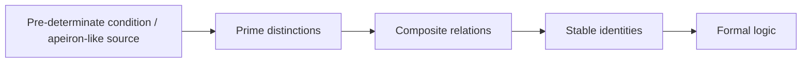
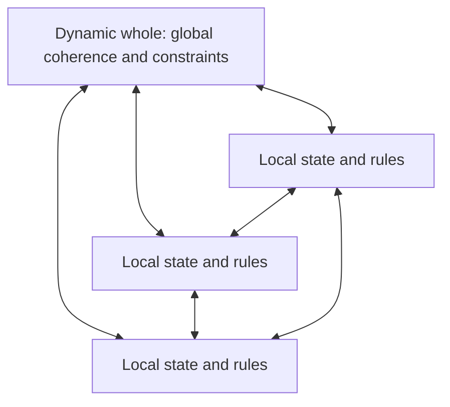
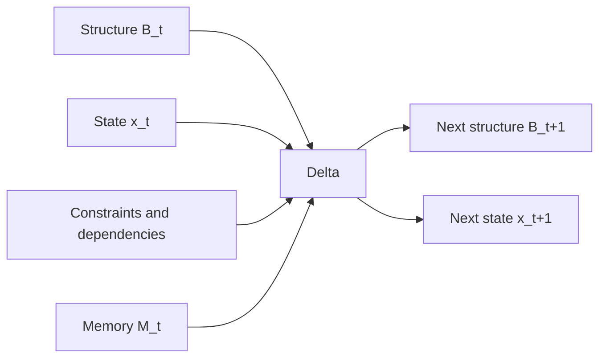
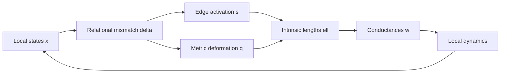
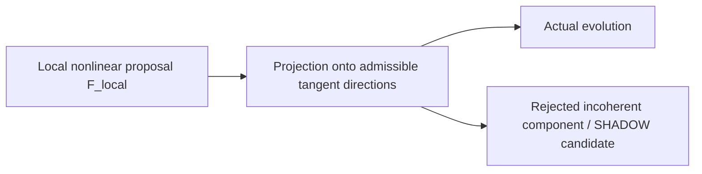
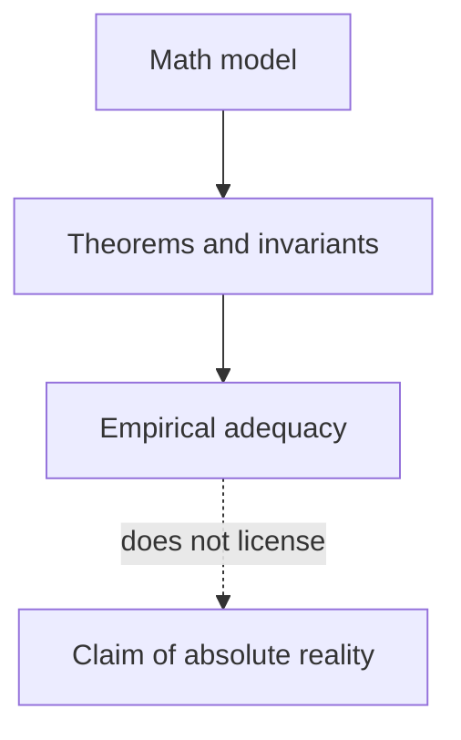
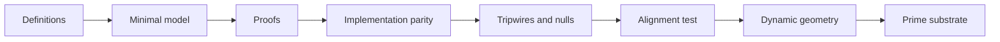
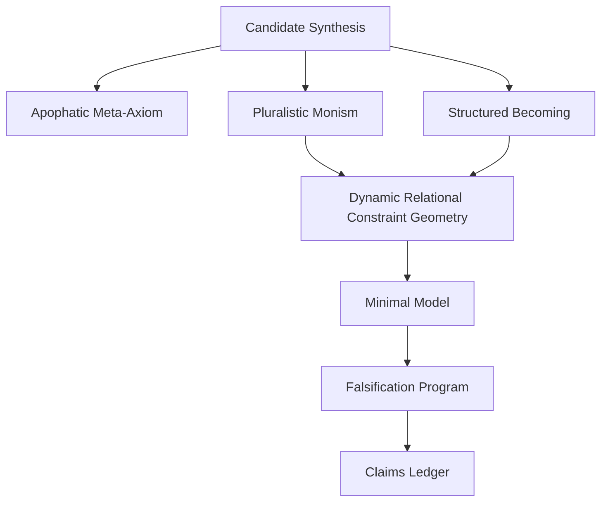

# Diagrams and Concept Maps

## 1. Developmental sequence

Status: philosophical-developmental hypothesis.

## 2. Pluralistic monism

Status: central model architecture.

## 3. Structured Becoming

Status: persistence framework.

## 4. Geometry–state feedback

Status: mathematical proposal.

## 5. Local proposal and global exclusion

Equation:

$$
\dot Z
=
F_{\mathrm{local}}
-
\Pi_{N_Z\mathcal M}F_{\mathrm{local}}.
$$

## 6. RAIL, SHADOW, KEEPER

Status: provisional operational mapping.

## 7. Apophatic discipline

Equation:

$$
\text{formal success}
\not\Rightarrow
\text{ontological identity}.
$$

## 8. Infinity barrier

## 9. Research program

## 10. Document dependency map

