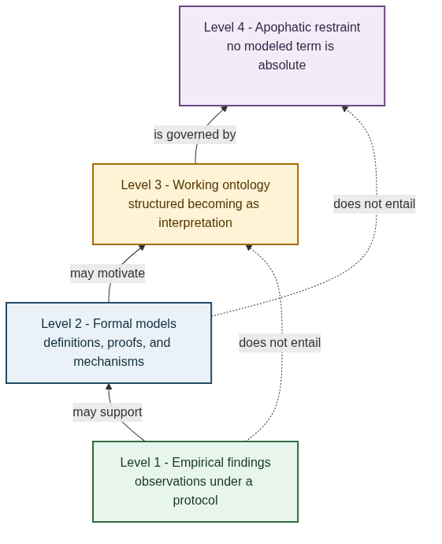
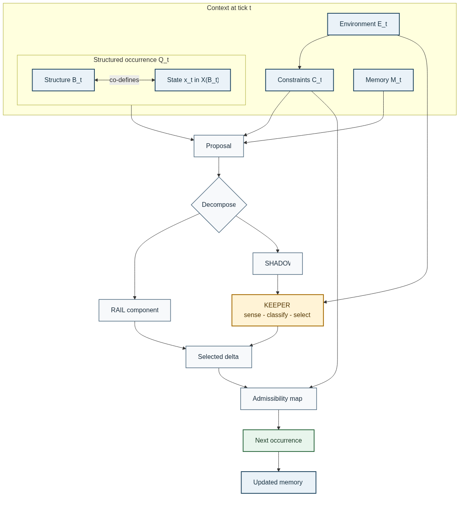
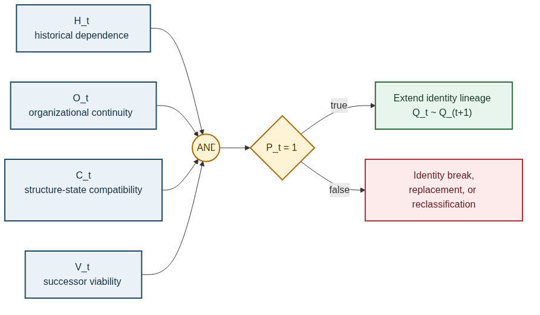
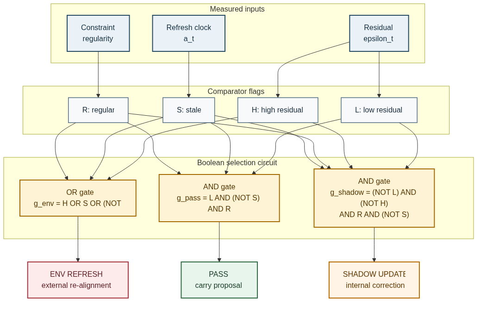
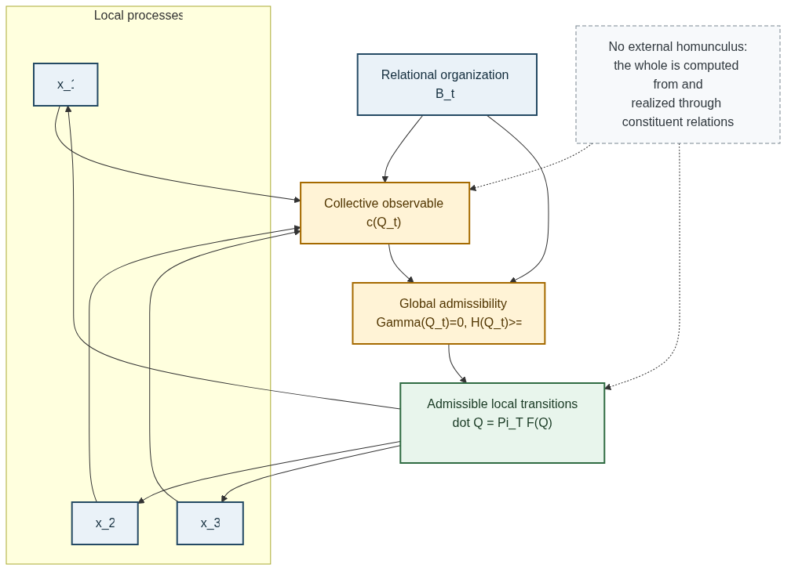
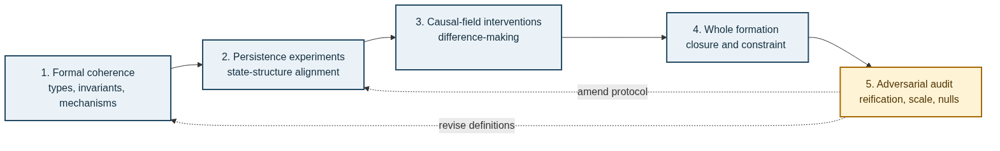

> **FORMAL WORKING PAPER — VERSION 0.2**  
> **Michael Young and Ashley Kelly · Novel Byte Labs**  
> Based on a metaphysics dialogue conducted 2–3 August 2026. Definitions and propositions are exact relative to the declared model. They do not establish that reality literally is a graph, manifold, computation, circuit, structured occurrence, or relation.

```{=latex}
\newpage
```

```{=openxml}
<w:p><w:r><w:br w:type="page"/></w:r></w:p>
```

# Contents {.unnumbered}

- [Research question and contribution](#research-question-and-contribution)
- [Method and levels of claim](#method-and-levels-of-claim)
- [Formal type system](#formal-type-system)
- [Axioms of the persistence framework](#axioms-of-the-persistence-framework)
- [Transition architecture](#transition-architecture)
- [Persistence and identity](#persistence-and-identity)
- [The KEEPER as an auditable logic circuit](#the-keeper-as-an-auditable-logic-circuit)
- [Causation, possibility, and necessity](#causation-possibility-and-necessity)
- [Properties, motion, space, and time](#properties-motion-space-and-time)
- [Wholes and organizational constraint](#wholes-and-organizational-constraint)
- [The apophatic restriction](#the-apophatic-restriction)
- [The structure-state alignment theorem](#the-structure-state-alignment-theorem)
- [Relationship to existing traditions](#relationship-to-existing-traditions)
- [Research protocol and falsification](#research-protocol-and-falsification)
- [Objections and limits](#objections-and-limits)
- [Open problems](#open-problems)
- [Core theses](#core-theses)
- [Conclusion](#conclusion)
- [Glossary](#glossary)
- [Source note and references](#source-note-and-references)

```{=latex}
\newpage
```

```{=openxml}
<w:p><w:r><w:br w:type="page"/></w:r></w:p>
```

# Research question and contribution

## The problem

The conversation began with one question: **what persists?** A monitor, organism, person, computation, or institution changes continuously, yet we treat it as one continuing entity. If persistence means exact sameness, change destroys identity. If persistence means only reuse of a name, identity becomes arbitrary. The problem is to specify a middle condition that is neither immutable substance nor unconstrained convention.

The proposed answer is:

> **Central thesis.** Persistence is compatible carryover: a prior structured state remains causally available to a successor, preserves the organization relevant to its kind, remains compatible with its relational structure, and stays within a corridor from which further organized transformation is possible.

The word *compatible* is essential. Structure alone does not persist as a concrete entity; it supplies a space of relations and transformations. State alone does not persist; a state is intelligible only relative to the distinctions supplied by a structure. Their organized fit determines whether activity is carried, suppressed, corrected, or reorganized.

## Four contributions

This paper makes four bounded contributions.

| Contribution | Formal result | Status |
|---|---|---|
| Ontology of the working model | A typed, structure-dependent state space | Definition |
| Persistence criterion | A four-input Boolean predicate and graded score | Definition |
| KEEPER mechanism | An explicit, mutually exclusive control policy | Defined; not claimed universal |
| Structure-state alignment | Exact spectral identity for normal linear evolution | Proved under stated assumptions |

The paper does **not** claim a new fundamental geometry, a universal law of nature, a solution to quantum foundations, or empirical validation of a metaphysical ontology. It provides a formal language in which those stronger questions can be asked without being decided in advance.

# Method and levels of claim

The method inherited from the earlier *Structured Becoming* paper has three stages.

## Construct

Replace loose metaphysical nouns with typed objects, maps, predicates, and intervention criteria. “Thing,” “identity,” “cause,” and “whole” become claims that can be inspected for internal coherence and, where possible, tested.

## Challenge

For every object introduced, ask:

- Can it exist independently of the other terms that define it?
- Has a distinction in a model been mistaken for a division in reality?
- Has an explanatory function been turned into a hidden bearer, force, or agent?
- Does the claim survive changes of coordinates, labels, scale, and observation map?

This stage preserves the decisive correction from the dialogue: do not “reify the relation.” Replacing isolated substances with a self-existing entity called *Relation* merely relocates the original problem.

## De-reify

Retain exact positive claims at the level where they are licensed, then refuse the invalid upward inference from usefulness to ultimacy. Four levels must remain separate.

{width=55%}

1. **Empirical:** observations produced under a declared protocol.
2. **Formal:** definitions, proofs, algorithms, and mechanism models.
3. **Working ontology:** the interpretive proposal of structured becoming.
4. **Apophatic restraint:** denial that any modeled term thereby possesses independent, self-sufficient nature.

The method is constructive rather than quietist. It permits increasingly precise models while installing a tripwire against metaphysical overreach.

# Formal type system

Precision begins by distinguishing the kinds of objects used in the model.

The candidate ontological unit is a **structured occurrence**: a presently realized stage inseparable from the constraints, dependencies, and possible transformations through which it is realized. Its formal representation is the structured state $Q_t=(B_t,x_t)$. The word *occurrence* emphasizes that $Q_t$ is a stage in an inherited trajectory, not an inert bearer that first exists and later acquires relations.

This wording also avoids introducing a third entity called “the relation.” A relation may be represented as an edge, map, matrix, tensor, or rule and treated as a formal object. That does not establish a separate ontological object existing independently of the terms and context through which it is defined.

| Symbol | Type | Meaning |
|---|---|---|
| $B_t\in\mathcal B$ | relational structure | dependencies, topology, admissible distinctions, or organization at tick $t$ |
| $X_B$ | state fiber over $B$ | the states meaningful under structure $B$ |
| $x_t\in X_{B_t}$ | realized state | the entity's current condition |
| $Q_t=(B_t,x_t)\in\mathcal Q$ | structured state | the focal entity at a declared scale and boundary |
| $C_t\in\mathcal C$ | conditions | local rules and global constraints |
| $E_t\in\mathcal E$ | environment | variables outside the selected organizational boundary |
| $M_t\in\mathcal M$ | memory | retained trace of prior evolution |
| $\Delta_t\in T_{Q_t}\mathcal Q$ | delta | represented change sufficient for the next update in a local chart |

## Definition 1 — Structured-state space

The state space is not assumed identical under every structure. Define the total configuration space as the disjoint union

$$
\mathcal Q
=
\{(B,x):B\in\mathcal B,\ x\in X_B\}.
$$

A concrete configuration is

$$
Q_t=(B_t,x_t),
\qquad x_t\in X_{B_t}.
$$

This typing formalizes co-constitution. Changing $B_t$ may change which states, distances, or transformations are even meaningful. Structure and state remain analytically distinguishable, but they are not independent variables drawn from a single fixed Cartesian product unless a particular model proves that reduction.

## Definition 2 — Boundary and context

A **boundary map**

$$
b_t:\Omega\rightarrow\{\mathrm{internal},\mathrm{external}\}
$$

classifies variables relative to the organization being studied. The complete context is

$$
\Omega_t=(Q_t,C_t,E_t,M_t).
$$

Internal and external are therefore relational roles, not absolute regions of reality. A variable may be internal at one scale and environmental at another.

## Definition 3 — Compatibility energy

Let

$$
\mathcal E_{\mathrm{comp}}:\mathcal Q\times\mathcal C\rightarrow[0,\infty]
$$

measure mismatch between a realized state, its structure, and active conditions. Define normalized compatibility by

$$
\kappa(Q_t,C_t)
=
\exp\!\left[-\mathcal E_{\mathrm{comp}}(Q_t,C_t)\right]
\in[0,1].
$$

$\kappa=1$ denotes maximal compatibility under the declared measure; $\kappa\rightarrow0$ denotes increasing mismatch. This is model-relative. It is not a universal scalar attached to things in themselves.

# Axioms of the persistence framework

The framework is generated by five explicit assumptions.

> **Axiom A1 — Co-constitution.** A realized state is typed by a relational structure: $x_t\in X_{B_t}$. Neither $B_t$ nor $x_t$ alone is sufficient to specify the concrete entity $Q_t$.

> **Axiom A2 — Carryover.** A successor is generated from information retained from the prior context. The default update is not creation from no prior state.

> **Axiom A3 — Delta sufficiency.** Whenever an exact or tolerance-bounded difference representation exists, the transition may be expressed by propagating that sufficient difference rather than recomputing the complete state. This is an operational option, not a claim that every system admits a sparse delta.

> **Axiom A4 — Viability.** Persistence requires membership in a model-declared corridor from which at least one further organized transition is reachable.

> **Axiom A5 — Apophatic non-reification.** No object acquires context-independent ontological status merely because it performs an indispensable role inside a successful model.

A1–A4 constitute the positive theory. A5 governs its interpretation and applies to the axioms themselves.

Two uses of *delta* must remain separate:

$$
\Delta_t^{\mathrm{desc}}
=
\operatorname{Enc}(Q_{t+1}\mid Q_t,M_t)
$$

is a compact **description** of an observed transition relative to retained information, whereas

$$
\Delta_t^{\mathrm{input}}
$$

is an **implemented input** that participates in generating the transition. A descriptive difference is not automatically a causal force. Equating the two without an explicit update path is a category error.

# Transition architecture

## General update system

The entire persistence cycle can be written as seven maps:

$$
v_t
=
F(Q_t,C_t,M_t),
$$

$$
r_t
=
R(v_t,Q_t,C_t),
$$

$$
g_t
=
K(r_t,Q_t,C_t,E_t,M_t),
$$

$$
\Delta_t
=
U(v_t,r_t,E_t;g_t),
$$

$$
\widetilde Q_{t+1}
=
\operatorname{Advance}(Q_t,\Delta_t),
$$

$$
Q_{t+1}
=
\Pi_{\mathcal A(C_{t+1})}(\widetilde Q_{t+1}),
$$

$$
M_{t+1}
=
G_M(M_t,r_t,Q_{t+1}).
$$

$F$ proposes evolution; $R$ measures the residual; $K$ is the KEEPER policy; $U$ selects or combines deltas; $\Pi_{\mathcal A}$ enforces admissibility when the model supplies such a map; and $G_M$ retains history. These are distinct functions. In particular, feedback from a residual is not the same operation as geometric projection.

{width=72%}

## Definition 4 — Admissibility and the RAIL

Let the admissible set under conditions $C$ be

$$
\mathcal A(C)
=
\{Q\in\mathcal Q:
\Gamma(Q,C)=0,\ H(Q,C)\ge0\}.
$$

Let $\varepsilon(Q,C)$ be a declared error or incompatibility measure. The RAIL is the viability corridor

$$
\mathcal R_{\tau}(C)
=
\{Q\in\mathcal A(C):\varepsilon(Q,C)\le\tau\}.
$$

The RAIL need not be one-dimensional. Depending on the model, it may be a trajectory, tube, invariant subspace, constraint manifold, attractor neighborhood, or viable region.

## Definition 5 — Local RAIL/SHADOW split

For a smooth equality-constrained specialization with state metric $\mathbf G(Q)>0$ and full-row-rank Jacobian $J_\Gamma(Q)$, the tangent projector is

$$
P_T(Q)
=
I-
\mathbf G^{-1}J_\Gamma^{\mathsf T}
\left(J_\Gamma\mathbf G^{-1}J_\Gamma^{\mathsf T}\right)^{-1}
J_\Gamma.
$$

A proposal $v_t$ decomposes uniquely in the selected metric as

$$
v_t^{\mathrm{RAIL}}=P_Tv_t,
\qquad
v_t^{\mathrm{SHADOW}}=(I-P_T)v_t.
$$

The SHADOW is therefore not a mysterious second realm. In this specialization it is the component of proposed motion that violates local admissibility. In broader models it may also include prediction error, accumulated numerical residual, or unmodeled structure; those meanings must not be silently conflated.

# Persistence and identity

## Four necessary predicates

Fix declared tolerances $\eta,\iota\ge0$ and $0<\kappa_{\min}\le1$. Let $\Phi_t$ be the registered transition model and $I:\mathcal Q\to\mathbb R^p$ the vector of kind-relative organizational invariants.

**Historical traceability** is

$$
H_t
=
\mathbf 1\!\left[
d_{\mathcal Q}\!\left(Q_{t+1},\Phi_t(\Omega_t)\right)
\le\eta
\right].
$$

**Organizational continuity** is

$$
O_t
=
\mathbf 1\!\left[
\|I(Q_{t+1})-I(Q_t)\|\le\iota
\right].
$$

**Structure-state compatibility** is

$$
C_t^{\mathrm{comp}}
=
\mathbf 1\!\left[
\kappa(Q_{t+1},C_{t+1})\ge\kappa_{\min}
\right].
$$

**Successor viability** is

$$
V_t
=
\mathbf 1\!\left[
Q_{t+1}\in\mathcal R_{\tau}(C_{t+1})
\right].
$$

## Definition 6 — One-step persistence

The strict persistence predicate is the conjunction

$$
P_t
=
H_t\land O_t\land C_t^{\mathrm{comp}}\land V_t.
$$

{width=82%}

This definition is intentionally demanding. It prevents persistence from collapsing into mere temporal succession. A later configuration can resemble an earlier one without being its successor; it can be historically descended while losing the organization relevant to its identity; or it can preserve organization temporarily while leaving every viable continuation.

## Definition 7 — Identity across an interval

Strict lineage from tick $i$ through tick $j$ is

$$
P_{i:j}
=
\prod_{t=i}^{j-1}P_t.
$$

For empirical work, binary predicates may be replaced by calibrated scores $h_t,o_t,c_t,v_t\in[0,1]$ and a graded persistence score

$$
p_{i:j}
=
\prod_{t=i}^{j-1}
\left(h_t\,o_t\,c_t\,v_t\right).
$$

> **Proposition 1 — Lineage composition.** If $P_{i:k}=1$ and $P_{k:j}=1$, then $P_{i:j}=1$.

*Proof.* Each expression is a conjunction of the one-step predicates over its interval. The two true conjunctions jointly contain every $P_t$ for $i\le t<j$. Their conjunction is therefore true. $\square$

The proposition is simple but important: identity through time is constructed from warranted transitions, not from an immutable object numerically identical at every tick.

# The KEEPER as an auditable logic circuit

The conversation described the KEEPER as the mechanism that decides whether the current process can correct itself or must request environmental re-alignment. To avoid a homunculus, the decision must be decomposed into measured inputs, Boolean gates, and explicit outputs.

## Definition 8 — KEEPER input flags

Choose $0\le\tau_{\mathrm{low}}<\tau_{\mathrm{high}}$, required constraint rank $m$, and maximum environment age $L_{\max}$. Define

$$
L_t=\mathbf1[\varepsilon_t\le\tau_{\mathrm{low}}],
\qquad
H_t^{\varepsilon}=\mathbf1[\varepsilon_t>\tau_{\mathrm{high}}],
$$

$$
R_t^{\Gamma}=\mathbf1[\operatorname{rank}J_\Gamma(Q_t)=m],
\qquad
S_t^{E}=\mathbf1[a_t\ge L_{\max}],
$$

where $a_t$ is the number of ticks since the last environmental refresh.

The selection gates are

$$
g_t^{\mathrm{env}}
=
H_t^{\varepsilon}\lor S_t^E\lor\neg R_t^{\Gamma},
$$

$$
g_t^{\mathrm{pass}}
=
L_t\land\neg S_t^E\land R_t^{\Gamma},
$$

$$
g_t^{\mathrm{shadow}}
=
\neg L_t\land\neg H_t^{\varepsilon}
\land R_t^{\Gamma}\land\neg S_t^E.
$$

{width=94%}

## Proposition 2 — Determinate KEEPER selection

Assume the threshold flags are consistent, so $L_t$ and $H_t^{\varepsilon}$ cannot both be true. Then exactly one of

$$
g_t^{\mathrm{env}},
\quad
g_t^{\mathrm{pass}},
\quad
g_t^{\mathrm{shadow}}
$$

equals one.

*Proof.* If $S_t^E$ is true, $R_t^\Gamma$ is false, or $H_t^\varepsilon$ is true, then $g_t^{\mathrm{env}}=1$ and the other gates are forced to zero. Otherwise the system is fresh, regular, and not high-error. If $L_t=1$, pass-through is selected; if $L_t=0$, the residual lies in the intermediate band and SHADOW correction is selected. The cases are exhaustive and disjoint. $\square$

The selected update is

$$
\Delta_t
=
g_t^{\mathrm{pass}}\Delta_t^{\mathrm{proposal}}
+
g_t^{\mathrm{shadow}}\Delta_t^{\mathrm{shadow}}
+
g_t^{\mathrm{env}}\Delta_t^{\mathrm{environment}}.
$$

A simple internal correction is $\Delta_t^{\mathrm{shadow}}=-K_sr_t$ with gain $K_s\succeq0$. An environmental delta must be computed from a declared external measurement path; it cannot be an unexplained rescue term.

The conversation proposed environmental sampling at least once per two percent of a finite computation. For a registered horizon of $N$ ticks, that design corresponds to

$$
L_{\max}=\lceil0.02N\rceil.
$$

This cadence is a tunable engineering hypothesis, not a metaphysical constant.

# Causation, possibility, and necessity

## Definition 9 — Causal contribution

Let $Y_{t+1}=f(X_t,Z_t)$ be a component of the transition model, with $Z_t$ collecting other conditions. $X_t$ is causally relevant to $Y_{t+1}$ relative to the model and intervention class when there exist $x\ne x'$ such that

$$
Y_{t+1}\!\left(\operatorname{do}(X_t=x)\right)
\ne
Y_{t+1}\!\left(\operatorname{do}(X_t=x')\right).
$$

This gives operational content to “generates and constrains the transition.” A cause is not reified as a self-existing metaphysical object; it is a factor whose controlled variation changes the modeled successor under stated conditions.

Global constraint is causal only when its path into transition equations or admissibility is explicit. A collective statistic that is merely logged has no downward transition path. A projection that removes inadmissible velocity is not identical to feedback from a collective variable. The mechanisms may coexist, but equivalence requires proof.

## Definition 10 — Reachable futures

Let

$$
\operatorname{Reach}(Q_t,C_t)
=
\{Q':Q'\text{ is generated by an admissible transition from }Q_t\}.
$$

For a proposition $\varphi$ about successors:

$$
\operatorname{Possible}_t(\varphi)
\iff
\exists Q'\in\operatorname{Reach}(Q_t,C_t):\varphi(Q'),
$$

$$
\operatorname{Necessary}_t(\varphi)
\iff
\forall Q'\in\operatorname{Reach}(Q_t,C_t):\varphi(Q').
$$

Possibility is therefore constraint-conditioned reachability. Necessity is truth across all reachable admissible successors. Neither is absolute; both are indexed to the present organization, conditions, and transition law.

# Properties, motion, space, and time

## Definition 11 — Property

Let $\mathcal G$ be a declared family of admissible transformations. A property $p:\mathcal Q\to Y$ is invariant under $\mathcal G$ when

$$
p(g\cdot Q)=p(Q)
\qquad
\forall g\in\mathcal G.
$$

A disposition is a conditional reachability relation: $Q$ has disposition $D$ under trigger class $\mathcal T$ when the relevant successor set enters a declared target region. Flexibility, fragility, and conductivity are therefore not detachable objects; they describe stable possibilities generated by organization under interventions.

## Definition 12 — Change and motion

Change is any nonzero transition difference in a declared chart:

$$
\Delta Q_t
=
\operatorname{Log}_{Q_t}(Q_{t+1})\ne0.
$$

Motion is change interpreted through a geometry $d_{B_t}$:

$$
\operatorname{Motion}_t
\iff
d_{B_t}(x_t,x_{t+1})>0.
$$

Motion is thus a species of relational change. Change in topology, constraint, property, or organization need not be spatial motion.

## Working hypotheses for space and time

Within this metaphysics:

- **Space** is the geometry of coexisting distinctions, represented by adjacency, distance, or compatibility relations at a selected state.
- **Time** is the order and measure of transformations along a history $Q_0,Q_1,\ldots$.

These functional definitions do not establish that physical spacetime is emergent. They only deny that a container model is logically required by the persistence framework.

Spatial distance also does not entail relational independence. Two local events may be distant in one metric while participating in one globally constrained state description. This offers a conceptual perspective on nonlocal correlation, but it does not derive quantum probabilities, the Born rule, no-signaling, relativistic compatibility, or a physical model of entanglement.

# Wholes and organizational constraint

## Definition 13 — Organizational whole

A collection $W$ counts as an organizational whole over an interval when it satisfies:

1. **integration:** relevant local variables are linked by nontrivial dependencies;
2. **constraint:** joint organization excludes locally conceivable transitions;
3. **closure:** some internal processes regenerate or repair conditions needed by the organization;
4. **lineage:** the persistence predicate remains satisfied across the interval.

The criteria admit degrees. They do not imply material isolation. An autopoietic system can be operationally closed while energetically and materially open; a sympoietic system can be produced jointly with other systems while retaining a functional boundary.

{width=76%}

The figure formalizes “the whole constrains the parts” without inserting a second substance above the parts. The global variables must be computed from or jointly defined with constituent relations, and their return path into local transitions must be explicit.

# The apophatic restriction

The hardest question in the conversation was “What is fundamental?” Each candidate failed as an independent foundation:

- structure is inferred from regularities among states and transformations;
- state is typed by a structure of possible distinctions;
- relation depends on distinguishable terms and a context of comparison;
- cause is articulated with conditions, interventions, and effects;
- computation depends on a presentation, interpretation, and substrate.

The result is not nihilism. It is a restriction on ontological inference.

## Definition 14 — Apophatic non-reification

For a formal theory $T$, a model $\mathfrak M$, and an interpreted object $O$,

$$
\mathfrak M\models\varphi(O).
$$

This does not license the conclusion

$$
\operatorname{Absolute}(O).
$$

A theorem establishing a formal role does not identify that object with context-independent reality. The rule applies equally to graphs, manifolds, constraints, RAILS, SHADOWS, KEEPERs, relations, and emptiness.

Nāgārjuna's critique of *svabhāva* supplies the closest philosophical discipline introduced in the conversation: phenomena lack independent, self-sufficient nature yet remain conventionally and dependently real. Relations are empty too. They must not become a hidden substrate replacing substances.

The framework therefore applies to itself. Its categories are tools for disciplined distinction, intervention, and test. A later formalism may preserve their explanatory work while replacing their presentation.

# The structure-state alignment theorem

The conversation was triggered by an experimental surprise: a relational operator reportedly contained long-lived modes, but the original starting state had almost no overlap with them. Its contributions canceled and the activity decayed. Changing only the relationships or only the starting values altered their geometric fit and produced much longer-lived dynamics.

The underlying experimental record is not contained in the supplied conversation, so that result is not certified here. The mathematical core, however, can be made exact.

## Definition 15 — Persistent spectral subspace

Let $A\in\mathbb C^{n\times n}$ be a normal operator, so

$$
A=V\Lambda V^{\mathsf H},
$$

with orthonormal eigenvectors $v_i$ and eigenvalues $\lambda_i$. The dynamics are

$$
x_{t+1}=Ax_t.
$$

Write $a_i$ for the modulus of $\lambda_i$. For a persistence threshold $\rho>0$, define

$$
I_\rho
=
\{i:a_i\ge\rho\},
\qquad
P_\rho
=
\sum_{i\in I_\rho}v_iv_i^{\mathsf H}.
$$

The structure-state alignment score is

$$
\alpha_\rho(A,x_0)
=
\frac{\|P_\rho x_0\|^2}{\|x_0\|^2}
\in[0,1].
$$

## Theorem 1 — Modal persistence identity

For normal $A$, let $c_i=v_i^{\mathsf H}x_0$ and write $b_i$ for the modulus of $c_i$. Then

$$
\|A^t x_0\|^2
=
\sum_{i=1}^{n}
a_i^{2t}b_i^2.
$$

*Proof.* Since $x_0=\sum_i c_iv_i$ and $A^tv_i=\lambda_i^tv_i$,

$$
A^tx_0=\sum_i c_i\lambda_i^tv_i.
$$

Orthonormality removes cross terms when the squared norm is taken, yielding the displayed identity. $\square$

## Corollary 1 — Misalignment suppresses persistence

If $\alpha_\rho(A,x_0)=0$ and

$$
\mu
=
\max_{a_i<\rho}a_i
<\rho,
$$

then

$$
\|A^tx_0\|
\le
\mu^t\|x_0\|.
$$

The operator may contain persistent modes while the selected state fails to excite them. Structure alone is therefore insufficient; state alone is insufficient; their overlap determines the realized trajectory.

## Proposition 3 — Relabeling versus compatibility intervention

Let $P$ be a permutation matrix.

1. A simultaneous relabeling

$$
A'=PAP^{\mathsf T},
\qquad
x_0'=Px_0
$$

preserves alignment:

$$
\alpha_\rho(A',x_0')
=
\alpha_\rho(A,x_0).
$$

2. Changing structure alone, $A'=PAP^{\mathsf T}$ with $x_0'=x_0$, generally changes alignment.

3. Changing state alone, $A'=A$ with $x_0'=Px_0$, generally changes alignment.

The first operation is a presentation change. The second and third are genuine interventions on the structure-state relation. This distinction is necessary when interpreting “shuffling” experiments.

For nonlinear or time-dependent dynamics, the nearest analogue uses the finite-time tangent product

$$
J_{t:0}
=
D\Phi_{t-1}(Q_{t-1})\cdots D\Phi_0(Q_0)
$$

and its singular or covariant Lyapunov directions. The linear theorem motivates that analysis but does not prove the nonlinear case.

# Relationship to existing traditions

*Structured Becoming* is a candidate synthesis, not a claim to have invented persistence theory, process metaphysics, relational ontology, cybernetics, or Madhyamaka.

## Process philosophy

The framework shares process philosophy's emphasis on becoming, event, and organized continuity over an unchanging substance. It does not adopt Whitehead's complete cosmology or require that every domain use one universal kind of process entity.

## Persistence theory

The account is closer to stage- or process-based theories than to strict endurantism: each $Q_t$ is a distinct occurrence, and diachronic identity is constructed by the lineage predicate. It remains pluralist about domain criteria. Persons, organisms, artifacts, institutions, and software processes need not preserve the same invariant vector $I(Q)$.

## Relational ontology and structural realism

The framework agrees that organization and relation are indispensable to what entities are and how they behave. It rejects the stronger inference that structure itself is the one independently existing reality. The typed space $\mathcal Q$ is a presentation of dependence, not a certification of ontic structural realism.

## Cybernetics, autopoiesis, and sympoiesis

RAIL, SHADOW, KEEPER, feedback, closure, and environmental refresh connect directly to cybernetic and autopoietic mechanisms. Sympoietic analysis corrects any tendency to treat closure as isolation: organizational continuation is often co-produced across a dynamic boundary.

## Madhyamaka

Nāgārjuna supplies the interpretive discipline rather than a positive physical mechanism. Whenever one term appears to complete the ontology, the analysis asks whether it has merely become a new *svabhāva*. Emptiness is not a final material, field, or relation. It is the absence of independent self-grounding in dependently designated phenomena.

The shortest name for the synthesis is **Structured Becoming**. A longer descriptive label is **an apophatic process-relational metaphysics of structured occurrence**.

# Research protocol and falsification

The metaphysical framework earns scientific relevance only by producing discriminating interventions.

| Test | Fixed | Varied | Question |
|---|---|---|---|
| State intervention | $B$, rules, environment | $x_0$ | Does persistence track modal alignment? |
| Structure intervention | $x_0$, rules | $B$ | Does changed organization alter the same state’s viability? |
| Presentation control | none physically | $B\mapsto PBP^T$, $x\mapsto Px$ | Are observables invariant under pure relabeling? |
| KEEPER ablation | proposal and thresholds | correction path | Does residual feedback maintain the RAIL? |
| Feedback/projection split | model and initial state | mechanism | Are the effects dynamically distinguishable? |
| Environmental replacement | information budget | endogenous vs matched exogenous input | Is closure doing explanatory work? |
| Observation-map robustness | trajectories | measurement scale | Does claimed persistence survive a changed lens? |

{width=96%}

Minimum reporting requirements are:

1. declare the structured-state space and observation map;
2. register the RAIL, thresholds, and failure conditions before execution;
3. separate feedback, projection, penalty, and refresh mechanisms;
4. distinguish simultaneous relabeling from one-sided compatibility interventions;
5. report both binary persistence decisions and continuous scores;
6. retain failed and singular runs;
7. avoid promoting software verification into a physical or ontological claim.

The framework is falsified in a declared domain if its compatibility measures fail to discriminate persistence after fair controls, if simpler state-only or structure-only models perform equivalently, or if its mechanism labels cannot be tied to distinct substrate paths.

# Objections and limits

## “Structured state” merely renames substance

It would if $Q_t$ were declared self-existing. Definition 1 instead makes state depend on a structure-specific fiber, while Axiom A5 denies ultimacy to the entire construction. The model is justified by interventions and invariance, not by naming a final bearer.

## The persistence predicate is conventional

Its tolerances and kind-relative invariants are conventional in the sense that they must be declared. They are not arbitrary when constrained by prediction, intervention, robustness, and shared measurement. Every scientific identity criterion operates at a scale and tolerance.

## The KEEPER is a homunculus

Figure 3 answers the objection by decomposing the KEEPER into comparator flags and Boolean gates. A model with no sensor, threshold, memory, or actuator path has only a metaphorical KEEPER and cannot claim the mechanism.

## The framework makes everything persistent

No. Persistence fails whenever historical traceability, organizational continuity, compatibility, or viability fails. A sequence can be continuous yet cease to instantiate the same kind of organization.

## Global constraint implies action at a distance

Constraint on a joint state is not automatically a traveling action or communication channel. A physical theory must still specify its dynamics and satisfy relevant signaling and relativistic restrictions. This paper supplies no shortcut around those obligations.

## The spectral theorem is too narrow

Correct. Theorem 1 is exact for normal linear operators. It isolates the compatibility mechanism cleanly. Nonnormal, nonlinear, stochastic, and topology-changing systems require separate tools and may exhibit transient growth not predicted by eigenvalue magnitude alone.

# Open problems

The candidate synthesis remains incomplete in ten explicit ways.

1. **Individuation:** What non-arbitrary rule separates one structured occurrence from another?
2. **Scale:** At which scale should $B_t$, $x_t$, the boundary map, and the causal field be defined?
3. **Identity thresholds:** When does lawful transformation become replacement rather than continuation?
4. **Constructive co-definition:** When does the fibered space $\mathcal Q$ yield a tractable model rather than merely redescribing mutual dependence?
5. **Novelty:** Can new organizational possibilities arise, or only paths already implicit in the state space?
6. **Temporal direction:** What grounds the asymmetry between retained past and unrealized future?
7. **Normativity:** When are “error,” “viability,” and “correction” intrinsic to an organization rather than imposed by an observer?
8. **Observer dependence:** Which boundaries and properties remain invariant across perspectives and encodings?
9. **Physical realization:** Which terms correspond to physical mechanisms rather than general explanatory roles?
10. **Apophatic productivity:** How can a positive research program accumulate knowledge without reifying its own most successful formalism?

These questions are not defects to conceal. They define the next research stages and the conditions under which the framework should be revised or abandoned.

# Core theses

The formal development yields twelve theses:

1. **No isolated entity:** an entity is individuated at a boundary, scale, and relational context.
2. **Typed structured state:** $x_t$ inhabits a space determined by $B_t$.
3. **Compatible carryover:** persistence requires traceability, organizational continuity, compatibility, and viability.
4. **Historical identity:** identity through time is a composition of warranted transitions.
5. **Delta transformation:** change may be propagated by sufficient differences when the model permits it.
6. **RAIL:** viable continuation is membership in a declared admissible corridor.
7. **SHADOW:** mismatch is an inspectable residual, not an occult substance.
8. **KEEPER:** correction is a decomposable control function, not an internal observer.
9. **Constraint-conditioned modality:** possibilities and necessities are indexed to reachable admissible futures.
10. **Organizational whole:** a whole is realized through integrated, constraining, partly self-maintaining relations.
11. **Structure-state alignment:** persistent modes matter only to the extent that realized states excite them.
12. **Apophatic closure:** no explanatory object is thereby an absolute foundation.

# Conclusion

The initial question—what persists?—does not require an immutable substance. It requires an account of how a present organization remains available to a successor without being recreated from nothing. This paper gives that account a type system, update equations, persistence predicate, control circuit, modal logic, and spectral theorem.

A thing persists, within the model, when a structured state is historically carried, organizationally continuous, compatible, and viable. The RAIL names its corridor of continuation. The SHADOW names measured deviation from that corridor. The KEEPER names the explicit policy that passes, corrects, or refreshes the proposed transition. None of these is permitted to become a hidden metaphysical agent.

The deepest claim is therefore both positive and negative. Positively, persistence depends on the relation between structure and state, not on either alone. Negatively, structure, state, and relation are themselves dependent distinctions. Persistence is continuity through transformation without an independently existing essence: not stillness defeating change, but organization achieving a next moment.

```{=latex}
\newpage
```

```{=openxml}
<w:p><w:r><w:br w:type="page"/></w:r></w:p>
```

# Glossary {.unnumbered}

| Term | Formal meaning in this paper |
|---|---|
| **Structured state** | $Q=(B,x)$ with $x\in X_B$ |
| **Compatibility** | $\kappa(Q,C)=e^{-\mathcal E_{\mathrm{comp}}(Q,C)}$ |
| **Delta** | A represented difference sufficient to advance the selected model |
| **RAIL** | $\mathcal R_\tau(C)$, the viable admissible corridor |
| **SHADOW** | Residual or inadmissible component of proposed evolution |
| **KEEPER** | Explicit selection policy among pass, internal correction, and environmental refresh |
| **Closure** | Recursive maintenance of conditions enabling continued organization; not isolation |
| **Persistence** | $P_t=H_t\land O_t\land C_t^{\mathrm{comp}}\land V_t$ |
| **Identity lineage** | $P_{i:j}=\prod_{t=i}^{j-1}P_t$ for binary one-step predicates |
| **Apophatic non-reification** | Formal success does not entail context-independent ontological identity |

# Source note and references {.unnumbered}

This paper was reconstructed from the supplied conversation “Have you ever mentally grappled with PERSISTENCE?”, the Kelly Algebra and Kelly Calculus archives supplied by the authors, and the internal Apophatic Relational Geometry documentation. The transcript is the source of the argumentative sequence. The technical notes supply the project vocabulary. The rendered logic figures were authored in Mermaid; their `.mmd` sources are distributed in the accompanying `papers/diagrams` directory.

Aristotle. *Metaphysics*. Various editions and translations.

Haslanger, Sally, and Roxanne Marie Kurtz, editors. *Persistence: Contemporary Readings*. MIT Press, 2006.

Kelly, Ashley, and Michael Young. “The Law of Causality in Computation — A New Scaling Paradigm Where Cost Tracks Churn, Not Size.” Novel Byte Labs technical note NBL-RD-2025-09-12, 2025.

Kelly, Ashley, and Michael Young. “The Geometry of Computation: Rail, Shadow, and Sphere.” Novel Byte Labs technical note NBL-RD-2025-09-13-A, rev. 1, 2025.

Kelly, Ashley, and Michael Young. “The Kelly Algebra — Axioms, Objects, and the Generator Split.” Novel Byte Labs technical note NBL-RD-2026-05-26-A, 2026.

Kelly, Ashley, and Michael Young. “The Dynamic Algebra — Self-Enrichment, Automorphism, and the SPRE as an Algebraic Engine.” Novel Byte Labs technical note NBL-RD-2026-05-26-D, 2026.

Maturana, Humberto R., and Francisco J. Varela. *Autopoiesis and Cognition: The Realization of the Living*. D. Reidel, 1980.

Ladyman, James, and Don Ross. *Every Thing Must Go: Metaphysics Naturalized*. Oxford University Press, 2007.

Nāgārjuna. *The Fundamental Wisdom of the Middle Way: Nāgārjuna's Mūlamadhyamakakārikā*. Translated by Jay L. Garfield. Oxford University Press, 1995.

Westerhoff, Jan. *Nāgārjuna's Madhyamaka: A Philosophical Introduction*. Oxford University Press, 2009.

Wiener, Norbert. *Cybernetics: Or Control and Communication in the Animal and the Machine*. 2nd ed. MIT Press, 1961.

Sider, Theodore. *Four-Dimensionalism: An Ontology of Persistence and Time*. Oxford University Press, 2001.

Varela, Francisco J. *Principles of Biological Autonomy*. North-Holland, 1979.

Whitehead, Alfred North. *Process and Reality*. 1929. Corrected edition, Free Press, 1978.

Young, Michael, and Ashley Kelly. *Apophatic Relational Geometry* internal documentation: “Scope and Status,” “Apophatic Non-Reification Schema,” and ADR 0001, “Separate Mathematics from Ontological Ultimacy,” 2026.
